## Jenkins Pipeline 中集成 Java性能分析

### 一. Java性能分析

```groovy

stage('Java Performance Analysis') {
    steps {
        echo '====== Java Performance Analysis ======'
        sh '''
            # 设置当返回不为0时 停止下一步，直接返回
            set -e
            CURDIR=$(pwd)
            # 删除上次jmeter产生的报告 (jmeter 命令-l、-o指定的文件和路径)
            rm -rf /home/zpp/report /home/zpp/result.html 
            # 运行java性能采集
            /home/zpp/.local/devkit_distribute/bin/entrance -i 160.0.1.2,160.0.1.3 -u root -f /home/zpp/.ssh/id_rsa -D 160.0.1.5 -a spring-boot -d 10 -g /home/zpp/spring-boot -j "sh /home/zpp/apache-jmeter-5.6.3/bin/jmeter.sh -nt /home/zpp/Test_request.jmx -l /home/zpp/result.html -eo /home/zpp/report"
        '''
    }
    post {
        always {
            publishHTML(target: [allowMissing: false,
                        alwaysLinkToLastBuild: false,
                        keepAll              : true,
                        reportDir            : '/home/zpp/.local/devkit_distribute/data',
                        reportFiles          : 'devkit_performance_report.html',
                        reportName           : 'Java Performance Report']
                        )
        }
    }
}
```

**entrance**具体参数如下

| 参数 | 参数类型      | 参数说明                                                                                                                                   |
|----|-----------|----------------------------------------------------------------------------------------------------------------------------------------|
| -i | ipv4,ipv4 | 必选参数。需要采集的目标程序所在的服务器地址， 多个使用逗号隔离                                                                                                       |
| -u | str       | 必选参数。服务器的用户名                                                                                                                           |
| -f | str       | 必选参数。执行机免密登陆所有服务器（-i指定的）的私钥路径                                                                                                          |
| -a | str       | 必选参数。需要采集的应用名称，多个采用逗号隔离                                                                                                                |
| -g | str       | 必选参数。执行机上通过git clone下载的代码路径                                                                                                            |
| -j | str       | 可选参数。jmeter执行命令。例如 bash /opt/apache-jmeter-5.6.3/bin/jmeter.sh -nt /home/xxx/Request.jmx -l /home/xxx/result.html -eo /home/xxx/report |
| -d | num       | 可选参数。任务采集执行时间，默认43200s（12 hour），当存在-j参数时，jmeter结束或者到达采集执行时间，结束采集。                                                                      |
| -D | ipv4      | 必选参数。Devkit工具的地址。                                                                                                                      |
| -P | num       | 可选参数。Devkit工具的端口，默认值8086。                                                                                                              |
| -U | str       | 可选参数。Devkit工具的用户名，默认值devadmin。                                                                                                         |
| -W | str       | 可选参数。Devkit工具的密码，默认值devkit123。                                                                                                         |

### 二. 配置示例

#### 1. 安装java分发采集命令行工具到执行jenkins执行机

##### 1.1 使用deploy_tool命令安装角色executor

[通过deploy_tool部署工具部署executor](../批量部署工具/批量部署工具和一键下载工具说明文档.md)

安装完成后查看

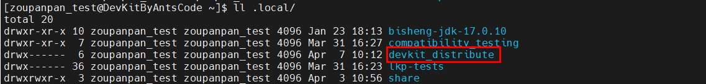

##### 1.2 离线安装

###### 1.2.1 下载离线包

发行版中下载<font color=white>**最新**</font>的devkit_distribute.tar.gz
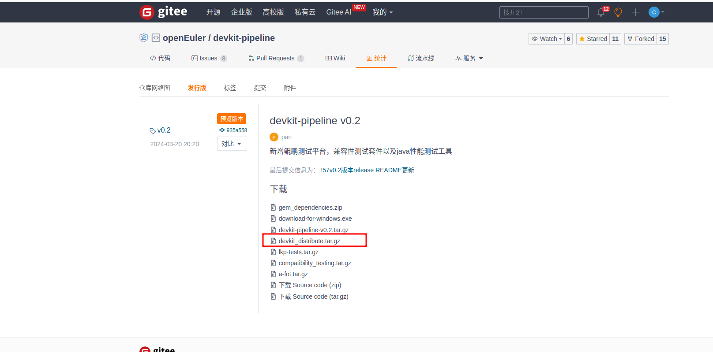

###### 1.2.2 执行以下命令：

```shell
  mkdir -p "${HOME}"/.local
  tar --no-same-owner -zxf devkit_distribute.tar.gz -C "${HOME}"/.local/
```

###### 1.2.3 安装成功：
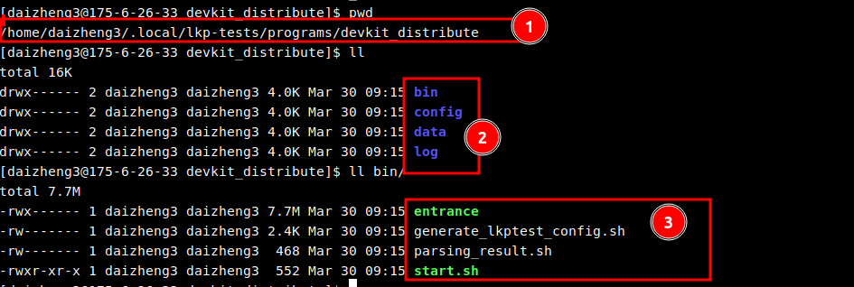

#### 2. 确定需要采集的java程序所在机器存在jcmd命令

##### 2.1 检查jcmd命令是否存在

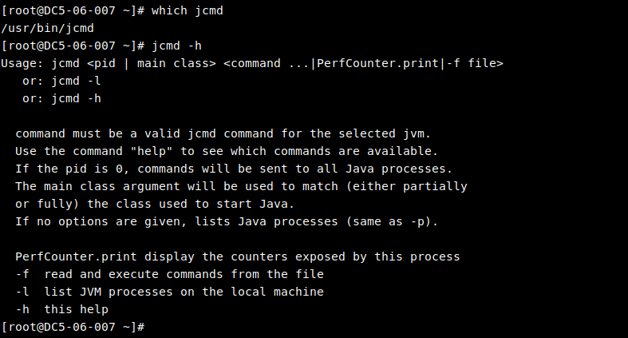

##### 2.2 安装jcmd命令

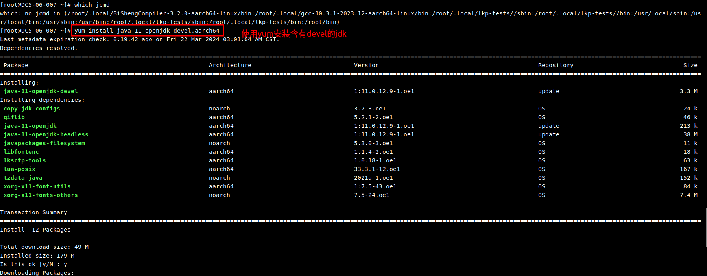

#### 3. 配置流水线


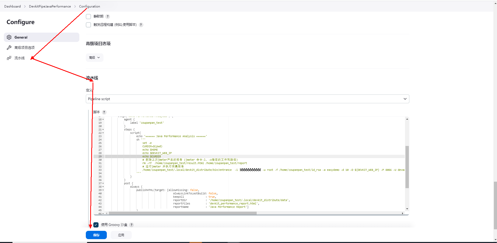
----

#### 4. 执行任务

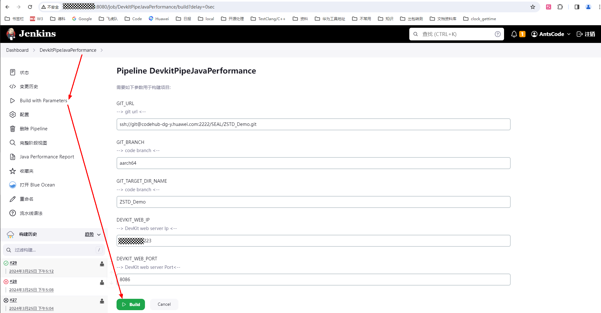

----

#### 5. 查看任务执行状态和报告

##### 5.1 失败执行

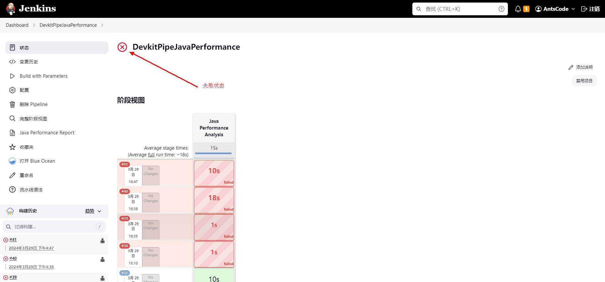

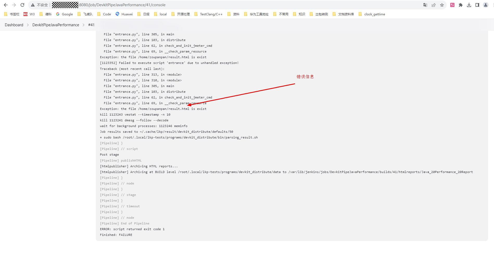

##### 5.2 成功执行

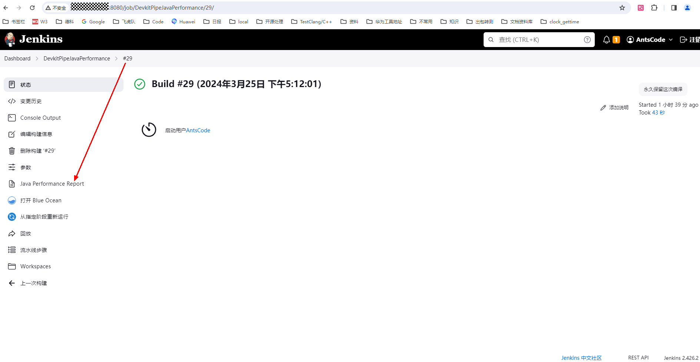

##### 5.3 最终报告

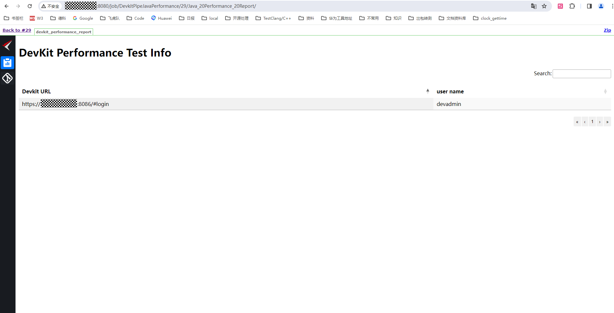
