<center><big><b>《鲲鹏 DevKit CLI 与 Jenkins 集成部署指导手册》</b></big></center>


[TOC]

------

## 一、Jenkins Pipeline 中集成 DevKit CLI

**命令行各任务模块命令解释：**

应用迁移包含软件迁移评估、源码迁移和系统迁移，其命令行返回值如下：

命令行状态码含义
| 状态码 | 触发情况                                   |
| ------ | ------------------------------------------ |
| 0      | 无扫描建议                                 |
| 1      | 扫描结果只存在建议项                       |
| 2      | 扫描任务出现Ctrl+C(SIGINT(2))              |
| 3      | 扫描结果超时                               |
| 4      | 扫描命令错误                               |
| 5      | 扫描结果存在必须修改项                     |
| 15/20  | 扫描任务出现Ctrl+Z SIGTERM(15)/SIGTSTP(20) |

- ##### 软件迁移评估：


```groovy
# devkit porting pkg-mig -i 待扫描软件包 -r 输出报告格式
# 示例 devkit porting pkg-mig -i impala-2.9.0+cdh5.12.1+0-1.cdh5.12.1.p0.3.el7.x86_64.rpm  -r html
# 该节点建议放在构建流程节点后
stage('software-migration-assessment') {
                            steps {
                                echo '====== 软件迁移评估 ======'
                                sh '''
                                    /usr/bin/rm -rf ./pkg-mig*.html
                                    devkit porting pkg-mig -i impala-2.9.0+cdh5.12.1+0-1.cdh5.12.1.p0.3.el7.x86_64.rpm  -r html
                                    mv ./pkg-mig*.html ./SoftwareMigrationAssessment.html
                                '''
                            }
                            post {
                                always {
                                    publishHTML(target: [allowMissing: false,
                                                alwaysLinkToLastBuild: false,
                                                keepAll              : true,
                                                reportDir            : '.',
                                                reportFiles          : 'SoftwareMigrationAssessment.html',
                                                reportName           : 'SoftwareMigrationAssessment Report']
                                                )
                                }
                            }
                        }
```

具体参数如下

| 参数             | 参数选项          | 参数说明                                                     |
| ---------------- | ----------------- | ------------------------------------------------------------ |
| -i/--input       | package_path      | 必选参数。待扫描的软件包路径，若存在多个扫描路径需使用英文逗号分割。支持的软件包格式有包括RPM、DEB、JAR/WAR包、TAR、ZIP、GZIP压缩文件等。例如：/home/test1.jar, /home/test2.jar。 |
| -t/--target-os   | target-os         | 可选参数。待扫描的目标操作系统。                             |
| -o/--output      | output_path       | 可选参数。报告存放路径。报告默认存放在当前执行路径下，名称默认为“特性名称_时间戳”。 |
| --set-timeout    | time              | 可选参数。任务超时时间。默认无超时时间，任务将持续执行直到结束。 |
| -l/--log-level   | 0,1,2,3           | 可选参数。任务日志级别。0（DEBUG）、1（INFO）、2（WARNING）、3（ERROR），默认为1（INFO）。 |
| -r/--report-type | all,json,html,csv | 可选参数。扫描报告的格式。默认为all，即默认生成json、html、csv三种报告 |

- ##### 源码迁移：


```groovy
 # devkit porting src-mig  -i 待扫描源码的文件夹或压缩包路径 -c 源码的构建命令 -r 输出报告格式
 # 示例 devkit porting src-mig -i ./wtdbg2 -c make -r html
 # 该节点若是扫描软件包建议放在构建流程节点后，若是源码文件则建议放在构建流程节点前  
stage('source-code-migration') {
                            steps {
                                echo '====== 源码迁移 ======'
                                sh '''
                                    /usr/bin/rm -rf ./src-mig*.html
                                    devkit porting src-mig -i ./wtdbg2 -c make -r html
                                    mv ./src-mig*.html ./SourceCodeScanningReport.html
                                '''
                            }
                            post {
                                always {
                                    publishHTML(target: [allowMissing: false,
                                                alwaysLinkToLastBuild: false,
                                                keepAll              : true,
                                                reportDir            : '.',
                                                reportFiles          : 'SourceCodeScanningReport.html',
                                                reportName           : 'Source Code Scanning Report']
                                                )
                                }
                            }
                        }
    
```

具体参数如下

| 参数                  | 参数选项                          | 参数说明                                                     |
| --------------------- | --------------------------------- | ------------------------------------------------------------ |
| -i/--input-path       | path                              | 必选参数。待扫描源码的文件夹或压缩包路径，若存在多个扫描路径需使用英文逗号分割。例如：/home/test1,/home/test2。 |
| -c/--cmd              | cmd                               | 必选参数。源码的构建命令。例如：make all。                   |
| -s/--source-type      | c,c++,asm,fortran,go, interpreted | 可选参数。待扫描源码类型。                                   |
| -t/--target-os        | target-os                         | 可选参数。迁移的目标操作系统。如果用户不输入则默认为当前操作系统。例如：bclinux7.7。 |
| -p/--compiler         | gcc,clang                         | 可选参数。编译器版本。默认为选定目标操作系统的默认GCC版本。例如：gcc7.8.5 |
| -f/--fortran-compiler | flang-ver                         | 可选参数。fortran代码的编译器版本。默认为flang2.5.0.1。      |
| -b/--build-tool       | make,cmake,automake,go            | 可选参数。构建工具。默认make，只有在--source-type中没有c/c++/asm/fortran并且包含go时可以选go。 |
| -o/--output           | /home/test/report                 | 可选参数。扫描报告的存放地址和文件名称。默认存放在当前执行路径下，名称默认为功能名_时间戳_uuid(4位)。 |
| --set-timeout         | time                              | 可选参数。命令行的超时时间。默认无超时时间。                 |
| -l/--log-level        | 0,1,2,3                           | 可选参数。设置日志级别。0（DEBUG）、1（INFO）、2（WARNING）、3（ERROR），默认为1（INFO）。 |
| -r/--report-type      | all,json,html,csv                 | 可选参数。 扫描报告的格式。默认为all，选择all的时候json、csv和html报告都会生成。 |
| --ignore              | /opt/ignore.json                  | 可选参数。屏蔽扫描规则信息。                                 |

- ##### 64位运行模式检查：

```groovy
# devkit advisor mode-check -i 待扫描的源码文件夹路径
# 示例 devkit advisor mode-check -i /opt/DevKit/testcase/affinity/precheck/test005
# 该节点建议放在构建流程节点前
stage('64-bit-running-mode-check') {
                            steps {
                                echo '====== 64位运行模式 ======'
                                sh '''
                                    /usr/bin/rm -rf ./mode_check*.html
                                    devkit advisor mode-check -i /opt/DevKit/testcase/affinity/precheck/test005
                                    mv ./mode_check*.html ./64-bit-running-mode-check.html
                                '''
                            }
                            post {
                                always {
                                    publishHTML(target: [allowMissing: false,
                                                alwaysLinkToLastBuild: false,
                                                keepAll              : true,
                                                reportDir            : '.',
                                                reportFiles          : '64-bit-running-mode-check.html',
                                                reportName           : '64-bit-running-mode-check Report']
                                                )
                                }
                            }
                        }

```

具体参数如下

| 参数             | 参数选项          | 参数说明                                                     |
| ---------------- | ----------------- | ------------------------------------------------------------ |
| -i/--input       | package_path      | 必选参数。待扫描的源码文件夹路径，若存在多个扫描路径需使用英文逗号分割。例如：/home/test1, /home/test2。 |
| -o/--output      | output_path       | 可选参数。报告存放路径。报告默认存放在当前执行路径下，名称默认为“特性名称_时间戳”。 |
| --set-timeout    | time              | 可选参数。任务超时时间。默认无超时时间，任务将持续执行直到结束。 |
| -l/--log-level   | 0,1,2,3           | 可选参数。日志等级，0（DEBUG）、1（INFO）、2（WARNING）、3（ERROR），默认为1（INFO）。 |
| -r/--report-type | all,json,html,csv | 可选参数。扫描报告的格式。默认为all，即默认生成json、html、csv三种报告。 |

- ##### 字节对齐检查：

```groovy
# devkit advisor byte-align -i 待扫描的源码文件夹路径 -c 源码构建命令 -b 构建工具
# 示例 devkit advisor byte-align -i /opt/DevKit/wtdbg2-2.5 -c make -b make
# 该节点建议放在构建流程节点前
stage('byte-alignment-check') {
                            steps {
                                echo '====== 字节对齐检查 ======'
                                sh '''
                                    /usr/bin/rm -rf ./byte-align*.html
                                    devkit advisor byte-align -i /opt/DevKit/wtdbg2-2.5 -c make -b make
                                    mv ./byte-align*.html ./byte-alignment-check.html
                                '''
                            }
                            post {
                                always {
                                    publishHTML(target: [allowMissing: false,
                                                alwaysLinkToLastBuild: false,
                                                keepAll              : true,
                                                reportDir            : '.',
                                                reportFiles          : 'byte-alignment-check.html',
                                                reportName           : 'byte-alignment-check Report']
                                                )
                                }
                            }
                        }
```

具体参数如下

| 参数             | 参数选项            | 参数说明                                                     |
| ---------------- | ------------------- | ------------------------------------------------------------ |
| -i/--input       | package_path        | 必选参数。待扫描的源码文件夹路径，若存在多个扫描路径需使用英文逗号分割。例如：/home/test1, /home/test2。 |
| -c/--cmd         | cmd                 | 必选参数。源码构建命令。在服务器中正常执行的构建命令，命令中如有空格，要使用单引号包住。 |
| -b/--build-tool  | make,cmake,automake | 必选参数。构建工具。当前工具支持make，cmake，automake，默认选项为make。 如-c make -b make 、-c cmake -b cmake 、-c make -b automake |
| -o/--output      | output_path         | 可选参数。报告存放路径。报告默认存放在当前执行路径下，名称默认为“特性名称_时间戳”。 |
| --set-timeout    | time                | 可选参数。任务超时时间。默认无超时时间，任务将持续执行直到结束。 |
| -l/--log-level   | 0,1,2,3             | 可选参数。日志等级，0（DEBUG）、1（INFO）、2（WARNING）、3（ERROR），默认为1（INFO）。 |
| -r/--report-type | all,json,html,csv   | 可选参数。扫描报告的格式。默认为all，即默认生成json、html、csv三种报告。 |

- 
  ##### 内存一致性检查：

```groovy
 # devkit advisor mem-cons -i BC文件对应的源码文件路径 -f BC文件路径  （需要用户配合编写生成的BC文件脚本）
 # 示例 devkit advisor mem-cons -i /opt/DevKit/testcase/affinity/weak_cons/test-mulbc_sort -f /opt/DevKit/testcase/affinity/weak_cons/bc_file
# 该节点建议放在构建流程节点前
stage('memory-consistency-check') {
    agent {
                label 'Linux_aarch64'
            }
                            steps {
                                echo '====== 内存一致性检查 ======'
                                sh '''
                                    /usr/bin/rm -rf ./mem-cons*.html
                                    devkit advisor mem-cons -i /opt/DevKit/testcase/affinity/weak_cons/test-mulbc_sort -f 												/opt/DevKit/testcase/affinity/weak_cons/bc_file
                                    mv ./mem-cons*.html ./memory-consistency-check.html
                                '''
                            }
                            post {
                                always {
                                    publishHTML(target: [allowMissing: false,
                                                alwaysLinkToLastBuild: false,
                                                keepAll              : true,
                                                reportDir            : '.',
                                                reportFiles          : 'memory-consistency-check.html',
                                                reportName           : 'memory-consistency-check Report']
                                                )
                                }
                            }
                        }
```

具体参数如下

| 参数             | 参数选项          | 参数说明                                                     |
| ---------------- | ----------------- | ------------------------------------------------------------ |
| -i/--input       | package_path      | 必选参数。BC文件对应的源码文件路径。例如：/home/test         |
| -f/--bc-file     | path              | 必选参数。BC文件路径，该路径下必须存在BC文件。例如：/home/testbc |
| --autofix        | true/false        | 可选参数。是否生成编译器配置文件。默认为false。              |
| --autofix-dir    | path              | 可选参数。编译器配置文件的存放地址。默认生成在工具目录下的源码文件夹下，使用--autofix且参数必须为true时才能生效。 |
| -o/--output      | output_path       | 可选参数。报告存放路径。报告默认存放在当前执行路径下，名称默认为“特性名称_时间戳”。 |
| --set-timeout    | time              | 可选参数。任务超时时间。默认无超时时间，任务将持续执行直到结束。 |
| -l/--log-level   | 0,1,2,3           | 可选参数。日志等级，0（DEBUG）、1（INFO）、2（WARNING）、3（ERROR），默认为1（INFO）。 |
| -r/--report-type | all,json,html,csv | 可选参数。扫描报告的格式。默认为all，即默认生成json、html、csv三种报告。 |

- ##### 向量化检查：

```groovy
# devkit advisor vec-check -i BC文件对应的源码文件路径 -f BC文件路径 -c 源码的构建命令
# 示例 devkit advisor vec-check -i /opt/DevKit/testcase/affinity/vec/simple -f /opt/DevKit/testcase/affinity/vec/BCfiles -c make
# 该节点建议放在构建流程节点前
stage('vectorized-check') {
                            steps {
                                echo '====== 向量化检查 ======'
                                sh '''
                                    /usr/bin/rm -rf ./vec-check*.html
                                    devkit advisor vec-check -i /opt/DevKit/testcase/affinity/vec/simple -f 															/opt/DevKit/testcase/affinity/vec/BCfiles -c make
                                    mv ./vec-check*.html ./vectorized-check.html
                                '''
                            }
                            post {
                                always {
                                    publishHTML(target: [allowMissing: false,
                                                alwaysLinkToLastBuild: false,
                                                keepAll              : true,
                                                reportDir            : '.',
                                                reportFiles          : 'vectorized-check.html',
                                                reportName           : 'vectorized-check Report']
                                                )
                                }
                            }
                        }
```

具体参数如下

| 参数             | 参数选项          | 参数说明                                                     |
| ---------------- | ----------------- | ------------------------------------------------------------ |
| -i/--input       | package_path      | 必选参数。BC文件对应的源码文件路径。例如：/home/test         |
| -f/--bc-file     | path              | 必选参数。BC文件路径，该路径下必须存在BC文件。例如：/home/testbc |
| -c/--cmd         | cmd               | 必选参数。源码的构建命令。例如：make all                     |
| -p/--compiler    | gcc,clang         | 可选参数。编译器。默认为clang。例如：gcc。                   |
| -o/--output      | output_path       | 可选参数。报告存放路径。报告默认存放在当前执行路径下，名称默认为“特性名称_时间戳”。 |
| --set-timeout    | time              | 可选参数。任务超时时间。默认无超时时间，任务将持续执行直到结束。 |
| -l/--log-level   | 0,1,2,3           | 可选参数。日志等级，0（DEBUG）、1（INFO）、2（WARNING）、3（ERROR），默认为1（INFO）。 |
| -r/--report-type | all,json,html,csv | 可选参数。扫描报告的格式。默认为all，即默认生成json、html、csv三种报告。 |
| --sve-enable     | true,false        | 可选参数。是否启用sve。默认不开启。                          |


### 1. 示例在Jenkins中配置命令行创建 Pipeline 任务：

> 下文使用到的 Jenkins Pipeline 样例脚本『有关 `devkit` 命令行用法,请使用以下命令查看 HELP 手册: `devkit --help`』
>
> ```groovy
> pipeline {
>        agent any
>        options {
>            timeout(time: 1, unit: 'HOURS') 
>        }
>        parameters {
>            string(name: 'GIT_URL', defaultValue: 'https://github.com/ruanjue/wtdbg2.git', description: '--> git url <--')
>            string(name: 'GIT_BRANCH', defaultValue: 'v2.5', description: '--> code branch <--')
>            string(name: 'GIT_TARGET_DIR_NAME', defaultValue: 'wtdbg2', description: '--> code branch <--')
>        }
>        stages{
>            stage('Git Clone Code') {
>                agent {
>                    label 'Linux_aarch64'
>                }
>                steps {
>                    echo '====== 获取源码 ======'
>                    checkout scmGit(branches: [[name: "${params.GIT_BRANCH}"]], 
>                                    browser: github("${params.GIT_URL}"), 
>                                    extensions: [[$class: 'RelativeTargetDirectory', 
>                                    relativeTargetDir: "${params.GIT_TARGET_DIR_NAME}"], 
>                                    cleanBeforeCheckout(deleteUntrackedNestedRepositories: true)], 
>                                    userRemoteConfigs: [[url: "${params.GIT_URL}"]])
>                }
>            }
>            stage('PARALLEL BUILD') {
>                parallel {
>                    stage('Kunpeng') {
>                        agent {
>                            label 'Linux_aarch64'
>                        }
>                        stages{
>                            stage('source-code-migration') {
>                                steps {
>                                    echo '====== 源码迁移 ======'
>                                    sh '''
>                                        /usr/bin/rm -rf ./*.html
>                                        devkit porting src-mig -i ./wtdbg2 -c make -r html
>                                        mv ./src-mig*.html ./SourceCodeScanningReport.html
>                                    '''
>                                }
>                                post {
>                                    always {
>                                        publishHTML(target: [allowMissing: false,
>                                                    alwaysLinkToLastBuild: false,
>                                                    keepAll              : true,
>                                                    reportDir            : '.',
>                                                    reportFiles          : 'SourceCodeScanningReport.html',
>                                                    reportName           : 'Source Code Scanning Report']
>                                                    )
>                                    }
>                                }
>                            }
>                            stage('Affinity Scanning') {
>                                steps {
>                                    echo '====== 构建亲和 ======'
>                                    sh '''
>                                        devkit advisor constr-check -i ./wtdbg2 -c make -r html
>                                        mv ./constr-check*.html ./ConstrCheckReport.html
>                                    '''
>                                }
>                                post {
>                                    always {
>                                        publishHTML(target: [allowMissing: false,
>                                                    alwaysLinkToLastBuild: false,
>                                                    keepAll              : true,
>                                                    reportDir            : '.',
>                                                    reportFiles          : 'ConstrCheckReport.html',
>                                                    reportName           : 'Affinity Scanning Report']
>                                                    )
>                                    }
>                                }
>                            }
>                        }
>                    }
>                }
>            }
>        }
>    }
>    ```

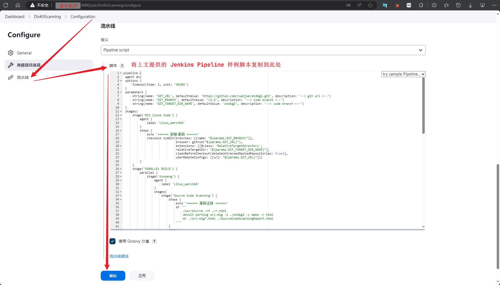

----

### 2. 执行任务

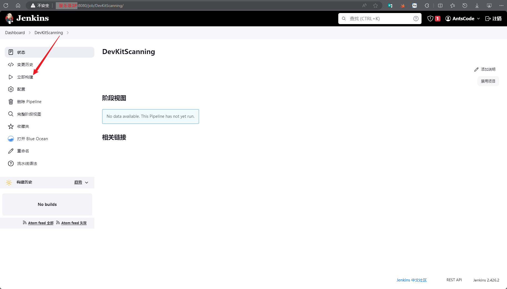

----

### 3. 查看任务执行状态

- ##### 传统方式查看任务执行状态

  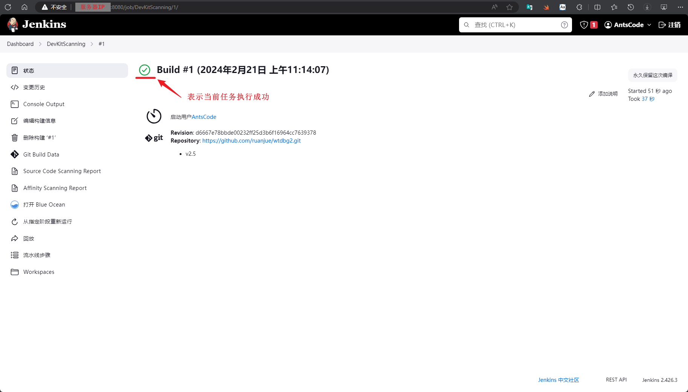

- ##### 现代方式查看任务执行状态

  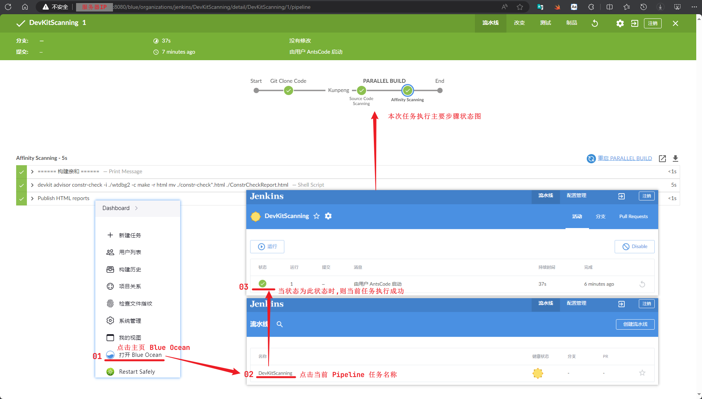


----

### 4. FAQ

当使用 Jenkins **Snippet Generator** 的 **checkout: Check out from version control** 模板时出现下图错误时，可尝试使用以下解决方案。

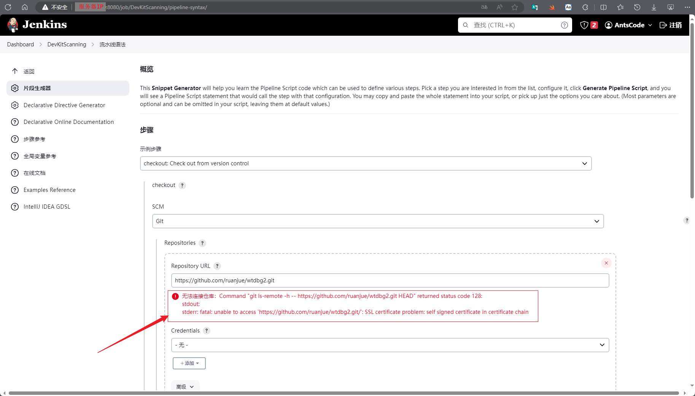

```shell
#=====================================================================================================================#
# Git 忽略证书校验
git config --global http.sslVerify false
#---------------------------------------------------------------------------------------------------------------------#
# 如果您的环境设置了系统网络代理，建议执行以下命令
git config --global http.proxy "${http_proxy}" && git config --global https.proxy "${http_proxy}"
#---------------------------------------------------------------------------------------------------------------------#
# 拷贝当前用户目录下 .gitconfig 文件到 /var/lib/jenkins/
cp "${HOME}"/.gitconfig /var/lib/jenkins/
#---------------------------------------------------------------------------------------------------------------------#
# 修改文件的所属用户及用户组为 jenkins
chown jenkins:jenkins /var/lib/jenkins/.gitconfig
#=====================================================================================================================#
```

------

## 二、查阅报告

### 1. 查阅报告

  **①** 传统方式

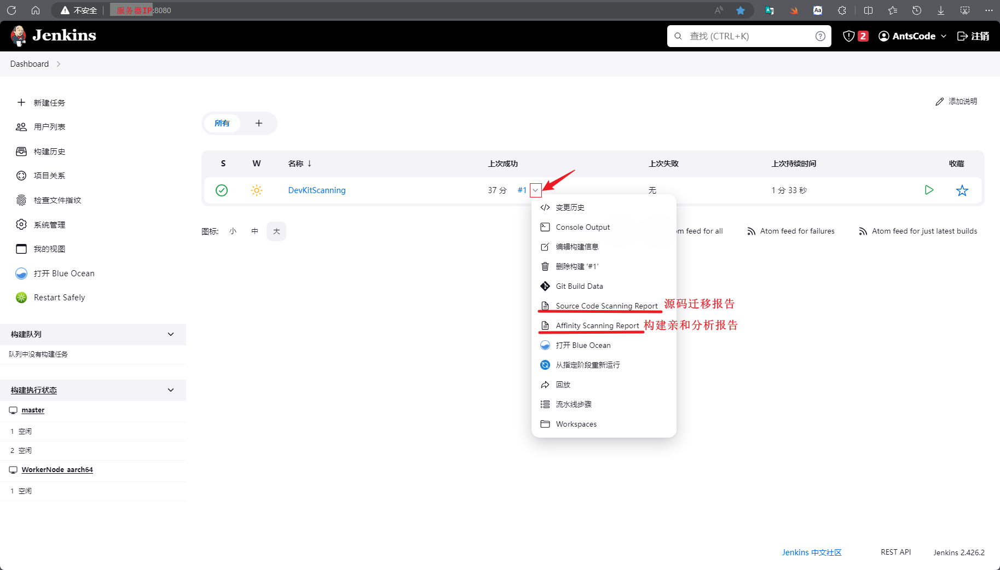

  **②** 现代方式

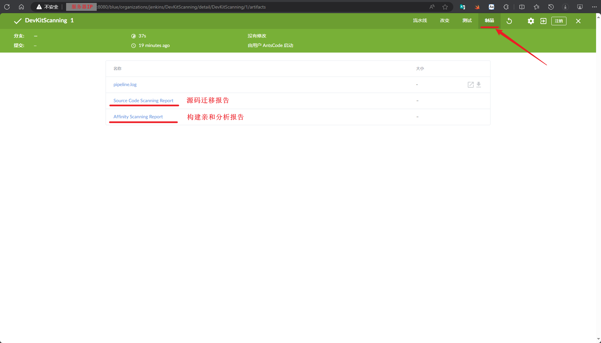

- ##### 源码迁移报告

  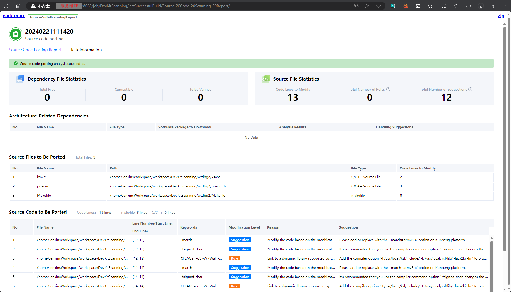

- ##### 构建亲和分析报告

  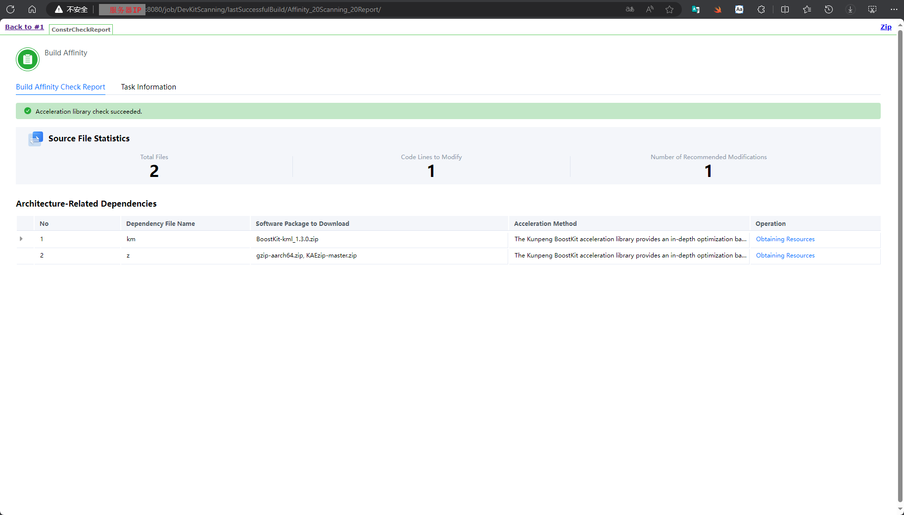

----

### 2. FAQ

> 相关问题根因参考链接：
>
> [https://www.jenkins.io/doc/book/security/user-content/](https://www.jenkins.io/doc/book/security/user-content/)
> [https://www.jenkins.io/doc/book/security/configuring-content-security-policy/](https://www.jenkins.io/doc/book/security/configuring-content-security-policy/)
> [https://content-security-policy.com/](https://content-security-policy.com/)

**当查看报告时，如下图样式显示异常时，可采用以下方案解决此问题。**

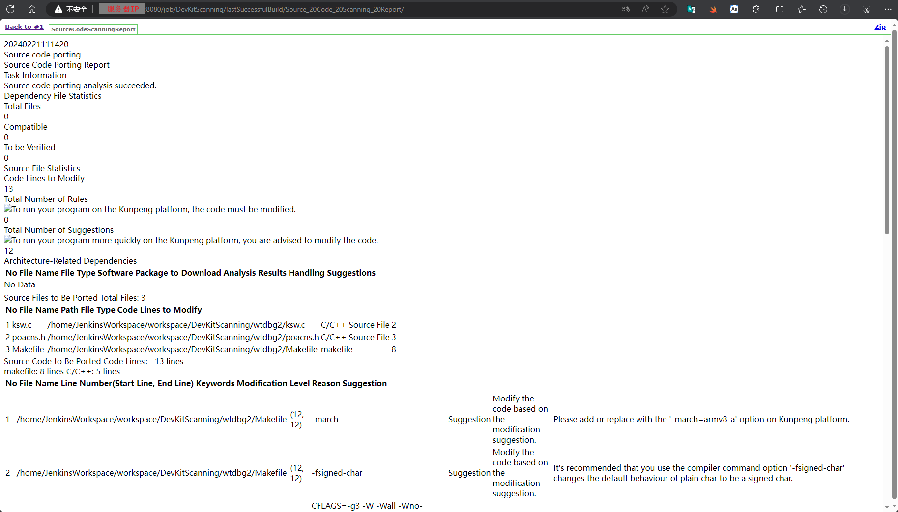

- ##### 临时解决方案(重启后失效)

  ```shell
  System.setProperty("hudson.model.DirectoryBrowserSupport.CSP", "default-src 'none'; script-src 'self' 'unsafe-inline'; style-src 'self' 'unsafe-inline'; img-src 'self' 'unsafe-inline'; data:;")
  ```

  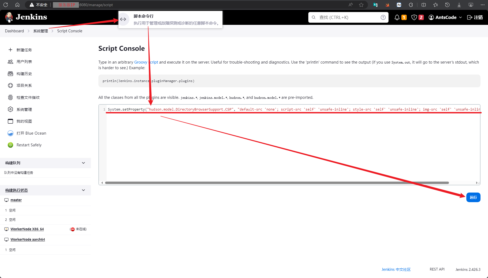

- ##### 永久解决方案(重启后设置继续生效)

  ```shell
  #=====================================================================================================================#
  # 将 /usr/lib/systemd/system/jenkins.service 文件中 Environment="JAVA_OPTS=-Djava.awt.headless=true" 选项进行替换
  sed -i 's/Environment="JAVA_OPTS=-Djava.awt.headless=true"/Environment="JAVA_OPTS=-Djava.awt.headless=true -Dhudson.model.DirectoryBrowserSupport.CSP=\\"default-src \x27none\x27; script-src \x27self\x27 \x27unsafe-inline\x27; style-src \x27self\x27 \x27unsafe-inline\x27; img-src \x27self\x27 \x27unsafe-inline\x27; data:;\\""/g' /usr/lib/systemd/system/jenkins.service
  #---------------------------------------------------------------------------------------------------------------------#
  # 重新加载 systemd 管理器配置
  systemctl daemon-reload
  #---------------------------------------------------------------------------------------------------------------------#
  # 重启 Jenkins 服务
  systemctl restart jenkins.service
  #=====================================================================================================================#
  ```

------
