<center><big><b>《安装部署 Jenkins》</b></big></center>


## 安装 Jenkins

> [Jenkins 离线安装 官方文档](https://www.jenkins.io/doc/book/installing/offline/)
>
> 如需获取目标系统的 Jenkins RPM 或 WAR 离线安装包可前往 [Jenkins mirrors](https://archives.jenkins.io/) 站点获取『推荐获取 **LTS Releases** 发行版』
>
> 例如本文使用的 Jenkins RPM 软件包下载链接 [https://archives.jenkins.io/redhat-stable/jenkins-2.426.2-1.1.noarch.rpm](https://archives.jenkins.io/redhat-stable/jenkins-2.426.2-1.1.noarch.rpm)
>
> 如您需要 Jenkins WAR 包,可前通过以下资源地址下载 [https://archives.jenkins.io/war-stable/2.426.2/jenkins.war](https://archives.jenkins.io/war-stable/2.426.2/jenkins.war)

 ### 1.配置 Jenkins YUM 源

   ```shell
   #=====================================================================================================================#
   # 下载 Jenkis YUM 镜像文件到 /etc/yum.repos.d/ 目录下『离线模式安装请查阅 Jenkins 官方文档』
   wget -O /etc/yum.repos.d/jenkins.repo https://pkg.jenkins.io/redhat-stable/jenkins.repo
   #---------------------------------------------------------------------------------------------------------------------#
   # 导入 Jenkins RPM 安装包校验证书
   rpm --import https://pkg.jenkins.io/redhat-stable/jenkins.io-2023.key
   #---------------------------------------------------------------------------------------------------------------------#
   # 升级系统软件包『可选(若需要执行以下命令,建议执行完后重启您的系统)』
   yum upgrade -y
   #=====================================================================================================================#
   ```

 ### 2.部署 Jenkins

   ```shell
   #=====================================================================================================================#
   # 安装 Jenkins RPM
   yum install jenkins -y
   #---------------------------------------------------------------------------------------------------------------------#
   # 重新加载 systemd 管理器配置
   systemctl daemon-reload
   #---------------------------------------------------------------------------------------------------------------------#
   # 设置开机启动服务并立即启动 jenkins.service
   systemctl --now enable jenkins.service
   #=====================================================================================================================#
   # 防火墙相关设置『可选(请根据实际情况配置您的防火墙,以允许访问 8080 端口)』
   firewall-cmd --permanent --zone=public --add-port=8080/tcp
   firewall-cmd --permanent --zone=public --add-service=http
   # 使用 RPM 安装的方式默认会安装此规则『若采用其他安装方式安装 Jenkins 请参考官方文档配置您的防火墙规则』
   firewall-cmd --permanent --zone=public --add-service=jenkins
   # 重新加载防火墙并保留状态信息
   firewall-cmd --reload
   # 查看防火墙规则设置是否生效
   firewall-cmd --permanent --zone=public --list-all
   #=====================================================================================================================#
   ```
   c43a88c4c6c2ba8eabf474d7555fdc0803dc93a0


 ### 3.Jenkins 初始化设置

   在浏览器端口键入以下地址访问 Jenkins 服务,并根据提示进行 Jenkins 的初始配置 **http://<服务器IP>:8080**

   - 根据提示获取初始密码并登录

     ```shell
     #=====================================================================================================================#
     # 获取初始密码参考命令
     cat /var/lib/jenkins/secrets/initialAdminPassword
     #=====================================================================================================================#
     ```

     填写初始密码,点击 **继续** 按钮

     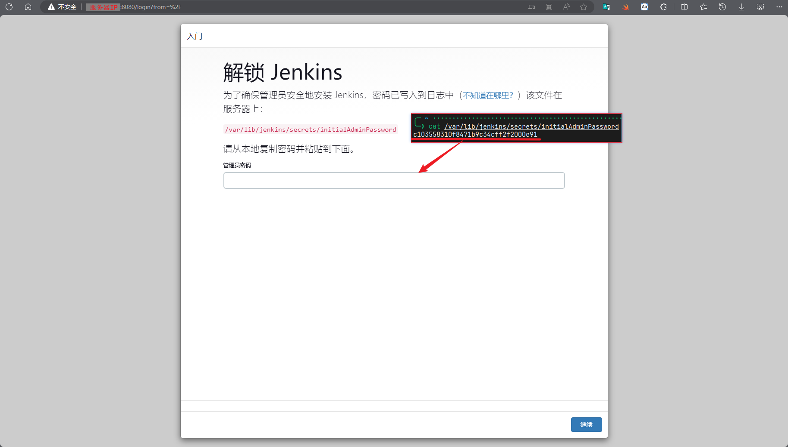

   - 配置代理『【可选】请根据您的网络环境进行设置,如需离线使用可点击 **跳过插件安装** 暂时跳过此步骤 (有关离线安装请查阅 [Jenkins离线安装官方文档](https://www.jenkins.io/doc/book/installing/offline/))』

     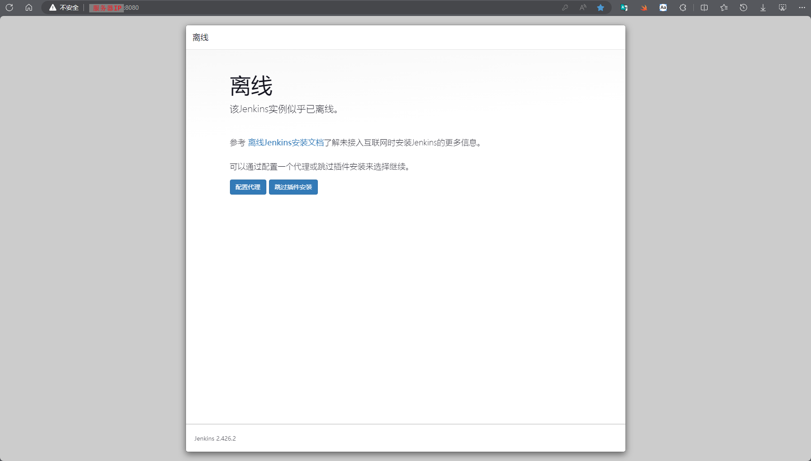

   - 点击 配置代理 按钮进入下图界面配置代理,配置完成后点击 **保存并继续** 按钮

     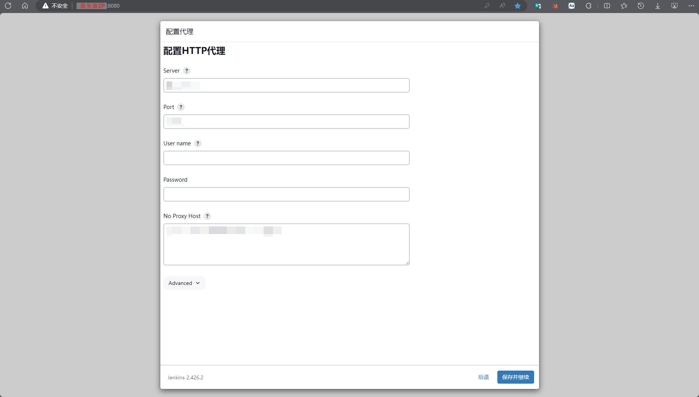

   - 安装推荐的插件『【可选】如您的网络不可用,可跳过以下步骤。点击 **选择插件来安装** 根据提示,跳过安装』

     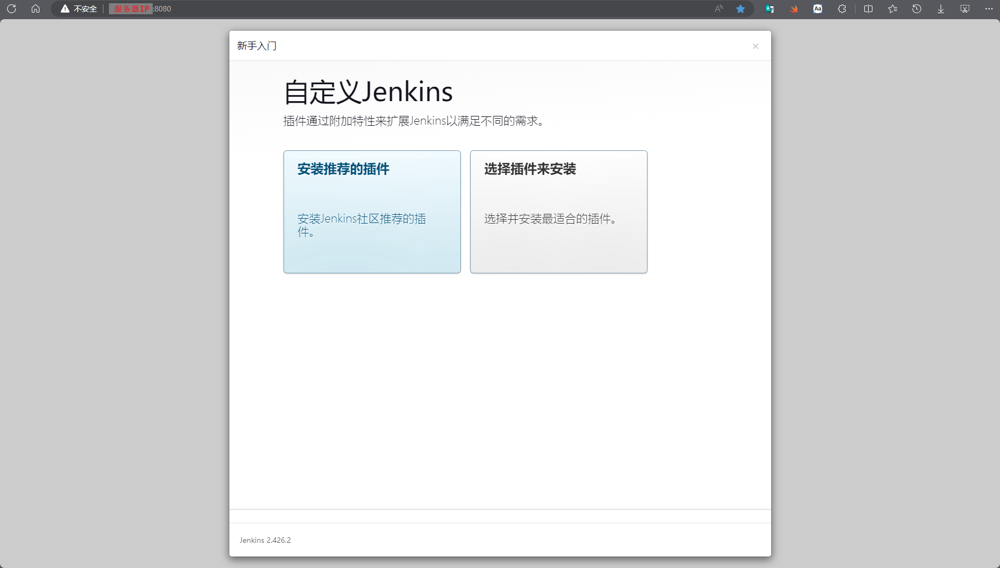

   - 配置管理员用户登录信息『请根据自己的实际需求填写信息,填写完成后请点击 **保存并完成** 按钮』

     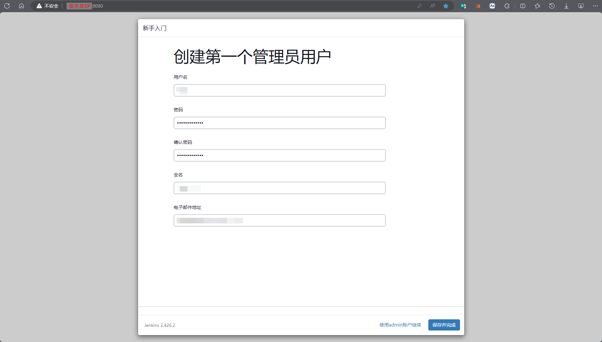

   - Jenkins 实例配置『请根据自己的实际需求填写,此处使用默认设置.填写完成后请点击 **保存并完成** 按钮』

     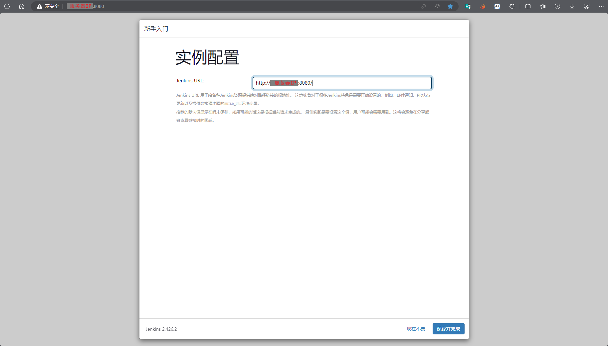

   - Jenkins安装已完成『请点击 **开始使用Jenkins** 按钮』

     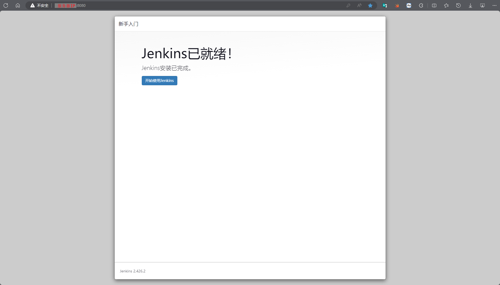

### 4.Jenkins 基础插件安装『插件的离线安装方式请访问插件主页下载符合目标要求的插件安装包 (.hpi)』

   > 有关 Jenkins 插件管理请阅读以下文章： [管理插件 (jenkins.io)](https://www.jenkins.io/doc/book/managing/plugins/)

   - #### 安装 [Blue Ocean](https://plugins.jenkins.io/blueocean/) 插件『可选 (以更直观的的方式查看 pipeline 状态)』

     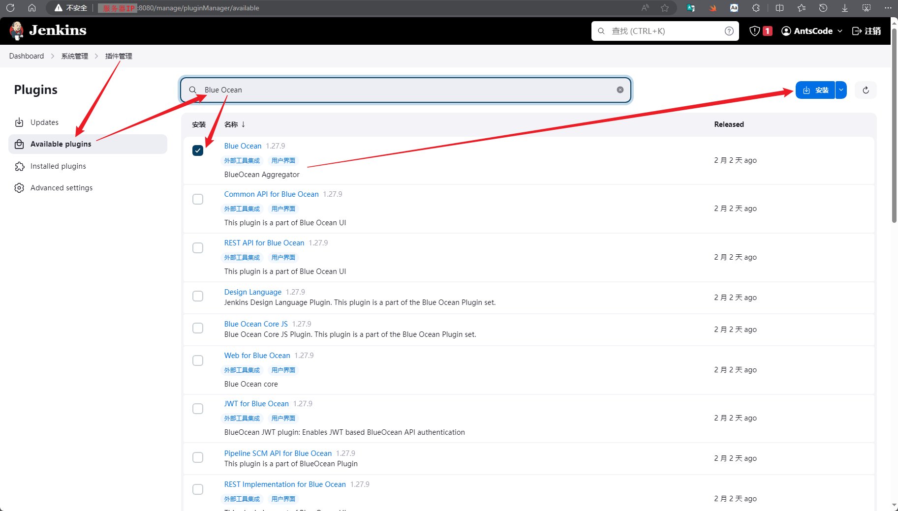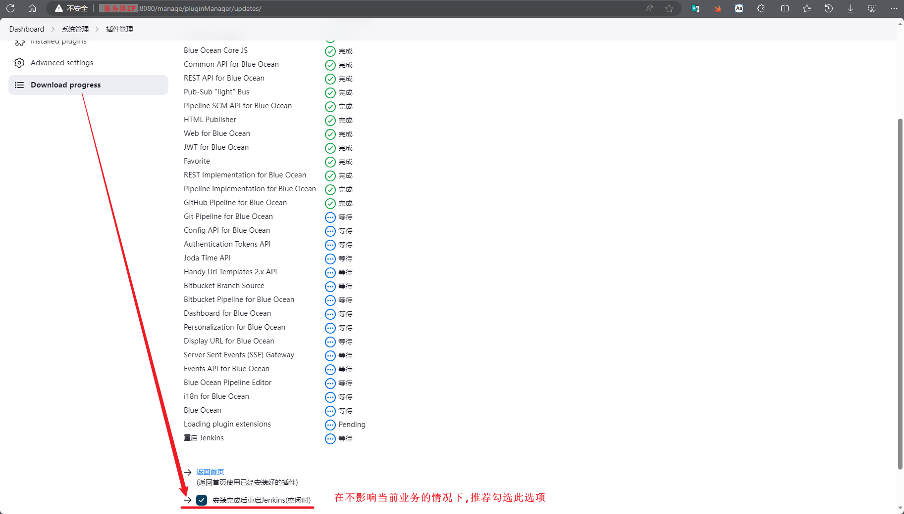

   - #### 安装 [Safe Restart](https://plugins.jenkins.io/saferestart/) 插件『可选 (安全重启 Jenkins)』

     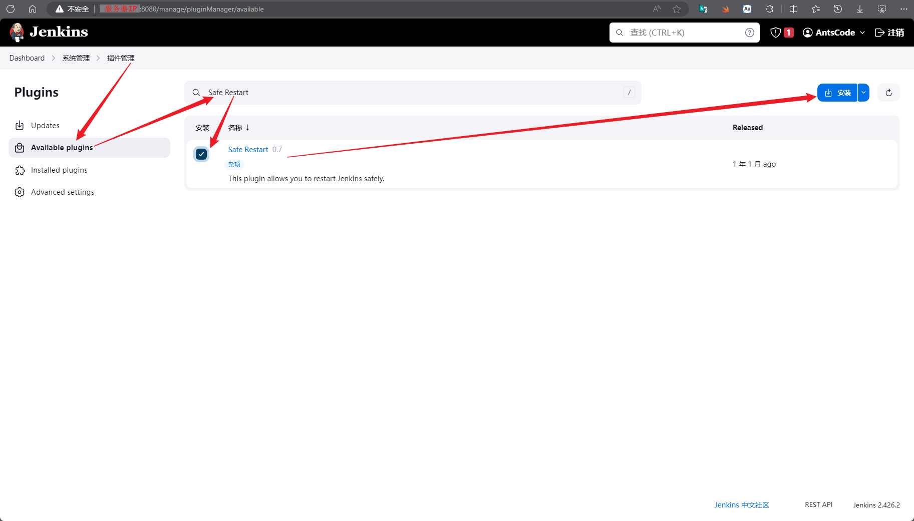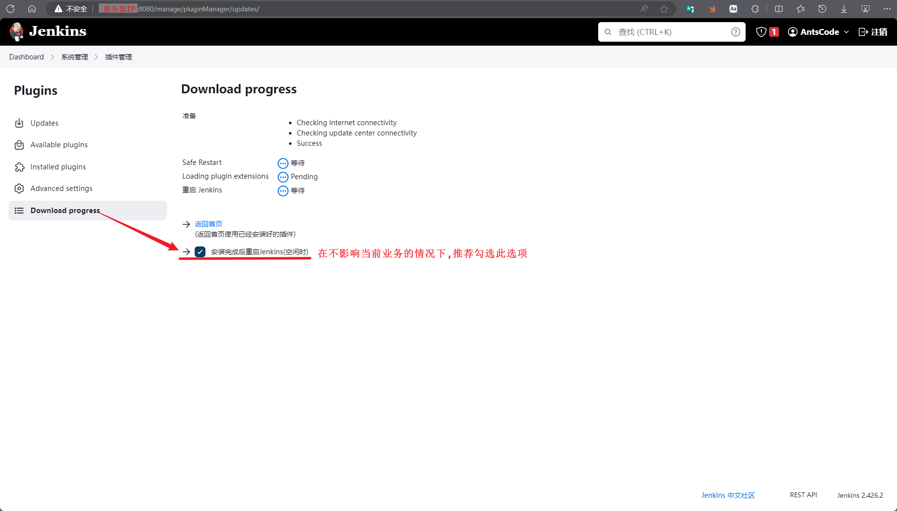


## 将各个执行机添加至Jenkins集群

 ### 1.凭证设置
  添加凭据域

   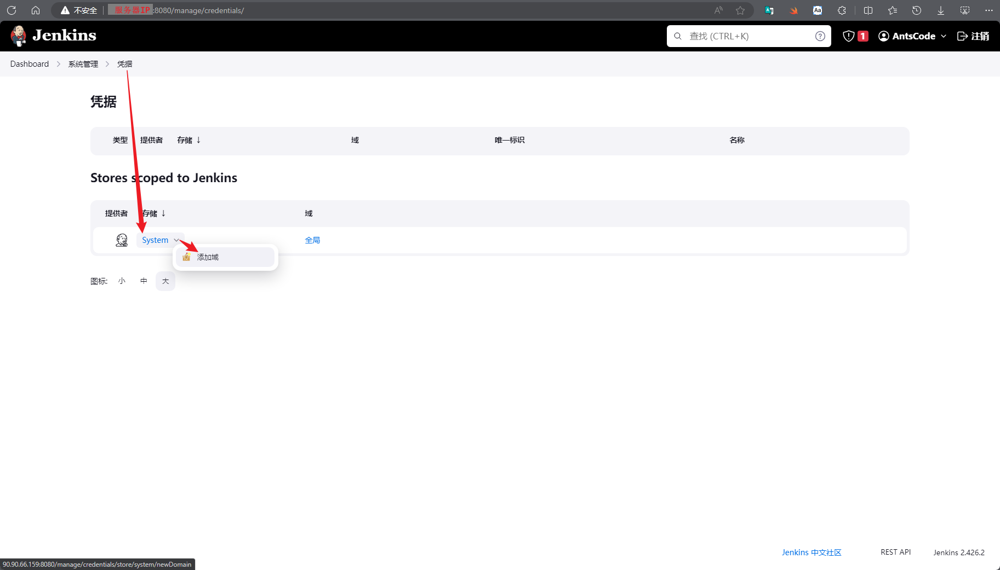
   域名和描述按需输入，便于识别和管理即可
   

   添加凭据到凭据域下

   


   在 DevKit 凭据域下添加 aarch64 Jenkins 工作节点 SSH 凭据

   ```shell
   #=====================================================================================================================#
   # 在安装了 Jenkins 的环境上生成工作节点 SSH 免密登录证书『请根据实际需求设置 SSH key passphrases』
   ssh-keygen -b 4096 -C "<邮件地址或其他标签>" -f ~/.ssh/id_ed25519_<推荐按照 *_*_*_* 格式填写目标服务器IP,便于管理 KEY> -t ed25519
   #---------------------------------------------------------------------------------------------------------------------#
   # 在安装了 Jenkins 的环境上将生成的证书的公钥上传至目标服务器『请根据提示输入目标服务器对应账户密码』
   ssh-copy-id -i ~/.ssh/id_ed25519_<推荐按照 *_*_*_* 格式填写目标服务器IP,便于管理 KEY>.pub root@<目标服务器IP>
   #---------------------------------------------------------------------------------------------------------------------#
   # 删除已知主机名文件中属于指定主机名的所有密钥
   ssh-keygen -R <目标服务器IP>
   #---------------------------------------------------------------------------------------------------------------------#
   # 使用 SSH key 测试连接目标主机『如果您设置了 SSH key passphrases,请在连接目标主机时根据提示输入证书密码』
   ssh -o IdentitiesOnly=yes -o PasswordAuthentication=no -i ~/.ssh/id_ed25519_<推荐按照 *_*_*_* 格式填写目标服务器IP,便于管理 KEY> -l root -p 22 <目标服务器IP>
   #---------------------------------------------------------------------------------------------------------------------#
   # 查看 SSH key 私钥
   cat ~/.ssh/id_ed25519_<推荐按照 *_*_*_* 格式填写目标服务器IP,便于管理 KEY>
   #=====================================================================================================================#
   ```

   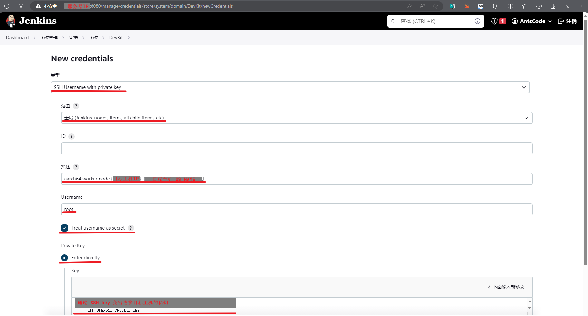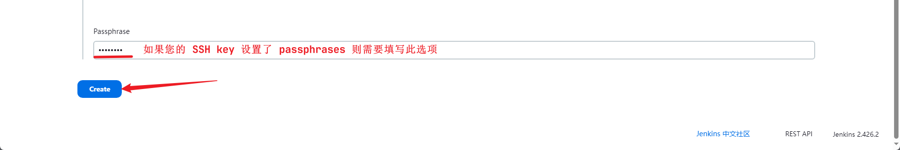

 ### 2. 工作节点设置

   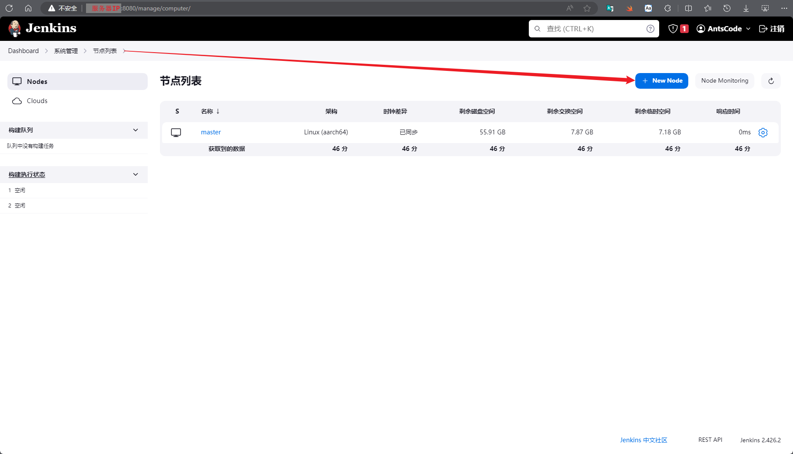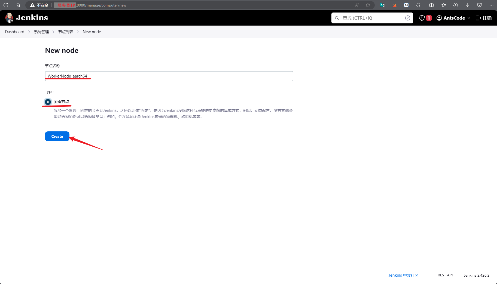


   |  配置项 | 配置说明  |
| ------------ | ------------ |
| 名字  |  与节点名称保持一致 |
| 描述  |  按需填写,便于管理标识和即可，如aarch64node(ip)openeuler22.03 |
| Number of executors  |  默认为1 |
| 远程工作目录  |  /home/JenkinsWorkspace/ |
| 标签  | 流水线脚本中根据标签来选取执行机，可以打多个标签，用空格隔开，标签需要以kunpeng_为前缀，如kunpeng_scanner kunpeng_builder kunpeng_executor  |
| 用法  | Only build jobs with label expressions matching this node  |
| 启动方式  |  Launch agents via SSH |
| 主机  | 节点IP  |
| Credentials  | 已添加的凭据  |
| Host Key Verification Strategy  | Known hosts file Verification Strategy  |
| 可用性  |  Keep this agent online as much as possible |
| 节点属性(可选) | 若需要配置环境变量可选择Environment variables  |

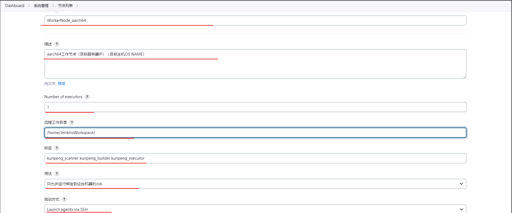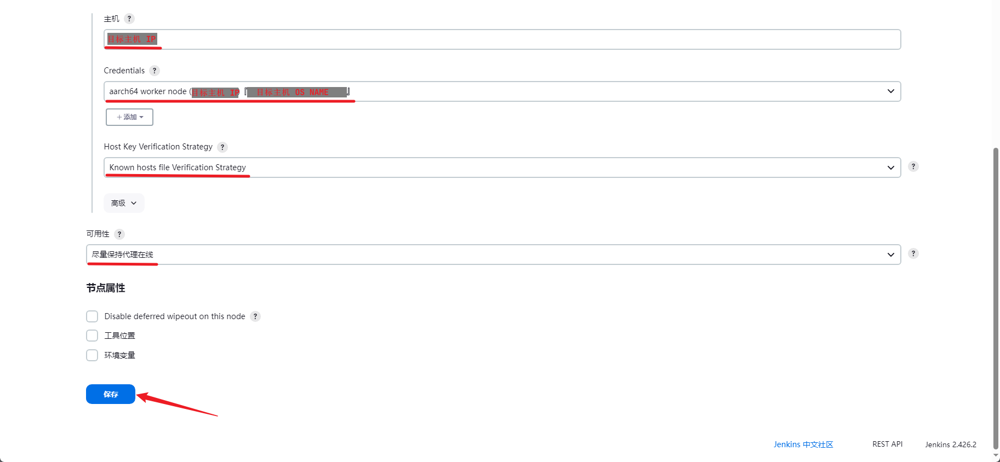

 ### 3.FAQ

   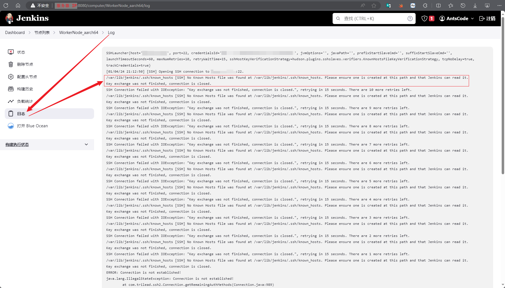

   > 当 Jenkins 工作节点连接不上时,且查看日志如上图所示时请考虑通过以下解决方案解决此问题。
   >
   > 有关 Jenkins 工作节点连接错误的问题可参考以下文章中 poddingue 的解答：[https://community.jenkins.io/t/node-connection-error/6082](https://community.jenkins.io/t/node-connection-error/6082)

   - 临时断开节点

     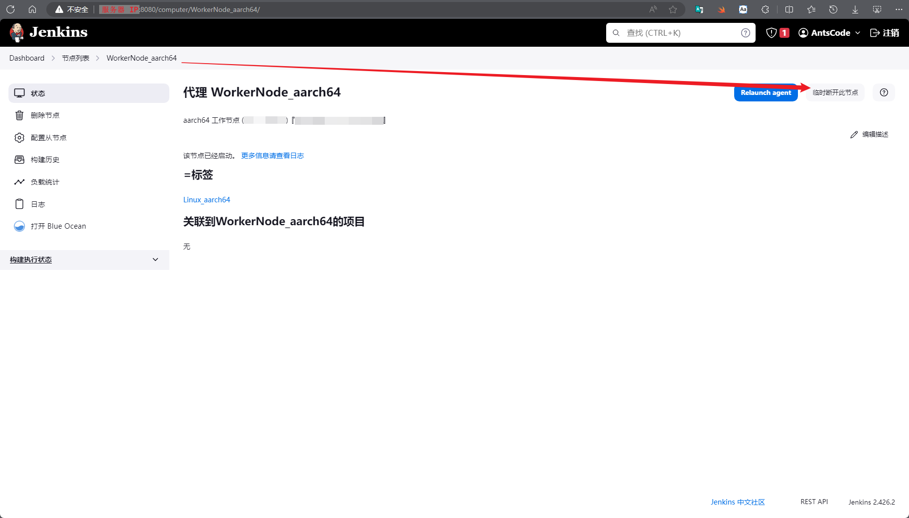

   - 在安装 Jenkins 服务的设备上配置 /var/lib/jenkins/.ssh/known_hosts

     ```shell
     #=====================================================================================================================#
     # 创建目标 /var/lib/jenkins/.ssh 目录
     mkdir -p /var/lib/jenkins/.ssh
     #---------------------------------------------------------------------------------------------------------------------#
     # 新建 known_hosts 文件
     touch /var/lib/jenkins/.ssh/known_hosts
     #---------------------------------------------------------------------------------------------------------------------#
     # 修改 known_hosts 文件权限为 600
     chmod 600 /var/lib/jenkins/.ssh/known_hosts
     #---------------------------------------------------------------------------------------------------------------------#
     # 将远程主机的 SSH 主机密钥添加到 known_hosts 文件中
     ssh-keyscan <目标服务器IP> >> /var/lib/jenkins/.ssh/known_hosts
     #---------------------------------------------------------------------------------------------------------------------#
     # 修改文件夹下所有文件的所属用户及用户组为 jenkins
     chown -R jenkins:jenkins /var/lib/jenkins/.ssh
     #=====================================================================================================================#
     ```

   - 重新连接节点

     

   - 节点连接成功后如下图所示

     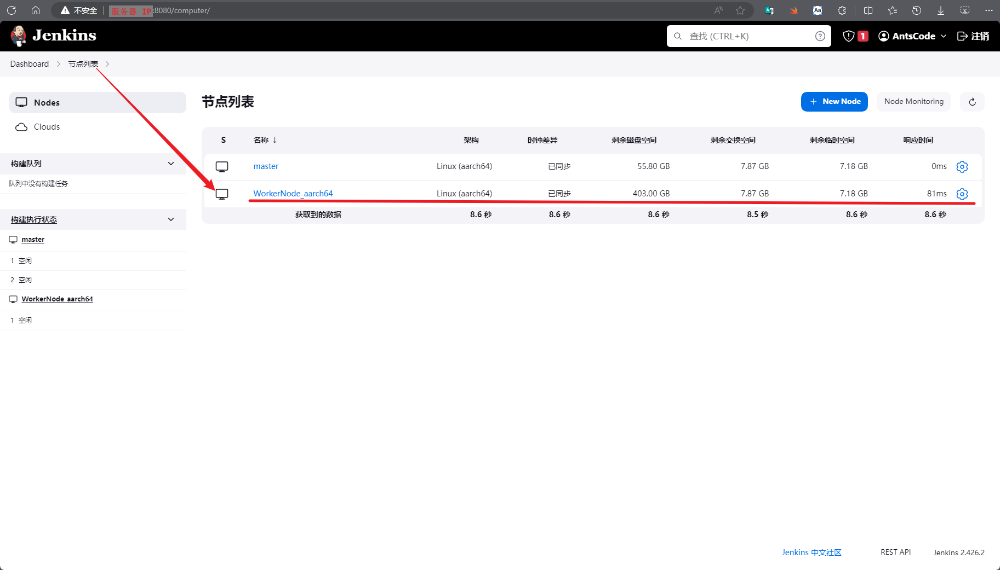

## 3. 修改CSP策略从而保证html功能正常
  ### 原因
  jenkins中使用htmlpublisher来显示报告，由于默认的CSP策略限制，会导致html功能异常
  ### 1. 修改方式
  需要通过执行以下命令修改CSP策略
  System.setProperty("hudson.model.DirectoryBrowserSupport.CSP","script-src 'self' 'unsafe-inline';style-src 'self' 'unsafe-inline';img-src 'self' data:;")

  上面的值为cli报告能正常显示的最小集，如果其他功能也需要修改该配置，可以取相应值的并集，也可以设置值为空字符串（但可能会有安全风险，不推荐）
  
  ### 2. 手动临时修改（重启jenkins后失效，需要再次手动执行命令）
  进入系统管理 -> 脚本命令行
  
  
  在输入框中添加命令后，点击运行即可（Result中的内容为修改前的值，可以再次点击运行查看是否修改成功）
  
  修改后查看cli报告即可(对修改前创建的报告同样有效，若仍然无效，可能等待1~2分钟后重试)

  ### 3. 永久自动修改（启动时自动执行）
  1. 安装依赖
  需要安装groovy、startup trigger插件
  离线安装地址：
  groovy: [Groovy|Jenkins plugin](https://plugins.jenkins.io/groovy/releases/)
  startup-trigger: [Startup Trigger|Jenkins plugin](https://plugins.jenkins.io/startup-trigger-plugin/releases/)
  
  
  2-1. 新建一个Job
  

  2-2. 选择在jenkins启动后执行
  

  2-3. 构建步骤添加 Execute system Groovy script (注意不是Execute Groovy script)，填写脚本并授权
  
  

  2-4. 点击保存即可，可以手动触发一次job，后续jenkins重启后会自动执行