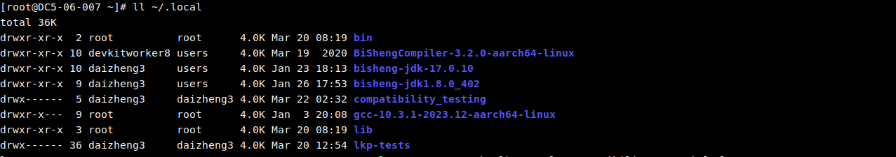
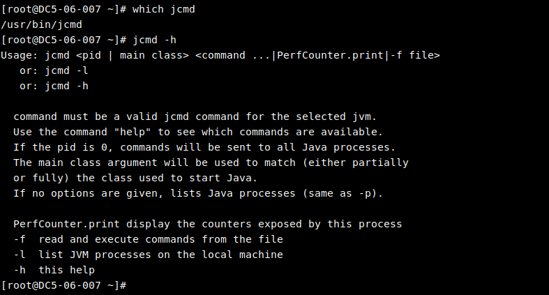
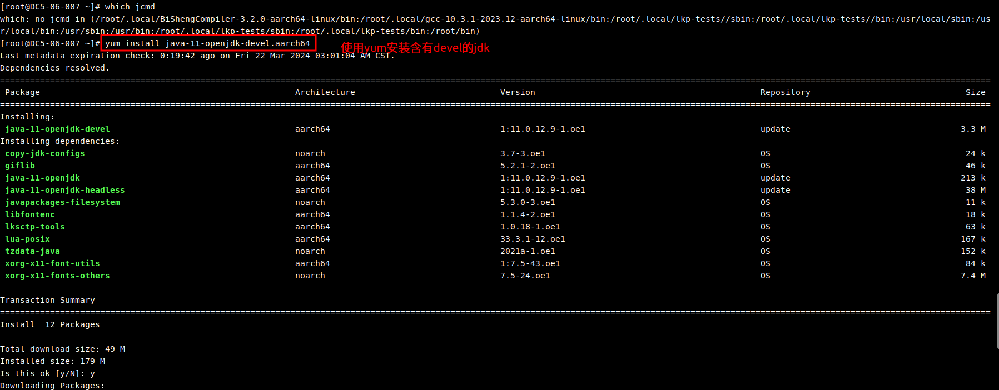
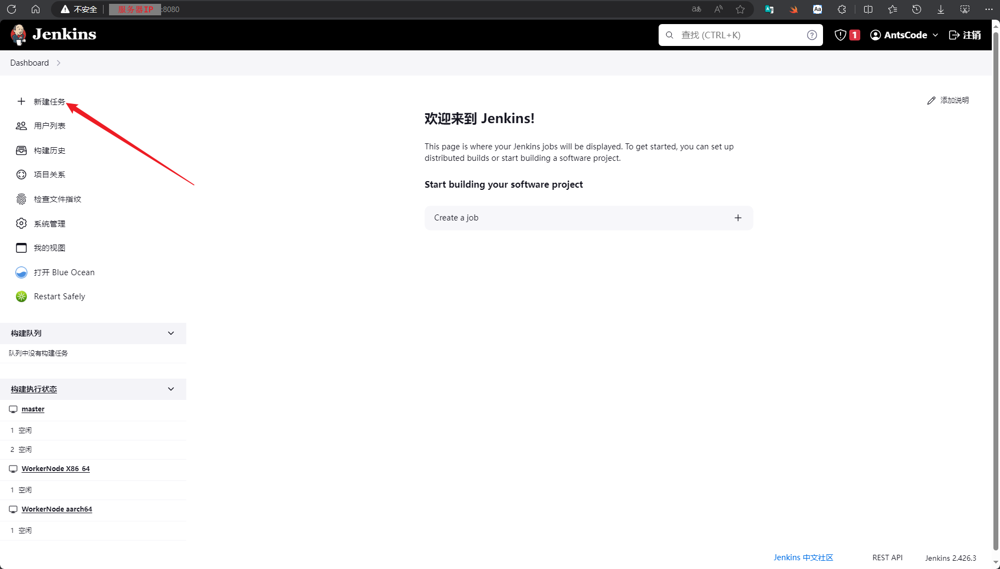
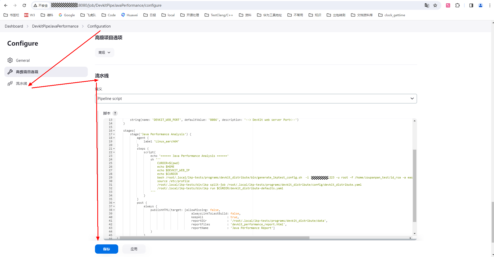
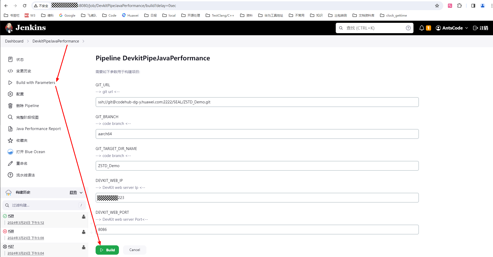
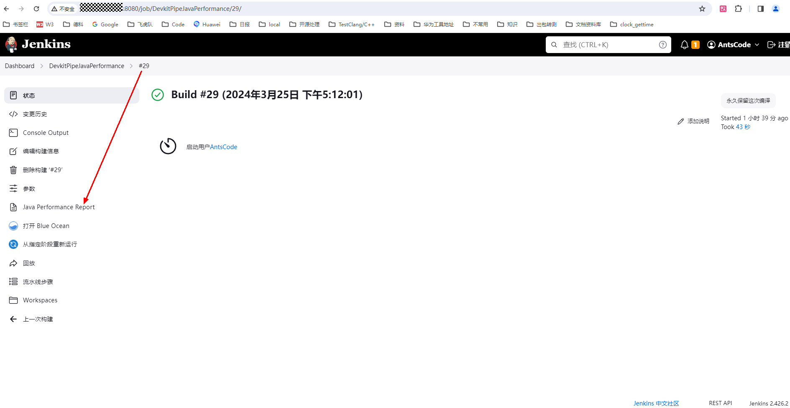
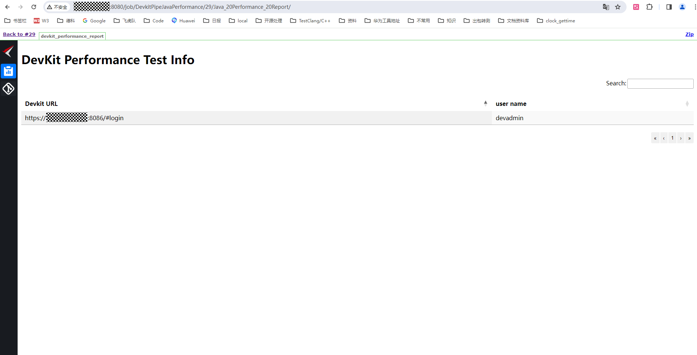

## Jenkins Pipeline 中集成 Java性能分析

### 一. Java性能分析

##### 源码迁移：

```groovy

stage('Java Performance Analysis') {
    steps {
        echo '====== Java Performance Analysis ======'
        sh '''
            set -e
            CURDIR=$(pwd)
            sudo bash /root/.local/lkp-tests/programs/devkit_distribute/bin/generate_lkptest_config.sh -i 160.0.1.2,160.0.1.3 -u root -f /home/Jenkens/id_rsa -D 160.0.1.5 -a spring-boot -d 10 -g /home/Jenkens/spring-boot
            source /etc/profile
            sudo /root/.local/lkp-tests/bin/lkp split-job /root/.local/lkp-tests/programs/devkit_distribute/config/devkit_distribute.yaml
            sudo bash /root/.local/lkp-tests/programs/devkit_distribute/bin/parsing_result.sh
            sudo /root/.local/lkp-tests/bin/lkp run ${CURDIR}/devkit_distribute-defaults.yaml
        '''
    }
    post {
        always {
            publishHTML(target: [allowMissing: false,
                        alwaysLinkToLastBuild: false,
                        keepAll              : true,
                        reportDir            : '/root/.local/lkp-tests/programs/devkit_distribute/data',
                        reportFiles          : 'devkit_performance_report.html',
                        reportName           : 'Java Performance Report']
                        )
        }
    }
}
```

```
stages:  
  - build    
  - test
  - deploy

source-code-migration:
  stage: build
  tags:
    - kunpeng_builder # 对应gitlab-runner注册时的标签，可选择多个
  script:
    - echo '====== Java Performance Analysis ======'
    - CURDIR=$(pwd)
    # 设置java性能采集必要的选项
    - sudo bash /root/.local/lkp-tests/programs/devkit_distribute/bin/generate_lkptest_config.sh -i 160.0.1.2,160.0.1.3 -u root -f /home/Jenkens/id_rsa -D 160.0.1.5 -a spring-boot -d 10 -g /home/Jenkens/spring-boot -j "sh /home/test/apache-jmeter-5.6.3/bin/jmeter.sh -nt /home/test/Test_request.jmx -l /home/test/result.html -eo /home/test/report"
    - source /etc/profile
    - sudo /root/.local/lkp-tests/bin/lkp split-job /root/.local/lkp-tests/programs/devkit_distribute/config/devkit_distribute.yaml
    - sudo bash /root/.local/lkp-tests/programs/devkit_distribute/bin/parsing_result.sh
    - sudo /root/.local/lkp-tests/bin/lkp run ${CURDIR}/devkit_distribute-defaults.yaml
    - cp /root/.local/lkp-tests/programs/devkit_distribute/data/devkit_distribute-defaults.yaml ${CURDIR}
  artifacts:
    paths:
      - devkit_distribute-defaults.yaml  # 文件后缀.html
      name: Java_Performance_Report

```

**generate_lkptest_config**脚本具体参数如下

| 参数 | 参数类型      | 参数说明                                                                                                                                   |
|----|-----------|----------------------------------------------------------------------------------------------------------------------------------------|
| -i | ipv4,ipv4 | 必选参数。需要采集的目标程序所在的服务器地址， 多个使用逗号隔离                                                                                                       |
| -u | str       | 必选参数。服务器的用户名                                                                                                                           |
| -f | str       | 必选参数。执行机免密登陆所有服务器（-i指定的）的私钥路径                                                                                                          |
| -a | str       | 必选参数。需要采集的应用名称，多个采用逗号隔离                                                                                                                |
| -g | str       | 必选参数。执行机上通过git clone下载的代码路径                                                                                                            |
| -j | str       | 可选参数。jmeter执行命令。例如 bash /opt/apache-jmeter-5.6.3/bin/jmeter.sh -nt /home/xxx/Request.jmx -l /home/xxx/result.html -eo /home/xxx/report |
| -d | num       | 可选参数。任务采集执行时间，默认43200s（12 hour），当存在-j参数时，jmeter结束或者到达采集执行时间，结束采集。                                                                      |
| -D | ipv4      | 必选参数。Devkit工具的地址。                                                                                                                      |
| -P | num       | 可选参数。Devkit工具的端口，默认值8086。                                                                                                              |
| -U | str       | 可选参数。Devkit工具的用户名，默认值devadmin。                                                                                                         |
| -W | str       | 可选参数。Devkit工具的密码，默认值admin100。                                                                                                          |

### 二. 配置示例

#### 1. 安装java分发采集命令行工具到执行jenkins执行机

[通过devkitpipeline部署工具部署](../../document/%E6%89%B9%E9%87%8F%E9%83%A8%E7%BD%B2%E5%B7%A5%E5%85%B7/%E6%89%B9%E9%87%8F%E9%83%A8%E7%BD%B2%E5%B7%A5%E5%85%B7%E5%92%8C%E4%B8%80%E9%94%AE%E4%B8%8B%E8%BD%BD%E5%B7%A5%E5%85%B7%E8%AF%B4%E6%98%8E%E6%96%87%E6%A1%A3.md#devkitpipeline-%E6%89%B9%E9%87%8F%E9%83%A8%E7%BD%B2%E5%B7%A5%E5%85%B7)

安装完成后查看



#### 2. 确定需要采集的java程序所在机器存在jcmd命令

##### 2.1 检查jcmd命令是否存在



##### 2.2 安装jcmd命令



#### 3. 配置流水线




----

#### 4. 执行任务



----

#### 5. 查看任务执行状态和报告

##### 查看任务执行状态和报告位置



##### 具体报告


 