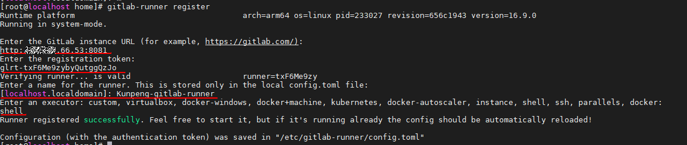

<p style="text-align: center;font-size: 32px">
<strong>安装部署 gitlab Runner</strong>
</p>

#### 1.下载gitlab Runner安装包

```
wget https://mirrors.tuna.tsinghua.edu.cn/gitlab-runner/yum/el7-aarch64/gitlab-runner-16.9.0-1.aarch64.rpm

# 也可在 https://mirrors.tuna.tsinghua.edu.cn/ 或 https://gitlab-runner-downloads.s3.amazonaws.com/latest/index.html中下载符合自己环境的gitlab Runer安装包，这里以gitlab-runner-16.9.0-1.aarch64.rpm为例，进行手动下载后传至服务器
```

#### 2.安装gitlab Runner安装包

```
yum install -y git tar 
rpm -ivh gitlab-runner-16.9.0-1.aarch64.rpm
```
#### 3.指定gitlab-runner

```
useradd Kunpeng_staff
gitlab-runner uninstall
gitlab-runner install --working-directory /home/Kunpeng_staff --user Kunpeng_staff

```
#### 4.启动gitlab-runner


```
systemctl daemon-reload                   #重新加载配置
systemctl start gitlab-runner             #启动服务
systemctl enable gitlab-runner            #设置开机启动
systemctl restart gitlab-runner           #重启服务
```
#### 4.查看gitlab-runner

```
systemctl status gitlab-runner
```
成功启动如下图所示
 

#### 5.设置权限

```
chown -R Kunpeng_staff.Kunpeng_staff /home/gitlab-runner
```
#### 6.gitlab runner注册服务
登录gitlab，在管理中心Runner中新建一个runner
 
标签多个时用逗号隔开，只可为kunpeng_scanner, kunpeng_builder, kunpeng_executor，
其他选项按需填写
 
根据所示url，token去gitlab-runner环境注册
 
运行 gitlab-runner register，参数如图根据实际情况填写，注册成功后会显示Runner registered successfully
 
点击进入runners页面
 
 
