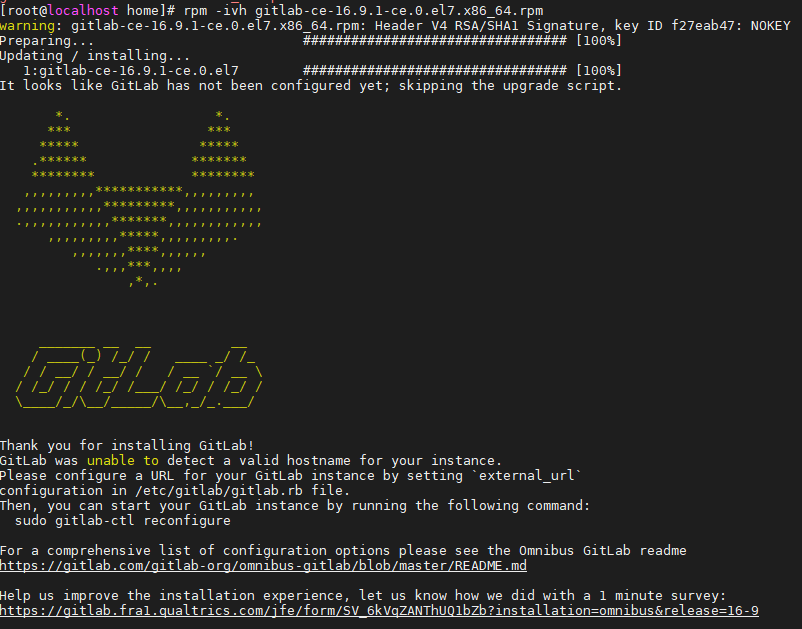
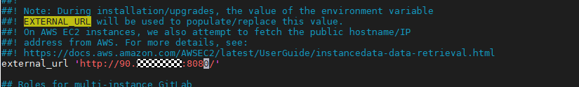
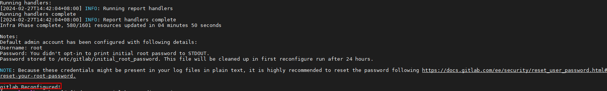
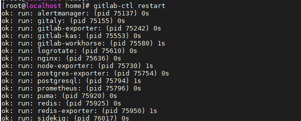
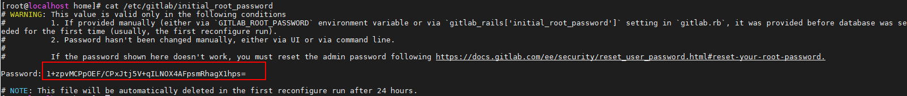
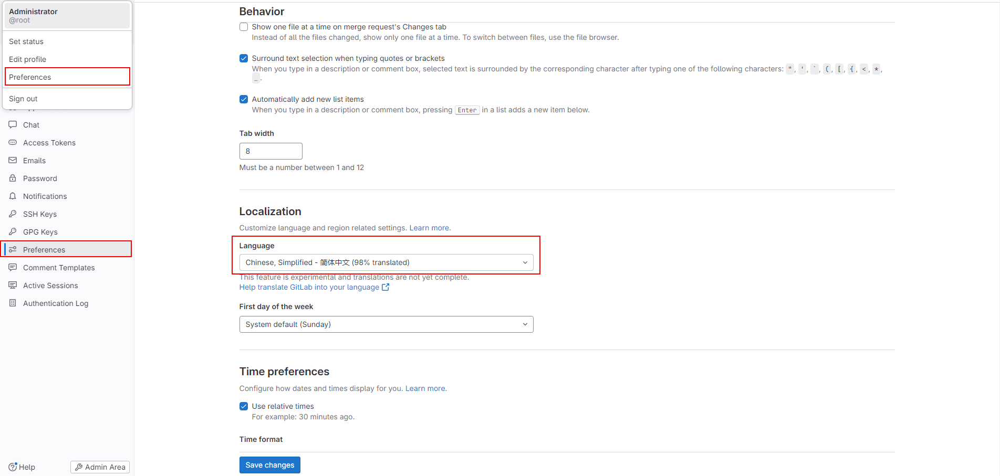
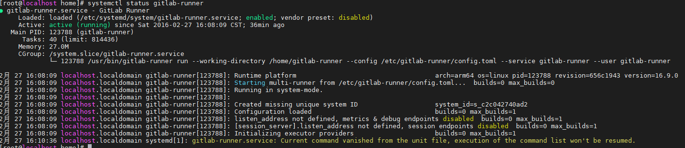
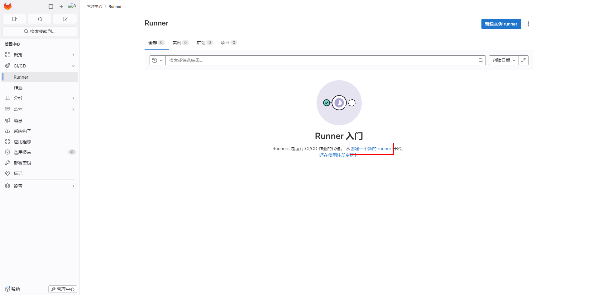
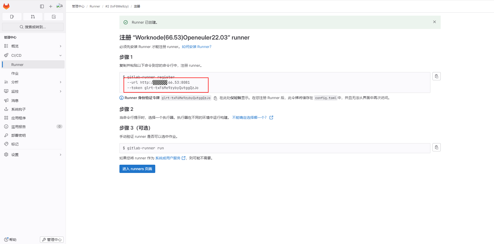
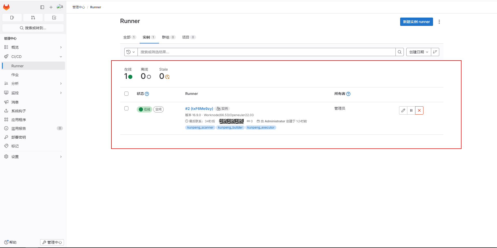

<p style="text-align: center;font-size: 32px">
<strong>安装部署 gitlab</strong>
</p>

## 1. gitlab 配置

#### 1.下载gitlab安装包

```
wget https://mirrors.tuna.tsinghua.edu.cn/gitlab-ce/yum/el7/gitlab-ce-16.9.1-ce.0.el7.x86_64.rpm
```

#### 2.安装gitlab

```
yum install -y git tar policycoreutils-python openssh-server
rpm -ivh gitlab-ce-16.9.1-ce.0.el7.x86_64.rpm
```


安装成功会有如下信息：
 

#### 3.修改IP端口

编辑gitlab配置文件

```
vi /etc/gitlab/gitlab.rb
```

修改对外访问的Ip端口：

```
external_url 'http://localhost:8081' # 修改成 http://实际ip:需要访问的端口
```

 

```
设置的端口不能被占用，如设置的端口已经使用，请自定义其它端口，并在防火墙设置开放范围内的端口
a.    执行systemctl status firewalld命令查看服务器OS防火墙的状态。如果防火墙已开启（active），执行如下操作开通防火墙端口；如果防火墙没有开启（inactive），请跳过以下步骤。
b.    执行firewall-cmd --query-port=8081/tcp命令查看端口是否开通，提示“no”表示端口未开通。
c.    执行firewall-cmd --add-port=8081/tcp --permanent命令永久开通端口，提示“success”表示开通成功。
d.    执行firewall-cmd --reload命令重新载入配置。
e.    再次执行firewall-cmd --query-port=8081/tcp命令查看端口是否开通，提示“yes”表示端口已开通。
```

#### 4.重新加载配置

```
gitlab-ctl reconfigure     #重新生成相关配置文件，执行此命令时间比较长
```

 

#### 5.配置gitlab开机自动启动

```
systemctl enable gitlab-runsvdir.service
systemctl start gitlab-runsvdir.service
# 关闭gitlab的自动启动命令：systemctl disable gitlab-runsvdir.service
```

#### 6.启动gitLab

```
gitlab-ctl restart      
```

启动成功会有如下信息
 

#### 7.查看 gitlab 版本

```
cat /opt/gitlab/embedded/service/gitlab-rails/VERSION # 回显应为16.9.1
```

#### 8.页面访问 gitlab

```
http://ip:8081/ # 端口根据个人配置进行更改
```

 

#### 9.登录 gitlab

默认账户名是root,密码存放在配置文件 /etc/gitlab/initial_root_password

 

#### 10.设置为简体中文

先登录gitLab，登录成功后，在gitlab后台的系统设置里配置简体中文。

 
完成后刷新页面即可

 

## 2. 安装部署 gitlab Runner

#### 1.下载gitlab Runner安装包

```
wget https://mirrors.tuna.tsinghua.edu.cn/gitlab-runner/yum/el7-aarch64/gitlab-runner-16.9.0-1.aarch64.rpm

# 也可在 https://mirrors.tuna.tsinghua.edu.cn/ 或 https://gitlab-runner-downloads.s3.amazonaws.com/latest/index.html中下载符合自己环境的gitlab Runer安装包，这里以gitlab-runner-16.9.0-1.aarch64.rpm为例，进行手动下载后传至服务器
```

#### 2.安装gitlab Runner安装包

```
yum install -y git tar 
rpm -ivh gitlab-runner-16.9.0-1.aarch64.rpm
```
#### 3.指定gitlab-runner

```
gitlab-runner uninstall
mkdir /home/Kunpeng_staff
gitlab-runner install --working-directory /home/Kunpeng_staff --user root

# 若想指定用户运行
useradd Kunpeng_staff 
gitlab-runner install --working-directory /home/Kunpeng_staff --user Kunpeng_staff
```
#### 4.启动gitlab-runner


```
systemctl daemon-reload                   #重新加载配置
systemctl start gitlab-runner             #启动服务
systemctl enable gitlab-runner            #设置开机启动
systemctl restart gitlab-runner           #重启服务
```
#### 5.查看gitlab-runner

```
systemctl status gitlab-runner
```
成功启动如下图所示
 

#### 6.设置权限

```
chown -R root.root /home/gitlab-runner
# 指定单一时用户运行
chown -R Kunpeng_staff.Kunpeng_staff /home/gitlab-runner
```
#### 7.gitlab runner注册服务
登录gitlab，在管理中心Runner中新建一个runner
 
标签多个时用逗号隔开，只可为kunpeng_scanner, kunpeng_c_cpp_builder, kunpeng_java_builder, kunpeng_executor
其他选项按需填写
 
根据所示url，token去gitlab-runner环境注册
 
点击进入runners页面
 
 
#### 8.脚本配置指导
创建或者导入项目，进入项目后，在目录中选择构建，在流水线编辑器中编辑
毕昇编译器调用示例：
在流水线脚本中在某一步骤需要调用毕昇编译器进行编译时,以目标文件为”/opt/test.c“文件为例。

```
stages:          
  - build

clang_job:
  stage: build
  tags:
    - kunpeng_scanner #对应gitlab-runner注册时的标签，可选择多个
  script:
    - /root/BiShengCompiler-3.2.0-aarch64-linux/bin/clang /opt/test.c -o 输出路径 #所在机器上应保障已安装毕昇编译器,路径根据视情况填写
  
```
GCC for openEuler调用示例：
在流水线脚本中在某一步骤需要调用GCC for openEuler进行编译时,以目标文件为”/opt/test.c“文件为例。

```
stages:          
  - build

gcc_job:
  stage: build
  tags:
    - kunpeng_scanner #对应gitlab-runner注册时的标签，可选择多个
  script:
    - /root/gcc-10.3.1-2023.12-aarch64-linux/bin/gcc /opt/test.c -o 输出路径 #所在机器上应保障已安装GCC for openEule,路径根据视情况填写


