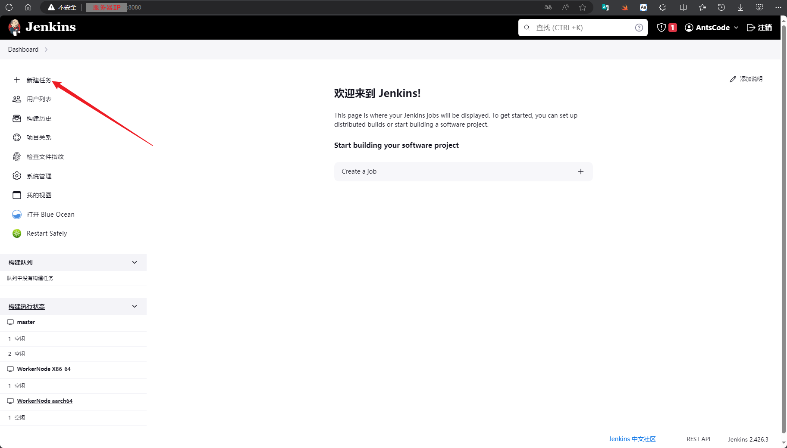

<center><big><b>《devkit 测试平台安装使用以及与Jenkins集成部署指导手册》</b></big></center>


------
测试平台使用的是lkp test 工具，以下均已lkp test描述测试平台
## 一、lkp test 添加测试用例介绍
### 样例
如下目录中的文件，完整的添加了一个典型的测试用例memtier:

```
programs/memtier/jobs/memtier-dcpmm.yaml	# 在job YAML里指定想跑的programs/params
programs/memtier/jobs/memtier.yaml		# 可以预定义很多的jobs
programs/memtier/meta.yaml			# memtier描述文件
programs/memtier/PKGBUILD			# memtier下载编译
programs/memtier/run				# memtier运行脚本
programs/memtier/parse				# memtier结果解析
```
如果加的program type属于monitor/setup脚本，则需要放到对应的monitors/, setup/目录下，而非programs/目录。 集中存放monitor/setup脚本，有利于他人查找和复用。

其中jobs/下的YAML文件，定义了memtier的各种常见运行参数、及与其它脚本的组合。 用户要跑其中的一个测试组合，典型步骤如下


```
# 把job YAML从矩阵描述形式分解为一系列原子任务
$ lkp split memtier-dcpmm.yaml
jobs/memtier-dcpmm.yaml => ./memtier-dcpmm-1-cs-localhost-0-8-1-1-65535-never-never.yaml
jobs/memtier-dcpmm.yaml => ./memtier-dcpmm-1-cs-localhost-0-24-1-1-65535-never-never.yaml

# 安装依赖，包括安装meta.yaml里depends字段描述的软件包，以及调用PKGBUILD
$ lkp install ./memtier-dcpmm-1-cs-localhost-0-8-1-1-65535-never-never.yaml

# 运行任务，会调用其中指定的各run脚本，结果保存到/lkp/result/下一个新建的目录里
# 结束后自动运行各parse脚本，提取各结果指标并汇集到stats.json
$ lkp run ./memtier-dcpmm-1-cs-localhost-0-8-1-1-65535-never-never.yaml
```
### 概述
一个测试用例一般涉及如下部分

```
1) 基本信息说明			# meta.yaml metadata部分
2) 安装哪些依赖			# meta.yaml depends字段
3) 下载编译一些程序		# PKGBUILD脚本
4) 对所在环境做哪些设置		# run脚本 (type=setup)
5) 监控系统的一些状态		# run脚本 (type=monitor)
6) 运行哪些程序，以什么参数运行	# run脚本 (type=workload)
7) 怎么解析结果，抽取度量指标	# parse脚本
```
为了实现最大的灵活性、可复用性，我们以job-program-param三层模型来组织测试用例。 一个job YAML的典型内容为

```
monitor_program1:
monitor_program2:
...
setup_program1:
	param1:
	param2:
setup_program2:
	param1:
...
workload_program1:
	param1:
workload_program2:
	param1:
	param2:
```
其中每个脚本只做一件事，这样组合起来会很灵活和强大。monitor/setup programs的可复用性就很好。

用户跑一个用例的入口是job，可以自己书写job，也可以使用jobs/目录下预定义的job。 当运行一个job时，lkp会找到job中指定的各类programs，以指定的params key/val为环境变量，执行各program。 确切的规则如下

```

# job YAML 内容

	$program:
	   param1: val1
	   param2: val2

# lkp install job 执行的伪代码

	find programs/$program/meta.yaml or
	     programs/**/meta-$program.yaml

	for each package in meta YAML's depends field:
		check install package RPM/DEB
		if OS has no such package:
			find programs/$package/PKGBUILD or
			     programs/**/PKGBUILD-$package
			makepkg for the first found one

# lkp run job 执行的 shell 伪代码

	# run
	export param1=val1
	export param2=val2
	find programs/$program/run or
	     programs/**/run-$program
	run the first found one, redirecting stdout/stderr to $RESULT_ROOT/$program
	# parse
	run its parse script < $RESULT_ROOT/$program | dump-stat to $RESULT_ROOT/$program.json
	unite all $RESULT_ROOT/$program.json to $RESULT_ROOT/stats.json
```
### 添加meta.yaml描述文件
一个meta.yaml文件描述一个program，其结构如下

```
metadata:
	name: 		# 程序名
	summary: 	# 单行描述
	description: 	# 多行/多段详细描述
	homepage: 	# 脚本所调用程序的上游项目的主页URL
type: 			# monitor|setup|daemon|workload
monitorType: 		# one-shot|no-stdout|plain
depends:
	gem: 			# ruby gem 依赖
	pip: 			# python pip 依赖
	ubuntu@22.04: 		# ubuntu 22.04的DEB包依赖
	openeuler@22.03:	# openeuler 22.03的RPM包依赖
pkgmap: # 各OS之间的包名映射，这样我们可以在depends里指定一个OS的完整依赖列表，通过少量包名映射来支持其它OS
        archlinux..debian@10:
	debian@10..openeuler@22.03: # 以下为两个样例
		dnsutils: bind-utils
		cron: cronie
params: # run脚本可以接受的环境变量参数，以下为样例
	runtime:
		type: timedelta
		doc: length of time, with optional human readable time unit suffix
		example: 1d/1h/10m/600s
	ioengine:
		type: str
		values: sync libaio posixaio mmap rdma
results: # parse脚本可以从结果中提取的metrics，以下为样例
	write_bw_MBps:
		doc: average write bandwidth
		kpi: 1 # weight for computing performance index; negative means the larger the worse
```
### 添加job YAML
一般我们需要主要跑一个type=workload的program，同时再跑一些type=monitor/setup/daemon的programs，加上它们的参数，构成一个完整的测试用例。 我们用一个个的job YAML来描述这些测试用例。

所以预定义job YAML大体上可以按workload来组织，放在路径下

```
programs/$workload/jobs/xxx.yaml
```
当然也可以按更大粒度来组织，比如场景、测试类型等分类，此时可以放在路径下


```
jobs/$test_scene/xxx.yaml
jobs/$test_class/xxx.yaml
```
以上预定义jobs的搜索路径，lkp框架代码都支持。具体path glob pattern是


```
programs/*/jobs/*.yaml
jobs/**/*.yaml
```
### 添加程序
Job YAML中引用的programs，需要您预先写好，lkp会在如下路径搜索其文信息/脚本：


```
1st search path				2nd search path
programs/$program/meta.yaml		programs/**/meta-$program.yaml
programs/$program/{run,parse} 		programs/**/{run,parse}-$program
programs/$package/PKGBUILD 		programs/**/PKGBUILD-$package
```
程序一般添加到 programs/$program/ 目录下，具体添加以下几个脚本


```

programs/$program/meta.yaml	# 描述文件
programs/$program/run		# 接收/转换环境变量传过来的参数，运行目标程序
programs/$program/parse		# 解析结果(一般是run的stdout)，输出metrics (YAML key/val)
programs/$program/PKGBUILD	# 下载编译安装run调用的目标程序
tests/$program => ../programs/$program/run	# 创建符号链接 保持兼容
```
其中PKGBUILD仅必要时添加。parse一般在program type=monitor/workload时才需要。

一般一个program一个目录。但有时候client/server类型的测试，把workload+daemon programs放在一起比较方便。 此时可以参照sockperf，把sockperf-server daemon以如下方式添加到sockperf workload目录下：

```

programs/sockperf/meta-sockperf-server.yaml
programs/sockperf/run-sockperf-server
```
### 添加依赖

一个program的依赖表述为

```

    programs/$program/meta.yaml
            depends:
                    debian@10:
		- $package1
		- $package2
	pkgmap:
		debian@10..centos@8: # centos 8不自带$package2，映射为空
			$package2:

    programs/$program/PKGBUILD-$package1
    programs/$program/PKGBUILD-$package2
```
这里定义了两类依赖 1) OS自带的包 2) 需要从源码下载编译的包 当OS包含package1/package2时，lkp框架可自动安装对应的rpm/deb; 如果没有，再使用PKGBUILD-xxx构建出包。

例如，在debian 10中，lkp install会执行


```
apt-get install $package1 $package2
```
在在centos 8中，lkp install会执行

```

yum install $package1
makepkg PKGBUILD-$package2 # 从源码下载编译
```
如您希望强制从源码编译下载，无论所在OS是否包含RPM/DEB包，那么可以通过指定PKGBUILD依赖

```

depends:
	PKGBUILD:
	- $package1
```
那么lkp install会无条件编译$package1

注意，PKGBUILD语义上对应一个package，而不是对应
program。 这两者语义上不同，虽然很多时候两者内容是一样的。当内容一样时，比如

```

programs/$program/PKGBUILD-$package

```
也可以写为简化形式


```
programs/$program/PKGBUILD # when $package=$program

```
注意，PKGBUILD文件名及其内部depends/makedepends字段里的$package使用的是archlinux包名。 所以其它OS缺失此包，或者有此包，但是名字不一样的话，需要配置对应的pkgmap包名映射，或者加上OS后缀，比如


```
makedepends_debian_11=(lam4-dev libopenmpi-dev libmpich-dev pvm-dev)
```

### 示例-云测工具（compatibility-test）
1. 在programs 文件夹下创建compatibility-test文件夹，里面至少要包含以下几个文件，其余文件可以根据需求自行决定是否添加
programs/compatibility-test/jobs/compatibility-test.yaml      # 预定义compatibility-test的job，需要与文件夹名字一致
programs/compatibility-test/meta.yaml          # compatibility-test描述文件
programs/compatibility-test/run                # compatibility-test运行脚本

2. 文件内容详情
programs/compatibility-test/jobs/compatibility-test.yaml：

```
suite: compatibility-test # 项目介绍
category: functional  # 项目类型（functional是只跑run脚本不会同时拉monitor监控应用，如果想同时使用monitor请写benchmark）

file_path: /home/lj/test/compatibility_testing/Chinese # run 脚本的输入参数，如果有多个请写在下面compatibility-test:后
compatibility-test: # run 脚本的输入参数，
# 如果同一参数有多个不同值需要运行，可以按照以下方式参考
xxx:
    parameter1:
        - value1
        - value2
    
    parameter2:
        - value1
        - value2
```

programs/compatibility-test/meta.yaml:
```
metadata:
  name: compatibility-test  # 名字
  summary: A program can run some basic tests # 这个项目的总结
  description: run compatinility test and generate the report # 这个项目的介绍
  homepage: https://gitee.com/openeuler/devkit-pipeline # 项目的网址
type: workload # 项目类型
depens: # 项目依赖
params: # 需要的参数
results: # 需要对结果进行处理
```
programs/compatibility-test/run：
```
# 这个文件是shell脚本，当使用lkp test命令去运行指定yaml的时候会把yaml的参数传入到run 文件中，请根据各自项目自行写此文件
#!/bin/bash

set -e
ct_sh_path=${HOME}/.local/compatibility_testing/Chinese/compatibility_testing.sh
cloud_jar=${HOME}/.local/compatibility_testing/cloudTest.jar

cd ${HOME}/.local/compatibility_testing/Chinese/
#sh $ct_sh_path

#java -jar $cloud_jar &
#sleep 15
#jar_pid=$!
#curl --location --request GET 'http://127.0.0.1:10037/api/v1/report?savePath=/'${HOME}'/.local/compatibility_testing/Chinese/log.json&file=/'${HOME}'/.local/compatibility_testing/Chinese/log.tar.gz'
#kill -9 $jar_pid
cp -rf ${HOME}/.local/compatibility_testing/template.html.bak ${HOME}/.local/compatibility_testing/template.html
cd ${HOME}/.local/compatibility_testing/
python3 ${HOME}/.local/compatibility_testing/json2html.py

```
3. 必要步骤
在完成此文件夹的创建后，依然还需要两步操作去让lkp命令找到指定的运行文件

```
# 第一步 运行lkp slpit 命令去分隔jobs里面写的yaml文件，他会根据run文件以来的每个参数不同的输入值分成多个可执行的yaml文件，
例如
lkp split programs/compatibility-test/jobs/compatibility-test.yaml
# 云测工具会得到输出 programs/compatibility-test/jobs/compatibility-test.yaml => ./compatibility-test-defaults.yaml，当我们每次更新jobs下面的yaml文件的输入参数后都需要重新运行 lkp split命令
# 当我们lkp run的时候就要运行这个分隔后的yaml文件(在云测工具就是compatibility-test-defaults.yaml)
# 第二步 需要增加一个软连接

ln -s xxx/lkp-tests/programs/compatibility-test/run xxx/lkp-tests/tests/compatibility-test
```

## 二、Jenkins Pipeline 中集成lkp test (以云测工具(compatibility-test)为示例)
### 1  groovy 代码

```groovy

stage('lkp test') {
                			steps {
                			    script{
                			        echo '====== lkp test ======'
                    			    sh '''
                                    cp -rf /home/lj/test/compatibility_testing/template.html.bak /home/lj/test/compatibility_testing/template.html # 用于最终生成报告
                    					sudo /home/lj/lkp-tests-master/bin/lkp run /home/lj/lkp-tests-master/programs/compatibility-test/compatibility-test-defaults.yaml
    					                cp -rf /home/lj/test/compatibility_testing/compatibility_report.html ./compatibility_report.html
                    				'''
                                   sh(script: "sudo bash /home/lj/test/compatibility_testing/Chinese/test_result.sh", returnStdout:true).trim() # 用来根据报告结果设置流水线结果
                                
                			    }
                			}
                			post {
                				always {
                					publishHTML(target: [allowMissing: false,
                											alwaysLinkToLastBuild: false,
                											keepAll              : true,
                											reportDir            : '.',
                											reportFiles          : 'compatibility_report.html',
                											reportName           : 'compatibility test Report']
                					)
                				}
                			}
```

### 2 创建流水线

----

### 3. 执行任务


----

### 4. 查看任务执行状态


  

----
### 5. 查看报告


### 6. lkp test报告内容(以云测工具(compatibility-test)为示例)
  

----

## 二、FAQ

### lkp install 遇到的问题

1. 报错，系统不支持
   
   [解决方式]：
   环境变量中增加 LKP_SRC，路径和$LKP_PATH 一样
   export PATH=$PATH:/home/lj/lkp-tests/sbin:/home/lj/lkp-tests/bin:/home/lj/lkp-tests/sbin:/home/lj/lkp-tests/bin
   export LKP_PATH=/home/lj/lkp-tests
   export LKP_SRC=/home/lj/lkp-tests

## 2. lkp test 任务创建指导

### 1. 文件介绍

[doc/add-testcase.zh.md · Fengguang/lkp-tests - Gitee.com](https://gitee.com/wu_fengguang/lkp-tests/blob/master/doc/add-testcase.zh.md)

### 2. 必须的文件

run （可执行脚本）

meta.yaml （介绍项目的详细信息）

jobs 文件夹以及文件夹内需要包含一个与program同名的yaml文件


```shell
lkp split xxx.yaml # 这个yaml是jobs文件夹里的，在哪里执行这个命令，分割出来的任务就会在哪
lkp run xxxx.yaml # 这个yaml是上一步分割完后生成的yaml
```

## 3. 离线安装指导


### 1.yum源配置

请配置everything的yum源
[https://repo.huaweicloud.com/openeuler/openEuler-20.03-LTS/ISO/aarch64/](https://repo.huaweicloud.com/openeuler/openEuler-20.03-LTS/ISO/aarch64/)

### 2.gem 配置

去[https://gems.ruby-china.com/](https://gems.ruby-china.com/) 下载以下gem依赖
bundeler 2.2.33, diff-lcs 1.5.0, minitest 5.15.0 concurrent-ruby 1.1.10, docile 1.4.0, rchardet 1.8.0,
gnuplot 2.6.2, parallel 1.22.1, public_suffix 4.0.7, regexp_parser 2.6.0, rexml 3.2.5, ast 2.4.2,
rainbow 3.1.1, rspec-support 3.12.0, ruby-progressbar 1.11.0, unicode-display_width 2.3.0,
git 1.7.0, simplecov_json_formatter 0.1.4, simplecov-html 0.12.3, rspec-core 3.12.0, rspec-expectations 3.12.0,
rspec-mocks 3.12.0, i18n 1.12.0, builder 3.2.4, sync 0.5.0, tzinfo 2.0.5, rspec 3.12.0, ci_reporter 2.0.0, 
ci_reporter_rspec 1.0.0, parser 3.1.2.1, tins 1.31.1, term-ansicolor 1.7.1, rubocop 1.12.1, simplecov 0.21.2,
simplecov-rcov 0.3.1
将以上依赖放到 /usr/share/gems/gems
并执行gem install --local 安装以上依赖

### 3.环境变量 配置

export PATH=$PATH:lkptest路径/lkp-tests/sbin:lkptest路径/lkp-tests/bin:lkptest路径/lkp-tests/sbin:lkptest路径/lkp-tests/bin
export LKP_PATH=lkptest路径/lkp-tests
export LKP_SRC=lkptest路径/lkp-tests

### 4.测试是否安装成功

```shell
lkp help
lkp install
```
## 四、 云测工具

要运行云测平台需要配置参数，在安装目录${HOME}/.local/compatibility_testing/Chinese/compatibility_testing.conf

```abap
##################################################################################
#功能描述: 提供给用户进行兼容性测试、性能测试的指标日志采集工具
#版本信息: 华为技术有限公司，版权所有（C） 2020-2022
#修改记录: 2022-08-17 修改
#使用方法：自动化采集开始前，请用户先配置compatibility_testing.conf，
#                 填写待测试应用名称application_names,
#         待测试应用启动命令start_app_commands,
#         待测试应用停止命令stop_app_commands
#                 被测应用软件的压力测试工具启动命令start_performance_scripts,
#         确认填写后
#                 CentOS/中标麒麟/SUSE/openEuler：使用root用户执行，sh compatibility_testing.sh。
#         Ubuntu/银河麒麟/UOS：使用root用户执行，bash compatibility_testing.sh。
#         多节点集群部署，在每台节点服务器上配置对自身节点和其他所有节点的SSH免密登录。并在控制节点（主节点）执行脚本。
###################################################################################

# 待测试应用软件进程名称，多个应用名称以逗号隔开。
# 可通过ps或者docker top 命令CMD所在列查找后台进程名称， Kubernetes集群环境下填写Pod名称。
application_names=  test1           #请填写应用启动后的进程名
# 待测试应用软件启动命令，多个应用的启动命令以逗号隔开。
start_app_commands= nohup python3 /xxx/test1.py &  # 如果是多行命令请写到脚本里，由脚本拉起，如果命令不是后台运行，请添加nohup参数变成后台运行
# 待测试应用软件停止命令，多个应用的停止命令以逗号隔开。
stop_app_commands=   #  应用软件停止命令
# 被测应用软件的压力测试工具启动命令。
start_performance_scripts= nohup python3 /home/lj/test2.py &
# Kubernetes集群填写"Y"。其他环境可置空。
kubernetes_env=

# 以下为多节点集群部署填写，单机（单节点）部署不需要填写。
# 集群环境的IP地址列表，多个IP地址以逗号隔开，列表不应包括当前脚本所在服务器IP地址，请勿增加。
cluster_ip_lists=

# 以下为Validated认证测试填写，Compatible认证测试不需要填写。
# CVE漏洞扫描目录，多个目录以逗号隔开，Validated认证测试有自己的CVE漏洞检查工具不需要填写。
# 集群环境下, 非当前脚本所在服务器的目录填写为"IP:目录", 如192.168.2.2:/root/tomcat
cve_scan_path=
# clamav防病毒扫描目录，多个目录以逗号隔开，Validated认证测试有自己的商用杀毒软件不需要填写。
# 集群环境下, 非当前脚本所在服务器的目录填写为"IP:目录", 如192.168.2.2:/root/tomcat
clamav_scan_path=

# 以下为HPC应用方案认证填写，HPC应用测试填写"Y"，其他应用认证测试可置空。
hpc_certificate=

# 以下为C/C++编译的应用填写，请填写待测试应用二进制文件的绝对路径。
binary_file=

```

