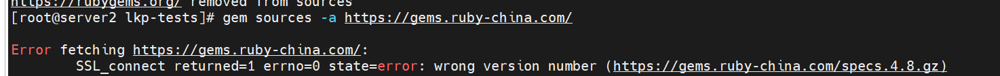
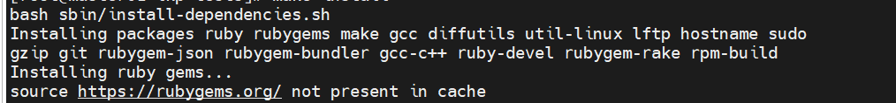
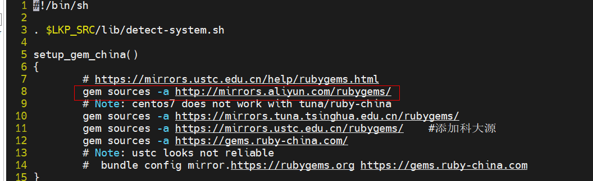
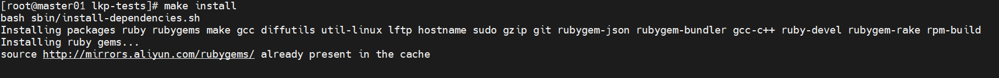
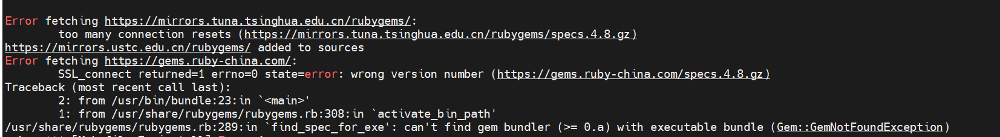
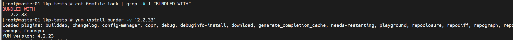
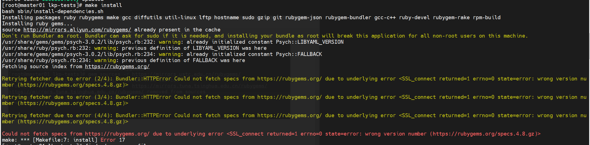
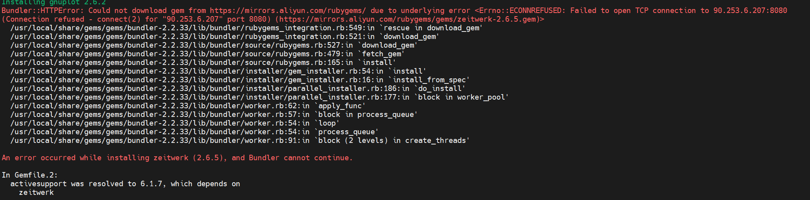

<center><big><b>《联网安装 lkp-tests 问题合集》</b></big></center>

## 1. 联网安装指导

### 权限

lkp test 运行需要root用户运行，所以在自动化的过程中有一个切root的操作

### 安装教程

[https://docs.openeuler.org/zh/docs/22.09/docs/certification/%E6%B5%8B%E8%AF%95%E6%A0%87%E5%87%86%E5%92%8C%E6%B5%8B%E8%AF%95%E5%B7%A5%E5%85%B7.html](https://docs.openeuler.org/zh/docs/22.09/docs/certification/%E6%B5%8B%E8%AF%95%E6%A0%87%E5%87%86%E5%92%8C%E6%B5%8B%E8%AF%95%E5%B7%A5%E5%85%B7.html)

### 证书问题


[解决方式]：[https://developer.baidu.com/article/details/2821747](https://developer.baidu.com/article/details/2821747)

[配套镜像源]:  (http://mirrors.aliyun.com/rubygems/)

### make install 遇到的问题

1. 未从更新后的镜像源拉取资源
   
   [解决方式]：


将 lib/install.sh里第8行替换为可用的镜像源，以及可以屏蔽掉10-12行中不可用的镜像源

2. 卡死报错
   



[解决方式]：
安装bundler
首先运行

```shell
cat Gemfile.lock | grep -A 1 "BUNDLED WITH"
```


安装相同版本

```shell
gem install bundler -v 2.2.33
```

3. 为更新gem缓存导致更新的镜像源未生效
   
   [解决方式]：

```shell
# 运行命令，删除无效镜像源
gem source
# 在更新镜像源后需要更新gem缓存，让更新的镜像源生效
gem source -u
```

4. bundle镜像源配置问题
   
   [解决方式]：

```shell
# 替换bundle镜像源
bundle config mirror.https://rubygems.org https://mirrors.aliyun.com/rubygems
```

5. 安装超时报错
   
   [解决方式]：

安装时间过长，连接冲断，重新运行make install即可解决

### lkp install 遇到的问题

1. 报错，系统不支持
   
   [解决方式]：
   环境变量中增加 LKP_SRC，路径和$LKP_PATH 一样
   export PATH=$PATH:/home/lj/lkp-tests/sbin:/home/lj/lkp-tests/bin:/home/lj/lkp-tests/sbin:/home/lj/lkp-tests/bin
   export LKP_PATH=/home/lj/lkp-tests
   export LKP_SRC=/home/lj/lkp-tests

## 2. lkp test 任务创建指导

### 1. 文件介绍

[doc/add-testcase.zh.md · Fengguang/lkp-tests - Gitee.com](https://gitee.com/wu_fengguang/lkp-tests/blob/master/doc/add-testcase.zh.md)

### 2. 必须的文件

run （可执行脚本）

meta.yaml （介绍项目的详细信息）

jobs 文件夹以及文件夹内需要包含一个与program同名的yaml文件


```shell
lkp split xxx.yaml # 这个yaml是jobs文件夹里的，在哪里执行这个命令，分割出来的任务就会在哪
lkp run xxxx.yaml # 这个yaml是上一步分割完后生成的yaml
```

## 3. 离线安装指导


### 1.yum源配置

请配置everything的yum源
[https://repo.huaweicloud.com/openeuler/openEuler-20.03-LTS/ISO/aarch64/](https://repo.huaweicloud.com/openeuler/openEuler-20.03-LTS/ISO/aarch64/)

### 2.gem 配置

去[https://gems.ruby-china.com/](https://gems.ruby-china.com/) 下载以下gem依赖
bundeler 2.2.33, diff-lcs 1.5.0, minitest 5.15.0 concurrent-ruby 1.1.10, docile 1.4.0, rchardet 1.8.0,
gnuplot 2.6.2, parallel 1.22.1, public_suffix 4.0.7, regexp_parser 2.6.0, rexml 3.2.5, ast 2.4.2,
rainbow 3.1.1, rspec-support 3.12.0, ruby-progressbar 1.11.0, unicode-display_width 2.3.0,
git 1.7.0, simplecov_json_formatter 0.1.4, simplecov-html 0.12.3, rspec-core 3.12.0, rspec-expectations 3.12.0,
rspec-mocks 3.12.0, i18n 1.12.0, builder 3.2.4, sync 0.5.0, tzinfo 2.0.5, rspec 3.12.0, ci_reporter 2.0.0, 
ci_reporter_rspec 1.0.0, parser 3.1.2.1, tins 1.31.1, term-ansicolor 1.7.1, rubocop 1.12.1, simplecov 0.21.2,
simplecov-rcov 0.3.1
将以上依赖放到 /usr/share/gems/gems
并执行gem install --local 安装以上依赖

### 3.环境变量 配置

export PATH=$PATH:lkptest路径/lkp-tests/sbin:lkptest路径/lkp-tests/bin:lkptest路径/lkp-tests/sbin:lkptest路径/lkp-tests/bin
export LKP_PATH=lkptest路径/lkp-tests
export LKP_SRC=lkptest路径/lkp-tests

### 4.测试是否安装成功

```shell
lkp help
lkp install
```
