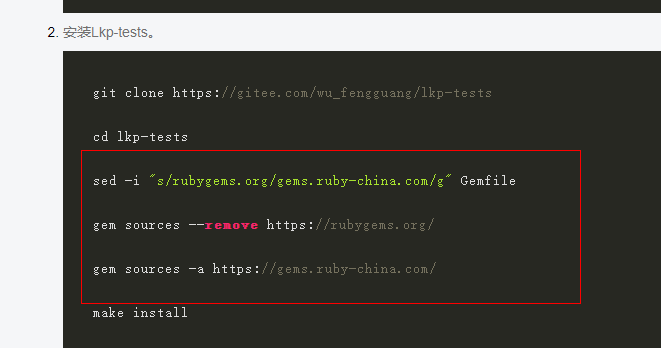

[toc]
<center><big><b>《离线安装 lkp-tests 教程》</b></big></center>

## 安装教程
[https://docs.openeuler.org/zh/docs/22.09/docs/certification/%E6%B5%8B%E8%AF%95%E6%A0%87%E5%87%86%E5%92%8C%E6%B5%8B%E8%AF%95%E5%B7%A5%E5%85%B7.html](https://docs.openeuler.org/zh/docs/22.09/docs/certification/%E6%B5%8B%E8%AF%95%E6%A0%87%E5%87%86%E5%92%8C%E6%B5%8B%E8%AF%95%E5%B7%A5%E5%85%B7.html)

## yum源配置
请配置everything的yum源
[https://repo.huaweicloud.com/openeuler/openEuler-20.03-LTS/ISO/aarch64/](https://repo.huaweicloud.com/openeuler/openEuler-20.03-LTS/ISO/aarch64/)

除安装教程外需要确保 git已经安装
```shell
yum install git
```
## gem 配置
  
无需执行这三部，直接讲所有需要的gem依赖放到/usr/share/gems/gems下面就行
然后gem install --local 每一个依赖

## 环境变量 配置
export PATH=$PATH:/home/lj/lkp-tests/sbin:/home/lj/lkp-tests/bin:/home/lj/lkp-tests/sbin:/home/lj/lkp-tests/bin
export LKP_PATH=/home/lj/lkp-tests
export LKP_SRC=/home/lj/lkp-tests
