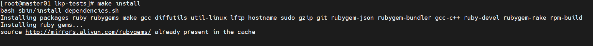
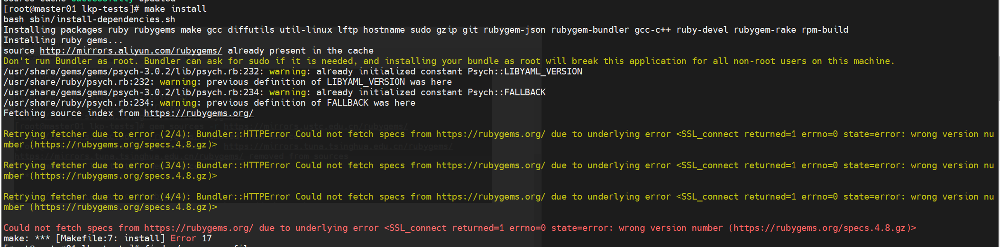

<center><big><b>《联网安装 lkp-tests 问题合集》</b></big></center>

##权限
lkp test 运行需要root用户运行，所以在自动化的过程中有一个切root的操作

## 安装教程
[https://docs.openeuler.org/zh/docs/22.09/docs/certification/%E6%B5%8B%E8%AF%95%E6%A0%87%E5%87%86%E5%92%8C%E6%B5%8B%E8%AF%95%E5%B7%A5%E5%85%B7.html](https://docs.openeuler.org/zh/docs/22.09/docs/certification/%E6%B5%8B%E8%AF%95%E6%A0%87%E5%87%86%E5%92%8C%E6%B5%8B%E8%AF%95%E5%B7%A5%E5%85%B7.html)

## 证书问题

[解决方式]：[https://developer.baidu.com/article/details/2821747](https://developer.baidu.com/article/details/2821747)

[配套镜像源]:  (http://mirrors.aliyun.com/rubygems/)


## make install 遇到的问题
1. 未从更新后的镜像源拉取资源

[解决方式]：


将 lib/install.sh里第8行替换为可用的镜像源，以及可以屏蔽掉10-12行中不可用的镜像源


2. 卡死报错



[解决方式]：
安装bundler
首先运行

```shell
cat Gemfile.lock | grep -A 1 "BUNDLED WITH"
```

安装相同版本

```shell
gem install bundler -v 2.2.33
```

3. 为更新gem缓存导致更新的镜像源未生效

[解决方式]：

```shell
# 运行命令，删除无效镜像源
gem source
# 在更新镜像源后需要更新gem缓存，让更新的镜像源生效
gem source -u
```
4. bundle镜像源配置问题

[解决方式]：

```shell
# 替换bundle镜像源
bundle config mirror.https://rubygems.org https://mirrors.aliyun.com/rubygems
```
5. 安装超时报错

[解决方式]：

安装时间过长，连接冲断，重新运行make install即可解决

## lkp install 遇到的问题
1. 报错，系统不支持

[解决方式]：
环境变量中增加 LKP_SRC，路径和$LKP_PATH 一样
export PATH=$PATH:/home/lj/lkp-tests/sbin:/home/lj/lkp-tests/bin:/home/lj/lkp-tests/sbin:/home/lj/lkp-tests/bin
export LKP_PATH=/home/lj/lkp-tests
export LKP_SRC=/home/lj/lkp-tests

