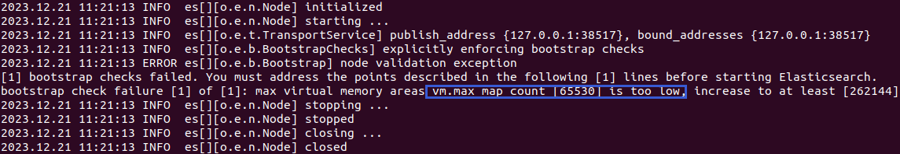

# 鲲鹏原生开发-代码检查

[TOC]

## 简介

代码检查工具是基于SonarQube代码质量管理开放平台，使用docker技术制作的源代码质量管理工具。通过代码规则检测工具检测源代码，可以快速的定位代码中潜在的或者明显的错误 ，支持众多计算机语言如C/C++，JAVA，PYTHON，GO等，并可以集成进Jenkins流水中。本文将介绍工具的镜像制作、配置以及Jenkins流水中的集成使用。 

## 环境要求

软件要求：

​	具备docker环境，磁盘空间最少有10G剩余空间

## 制作`SonarQube`docker镜像

### 1、预置条件
#### 1.1 修改`/etc/sysctl.conf`中`vm.max_map_count`的值大于262144


#### 1.2 执行`sysctl -p`加载修改，否则es.log报错


### 2、文件准备

#### 2.1 所需文件

| 序号 | 名称                           | 说明                             |
| ---- | ------------------------------ | -------------------------------- |
| 1    | build.sh                       | 参考2.1章节内容                  |
| 2    | Dockerfile.server              | 参考2.2章节内容                  |
| 3    | entrypoint.sh                  | 参考2.3章节内容                  |
| 4    | sonarqube-9.9.4.87374.zip      | 参考核心软件参考清单章节内容下载 |
| 5    | sonar-cxx-plugin-2.1.1.488.jar | 参考核心软件参考清单章节内容下载 |

创建server文件夹将上述文件放入其中，如下图所示：


#### 2.2 准备dockerfile文件，可参考如下内容：

> 下面内容中的RUN echo 'root:password' | chpasswd中的`password`表示容器环境中root账户的密码，请根据情况修改，密码长度要大于8位

```dockerfile
FROM openeuler/openeuler:20.03

USER root
WORKDIR /root

RUN yum install -y java-17-openjdk openssh && \
    yum clean all

ARG COPY_TO_DIR=/opt
ARG SONARQUBE=sonarqube-9.9.4.87374.zip
ARG SONAR_CXX_PLUGIN=sonar-cxx-plugin-2.1.2.648.jar

COPY $SONARQUBE $SONAR_CXX_PLUGIN $COPY_TO_DIR/

RUN useradd -b /home -s /bin/bash sonarqube
RUN cd $COPY_TO_DIR && \
    ls -al ./ && \
    unzip $SONARQUBE && \
    mv ${SONARQUBE::-4} sonarqube && \
    mv $SONAR_CXX_PLUGIN sonarqube/extensions/plugins && \
    chown -R sonarqube:sonarqube /opt/sonarqube && \
    rm -rf $SONARQUBE
COPY --chown=sonarqube:sonarqube entrypoint.sh $COPY_TO_DIR/sonarqube
RUN chmod u+x $COPY_TO_DIR/sonarqube/entrypoint.sh

RUN echo 'root:password' | chpasswd

## postgres
RUN yum install -y postgresql-13-server
RUN mkdir /opt/postgres && \
    chown sonarqube:sonarqube /opt/postgres && \
    chown sonarqube:sonarqube /var/run/postgresql

USER sonarqube
WORKDIR /home/sonarqube
RUN cd /opt/postgres && \
    initdb -D /opt/postgres/data --encoding="UTF-8" && \
    pg_ctl -D /opt/postgres/data -l logfile start && \
    psql postgres -c "ALTER USER sonarqube WITH PASSWORD 'sonarqube';" && \
    psql postgres -c "CREATE DATABASE sonarqube OWNER sonarqube;" && \
    psql postgres -c "GRANT ALL PRIVILEGES ON DATABASE sonarqube TO sonarqube;"

RUN echo "sonar.jdbc.url=jdbc:postgresql://localhost/sonarqube" >> /opt/sonarqube/conf/sonar.properties && \
    echo "sonar.jdbc.username=sonarqube" >> /opt/sonarqube/conf/sonar.properties && \
    echo "sonar.jdbc.password=sonarqube" >> /opt/sonarqube/conf/sonar.properties

USER sonarqube
EXPOSE 9000
ENTRYPOINT ["/opt/sonarqube/entrypoint.sh"]
```
#### 2.3 entrypoint.sh脚本参考内容如下

```shell
#!/bin/bash
cd /opt/postgres
pg_ctl -D /opt/postgres/data -l logfile start

cd /opt/sonarqube
java -Xms8m -Xmx32m -jar lib/sonar-application-9.9.4.87374.jar -Dsonar.log.console=true
```

#### 2.4 镜像构建脚本

创建构建镜像脚本build.sh文件，文件内容参考如下：
> Note
>
> `-f`参数指定dockerfile文件路径，根据实际情况修改
>
> `--build-arg`参数指定的为构建镜像中使用的代理设置，根据实际情况选择添加或删除

```shell
docker build -f /path/Dockerfile.server \
--rm -t sonarqube_server:v0.1 \
. \
--build-arg http_proxy="http://ip:port" \
--build-arg https_proxy="http://ip:port"  \
--build-arg no_proxy="127.0.0.1,localhost,local,.local"
```

### 3 、制作镜像

进入`2.1章节`中所创建的server文件夹执行`build.sh`脚本文件，使用`docker images`命令查看构建成功的镜像如下:


### 4、启动容器

执行下面命令启动容器，容器绑定宿主机9000端口

```shell
docker run -itd -p 0.0.0.0:9000:9000 --name sonarqube_server sonarqube_server:v0.1
```

## 配置SonarQube

### 1、登录SonarQube

在浏览器输入宿主机`ip`与`9000`端口（如：`http://ip：9000`），进入登录页面，首次登录账号密码均为admin，强制修改admin密码


进入Rules页面看到CXX规则，安装成功。

 

### 2、添加用户

#### 2.1 git本地配置

SonarQube根据代码提交信息，自动分配问题至个人名下，确保本地提交代码的信息准确。 


#### 2.2 SonarQube用户配置

与gitlab用户配置保持一致。进入管理员页面点击`Security`选择用户`Users`创建用户


创建用户

> Sonarqube用户配置与git本地配置保持一致，通过个人账号登录，可以查看自己名下的问题。
>
> 1、Login与git config –global user.name保持一致
>
> 2、Email与git config –global user.email保持一致
>
> 3、Name将显示在SonarQube问题列表中，建议使用有意义的名字，例如使用Login的配置


### 3、配置扫描规则

#### 3.1 C++

> SonarQube使用sonar-cxx插件支持C++，默认规则为0，需要新增规则。

1、拷贝已有CXX规则集，点击`Copy`，如下图所示。


2、创建CXX规则集，点击【Copy】，创建C++ Profile。 


3、进入【Activate More】，激活规则。


4、激活规则。【Bulk Change】批量激活规则，【Activate】逐条激活规则，根据业务需要自行配置。【规则参考】章节列举了C++、Python常用规则，可供参考。

​         根据sonar-cxx插件约束，SonarQube社区版sonar-cxx采集、分析扫描报告，不对C++进行扫描，需要用户自行配置激活规则对应扫描工具，生成扫描报告，然后使用sonar-scanner上传。


5、使规则集生效，点击【Set as Default】


#### 3.2 python

SonarQube Community默认打开Python扫描规则，数量较多，可根据业务需要进行删减，操作与C++扫描规则类似。 

### 4、配置质量门禁

1、创建质量门禁，点击【Create】


2、填写质量门禁名称，点击【Save】


3、设置为默认质量门禁，使其生效。


4、根据业务需要修改质量门禁条件，以下配置可供参考，看护整体代码质量。点击【Unlock editing】 


添加Overall Code质量门禁，依次选择Bugs、Code Smells、Vulnerabilities、Security Hotspots Reviewed，同时设置阈值大小。 :


设置后效果如下图所示。


## 制作代码检查docker镜像

### 1、文件准备

#### 1.1 所需文件

| 序号 | 名称                              | 说明                             |
| ---- | --------------------------------- | -------------------------------- |
| 1    | apache-maven-3.9.6-bin.zip        | 参考核心软件参考清单章节内容下载 |
| 2    | ClangTidy                         | 参考核心软件参考清单章节内容下载 |
| 3    | cmake-3.29.0-rc3-linux-aarch64.sh | 参考核心软件参考清单章节内容下载 |
| 4    | go1.21.0.linux-arm64.tar.gz       | 参考核心软件参考清单章节内容下载 |
| 5    | sonar-scanner-cli-5.0.1.3006.zip  | 参考核心软件参考清单章节内容下载 |
| 6    | node-v18.20.2-linux-arm64.tar.xz  | 参考核心软件参考清单章节内容下载 |
| 7    | golangci-lint                     | 参考1.2章节内容                  |
| 8    | build.sh                          | 参考1.3章节内容                  |
| 9    | Dockerfile.client                 | 参考1.4章节内容                  |
| 10   | entrypoint.sh                     | 参考1.5章节内容                  |
| 11   | settings.xml                      | 参考1.6章节内容                  |

创建client文件夹将上述文件放入其中，如下图所示：


#### 1.2 编译生成golangci-lint

- 下载 golangci-lint 源码
  curl -o golangci-lint.zip https://codeload.github.com/golangci/golangci-lint/zip/refs/heads/master

- 解压
  unzip golangci-lint.zip

- 进入源代码路径下执行编译（已配置好go环境）
  go build -o golangci-lint ./cmd/golangci-lint

- 编译成功当前路径下生成golangci-lint二进制文件，如下图：

  

- 执行`./golangci-lint -h`命令正常输出不报错，即编译正确

  


#### 1.3 镜像构建脚本

创建构建镜像脚本build.sh文件，文件内容参考如下：

> Note
>
> `-f`参数指定dockerfile文件路径，根据实际情况修改
>
> `--build-arg`参数指定的为构建镜像中使用的代理设置，根据实际情况选择添加或删除

```shell
docker build -f /path/Dockerfile.client \
--rm -t sonarscanner_client:v0.1 \
. \
--build-arg http_proxy="http://ip:port" \
--build-arg https_proxy="http://ip:port"  \
--build-arg no_proxy="127.0.0.1,localhost,local,.local"
```

#### 1.3 准备dockerfile文件，可参考如下内容：

> 下面内容中的RUN echo 'root:password' | chpasswd 中的`password`表示容器环境中root账户的密码，请根据情况修改，密码长度要大于8位

```dockerfile
FROM openeuler/openeuler:20.03

USER root
WORKDIR /root
RUN echo 'root:password' | chpasswd 

RUN yum install -y python3-pip python3-devel \
    gcc gcc-c++ make cppcheck \
    java-17-openjdk xz \
    git openssh && \
    yum clean all

ARG COPY_TO_DIR=/opt
ARG CLANG=BiShengCompiler-3.2.0-aarch64-linux.tar.gz
ARG SONAR_SCANNER=sonar-scanner-cli-5.0.1.3006.zip
ARG CMAKE=cmake-3.29.0-rc3-linux-aarch64.sh

ARG GOLANG=go1.21.0.linux-arm64.tar.gz
ARG GOLANG_LINT=golangci-lint

ARG MAVEN=apache-maven-3.9.6-bin.zip
ARG MAVEN_SETTINGS=settings.xml
ARG NODE_JS=node-v18.20.2-linux-arm64.tar.xz

COPY $CLANG $SONAR_SCANNER $CMAKE $GOLANG $GOLANG_LINT $MAVEN $MAVEN_SETTINGS $NODE_JS $COPY_TO_DIR/

RUN cd $COPY_TO_DIR && \
    unzip $SONAR_SCANNER && \
    mv sonar-scanner-5.0.1.3006 sonar-scanner && \
    rm -rf $SONAR_SCANNER

########### node env
RUN cd $COPY_TO_DIR && \
    mkdir node && \
    tar -xvf $NODE_JS --strip-components 1 -C node && \
    rm -rf $NODE_JS && \
    chmod -R 755 node

########## cpp env
RUN cd $COPY_TO_DIR && \
    mkdir clang && \
    tar -xvf $CLANG --strip-components 1 -C clang && \
    rm -rf $CLANG && \
    chmod -R 755 clang

RUN cd $COPY_TO_DIR && \
    mkdir cmake && \
    bash $CMAKE --skip-license --prefix=./cmake && \
    rm -rf $CMAKE && \
    chmod -R 755 cmake

########### golang env
RUN cd $COPY_TO_DIR && \
    mkdir go && \
    tar -xvf $GOLANG --strip-components 1 -C go && \
    rm -rf $GOLANG && \
    mv $GOLANG_LINT $COPY_TO_DIR/go/bin && \
    chmod -R 755 go/bin

########### java env
RUN cd $COPY_TO_DIR && \
    unzip $MAVEN && \
    mv apache-maven-3.9.6 maven && \
    rm -rf $MAVEN && \
    mv $MAVEN_SETTINGS maven/conf

RUN echo "export PATH=$COPY_TO_DIR/clang/bin:$COPY_TO_DIR/cmake/bin:$COPY_TO_DIR/sonar-scanner/bin:$COPY_TO_DIR/go/bin:$COPY_TO_DIR/maven/bin:$COPY_TO_DIR/node/bin:$PATH" >> ~/.bashrc

ARG TEST_CASE_DIR=/root
ARG ENTRYPOINT_FILE=entrypoint.sh

COPY $ENTRYPOINT_FILE $TEST_CASE_DIR/

# ########## creat codepath
VOLUME /root/sourcecode

RUN chmod u+x /root/entrypoint.sh
ENTRYPOINT ["bash", "-i", "/root/entrypoint.sh"]

```

#### 1.4 entrypoint.sh脚本参考内容如下

> Note
>
> `bash codecheck.sh ${project_name} http://ip:9000 admin 123456xx ./`解释如下：
>
> `codecheck.sh`：每个项目中必须要有codecheck.sh，内容参考`codecheck.sh文件内容`章节
>
> `http://ip:9000`：SonarQube登录地址，根据实际情况修改
>
> `admin` ：SonarQube管理员登录账户
>
> `123456xx`：SonarQube管理员登录密码

```shell
#!/bin/bash

root_path=/root/sourcecode
cd ${root_path}
for code in */; do
    code_path=${root_path}/${code}
    if [[ -f ${code_path}codecheck.sh ]]; then
        echo "========== ${code_path} =========="
        cd ${code_path}
        project_name=${code%/}
        bash codecheck.sh ${project_name} http://ip:9000 admin 123456xx ./
    else
        echo "The codecheck.sh does not exist in the ${code_path} directory."
    fi
done
```

#### 1.5 settings.xml内容如下

> Note
>
> 下面内容中163行`<url>http://IP:Port/maven/</url>`，根据实际情况修改maven真实地址

```xml
<?xml version="1.0" encoding="UTF-8"?>

<!--
Licensed to the Apache Software Foundation (ASF) under one
or more contributor license agreements.  See the NOTICE file
distributed with this work for additional information
regarding copyright ownership.  The ASF licenses this file
to you under the Apache License, Version 2.0 (the
"License"); you may not use this file except in compliance
with the License.  You may obtain a copy of the License at

    http://www.apache.org/licenses/LICENSE-2.0

Unless required by applicable law or agreed to in writing,
software distributed under the License is distributed on an
"AS IS" BASIS, WITHOUT WARRANTIES OR CONDITIONS OF ANY
KIND, either express or implied.  See the License for the
specific language governing permissions and limitations
under the License.
-->

<!--
 | This is the configuration file for Maven. It can be specified at two levels:
 |
 |  1. User Level. This settings.xml file provides configuration for a single user,
 |                 and is normally provided in ${user.home}/.m2/settings.xml.
 |
 |                 NOTE: This location can be overridden with the CLI option:
 |
 |                 -s /path/to/user/settings.xml
 |
 |  2. Global Level. This settings.xml file provides configuration for all Maven
 |                 users on a machine (assuming they're all using the same Maven
 |                 installation). It's normally provided in
 |                 ${maven.conf}/settings.xml.
 |
 |                 NOTE: This location can be overridden with the CLI option:
 |
 |                 -gs /path/to/global/settings.xml
 |
 | The sections in this sample file are intended to give you a running start at
 | getting the most out of your Maven installation. Where appropriate, the default
 | values (values used when the setting is not specified) are provided.
 |
 |-->
<settings xmlns="http://maven.apache.org/SETTINGS/1.2.0"
          xmlns:xsi="http://www.w3.org/2001/XMLSchema-instance"
          xsi:schemaLocation="http://maven.apache.org/SETTINGS/1.2.0 https://maven.apache.org/xsd/settings-1.2.0.xsd">
  <!-- localRepository
   | The path to the local repository maven will use to store artifacts.
   |
   | Default: ${user.home}/.m2/repository
  <localRepository>/path/to/local/repo</localRepository>
  -->

  <!-- interactiveMode
   | This will determine whether maven prompts you when it needs input. If set to false,
   | maven will use a sensible default value, perhaps based on some other setting, for
   | the parameter in question.
   |
   | Default: true
  <interactiveMode>true</interactiveMode>
  -->

  <!-- offline
   | Determines whether maven should attempt to connect to the network when executing a build.
   | This will have an effect on artifact downloads, artifact deployment, and others.
   |
   | Default: false
  <offline>false</offline>
  -->

  <!-- pluginGroups
   | This is a list of additional group identifiers that will be searched when resolving plugins by their prefix, i.e.
   | when invoking a command line like "mvn prefix:goal". Maven will automatically add the group identifiers
   | "org.apache.maven.plugins" and "org.codehaus.mojo" if these are not already contained in the list.
   |-->
  <pluginGroups>
    <!-- pluginGroup
     | Specifies a further group identifier to use for plugin lookup.
    <pluginGroup>com.your.plugins</pluginGroup>
    -->
  </pluginGroups>

  <!-- TODO Since when can proxies be selected as depicted? -->
  <!-- proxies
   | This is a list of proxies which can be used on this machine to connect to the network.
   | Unless otherwise specified (by system property or command-line switch), the first proxy
   | specification in this list marked as active will be used.
   |-->
  <proxies>
    <!-- proxy
     | Specification for one proxy, to be used in connecting to the network.
     |
    <proxy>
      <id>optional</id>
      <active>true</active>
      <protocol>http</protocol>
      <username>proxyuser</username>
      <password>proxypass</password>
      <host>proxy.host.net</host>
      <port>80</port>
      <nonProxyHosts>local.net|some.host.com</nonProxyHosts>
    </proxy>
    -->
  </proxies>

  <!-- servers
   | This is a list of authentication profiles, keyed by the server-id used within the system.
   | Authentication profiles can be used whenever maven must make a connection to a remote server.
   |-->
  <servers>
    <!-- server
     | Specifies the authentication information to use when connecting to a particular server, identified by
     | a unique name within the system (referred to by the 'id' attribute below).
     |
     | NOTE: You should either specify username/password OR privateKey/passphrase, since these pairings are
     |       used together.
     |
    <server>
      <id>deploymentRepo</id>
      <username>repouser</username>
      <password>repopwd</password>
    </server>
    -->

    <!-- Another sample, using keys to authenticate.
    <server>
      <id>siteServer</id>
      <privateKey>/path/to/private/key</privateKey>
      <passphrase>optional; leave empty if not used.</passphrase>
    </server>
    -->
  </servers>

  <!-- mirrors
   | This is a list of mirrors to be used in downloading artifacts from remote repositories.
   |
   | It works like this: a POM may declare a repository to use in resolving certain artifacts.
   | However, this repository may have problems with heavy traffic at times, so people have mirrored
   | it to several places.
   |
   | That repository definition will have a unique id, so we can create a mirror reference for that
   | repository, to be used as an alternate download site. The mirror site will be the preferred
   | server for that repository.
   |-->
  <mirrors>
    <!-- mirror
     | Specifies a repository mirror site to use instead of a given repository. The repository that
     | this mirror serves has an ID that matches the mirrorOf element of this mirror. IDs are used
     | for inheritance and direct lookup purposes, and must be unique across the set of mirrors.
     |
    <mirror>
      <id>mirrorId</id>
      <mirrorOf>repositoryId</mirrorOf>
      <name>Human Readable Name for this Mirror.</name>
      <url>http://my.repository.com/repo/path</url>
    </mirror> -->
    
    <mirror>
        <id>huaweicloud</id>
        <mirrorOf>*</mirrorOf>
        <url>http://IP:Port/maven/</url>
    </mirror>
  </mirrors>

  <!-- profiles
   | This is a list of profiles which can be activated in a variety of ways, and which can modify
   | the build process. Profiles provided in the settings.xml are intended to provide local machine-
   | specific paths and repository locations which allow the build to work in the local environment.
   |
   | For example, if you have an integration testing plugin - like cactus - that needs to know where
   | your Tomcat instance is installed, you can provide a variable here such that the variable is
   | dereferenced during the build process to configure the cactus plugin.
   |
   | As noted above, profiles can be activated in a variety of ways. One way - the activeProfiles
   | section of this document (settings.xml) - will be discussed later. Another way essentially
   | relies on the detection of a property, either matching a particular value for the property,
   | or merely testing its existence. Profiles can also be activated by JDK version prefix, where a
   | value of '1.4' might activate a profile when the build is executed on a JDK version of '1.4.2_07'.
   | Finally, the list of active profiles can be specified directly from the command line.
   |
   | NOTE: For profiles defined in the settings.xml, you are restricted to specifying only artifact
   |       repositories, plugin repositories, and free-form properties to be used as configuration
   |       variables for plugins in the POM.
   |
   |-->
  <profiles>
    <!-- profile
     | Specifies a set of introductions to the build process, to be activated using one or more of the
     | mechanisms described above. For inheritance purposes, and to activate profiles via <activatedProfiles/>
     | or the command line, profiles have to have an ID that is unique.
     |
     | An encouraged best practice for profile identification is to use a consistent naming convention
     | for profiles, such as 'env-dev', 'env-test', 'env-production', 'user-jdcasey', 'user-brett', etc.
     | This will make it more intuitive to understand what the set of introduced profiles is attempting
     | to accomplish, particularly when you only have a list of profile id's for debug.
     |
     | This profile example uses the JDK version to trigger activation, and provides a JDK-specific repo.
    <profile>
      <id>jdk-1.4</id>

      <activation>
        <jdk>1.4</jdk>
      </activation>

      <repositories>
        <repository>
          <id>jdk14</id>
          <name>Repository for JDK 1.4 builds</name>
          <url>http://www.myhost.com/maven/jdk14</url>
          <layout>default</layout>
          <snapshotPolicy>always</snapshotPolicy>
        </repository>
      </repositories>
    </profile>
    -->

    <!--
     | Here is another profile, activated by the property 'target-env' with a value of 'dev', which
     | provides a specific path to the Tomcat instance. To use this, your plugin configuration might
     | hypothetically look like:
     |
     | ...
     | <plugin>
     |   <groupId>org.myco.myplugins</groupId>
     |   <artifactId>myplugin</artifactId>
     |
     |   <configuration>
     |     <tomcatLocation>${tomcatPath}</tomcatLocation>
     |   </configuration>
     | </plugin>
     | ...
     |
     | NOTE: If you just wanted to inject this configuration whenever someone set 'target-env' to
     |       anything, you could just leave off the <value/> inside the activation-property.
     |
    <profile>
      <id>env-dev</id>

      <activation>
        <property>
          <name>target-env</name>
          <value>dev</value>
        </property>
      </activation>

      <properties>
        <tomcatPath>/path/to/tomcat/instance</tomcatPath>
      </properties>
    </profile>
    -->
  </profiles>

  <!-- activeProfiles
   | List of profiles that are active for all builds.
   |
  <activeProfiles>
    <activeProfile>alwaysActiveProfile</activeProfile>
    <activeProfile>anotherAlwaysActiveProfile</activeProfile>
  </activeProfiles>
  -->
</settings>
```

### 2、制作镜像

进入`1.1章节`中所创建的client文件夹执行`build.sh`，使用`docker images`命令查看构建成功的镜像如下:


## Jenkins流水线配置代码检查

### 1、实现方案


### 2、pipeline脚本内容

> Note 
>
> docker run -v /path/sourcecode/:/root/sourcecode -i --rm --name sonarscanner_client 解释如下：
>
> `/path/sourcecode/`：代码检查宿主机上项目代码路径的父路径，如下所示的python为项目路径：
>
> 
>
> `/root/sourcecode`：代码检查镜像中预设路径，此路径不可修改，为`Dockerfile.client`中写死路径，如果要修改需同步修改dockerfile与代码检查的entrypoint.sh且重新制作镜像
>
> `sonarscanner_client:v0.1`：代码检查镜像与标签，根据实际情况修改

```groovy
pipeline {
    agent any
    options {
        timeout(time: 1, unit: 'HOURS') 
    }
    parameters {
        string(name: 'GIT_URL', defaultValue: '替换为代码仓url', description: '--> git url <--')
        string(name: 'GIT_BRANCH', defaultValue: 'master', description: '--> code branch <--')
        string(name: 'GIT_TARGET_DIR_NAME', defaultValue: 'python_test', description: '--> code branch <--')
    }
    stages{
        stage('Git Clone Code') {
            agent {
                label 'sonarqube_test'
            }
            steps {
                echo '====== 获取源码 ======'
                checkout scmGit(branches: [[name: "*/${params.GIT_BRANCH}"]], extensions: [[$class: 'RelativeTargetDirectory', relativeTargetDir: "${params.GIT_TARGET_DIR_NAME}"], cleanBeforeCheckout(deleteUntrackedNestedRepositories: true)], userRemoteConfigs: [[credentialsId: 'e974e6ce-c3b9-407c-9b9d-c7e9e8d0c171', url: "${params.GIT_URL}"]])
            }
        }
        stage('PARALLEL BUILD') {
            parallel {
                stage('Kunpeng-codecheck') {
                    agent {
                        label 'sonarqube_test'
                    }
                    stages{
                        stage('code-check') {
                            steps {
                                echo '====== 代码检查 ======'
                                sh '''
                                    rm -rf /path/sourcecode/python_test
                                    cp -rfp ./python_test /path/sourcecode
                                    docker run -v /path/sourcecode/:/root/sourcecode -i --rm --name sonarscanner_client sonarscanner_client:v0.1
                                '''
                            }
                        }
                    }
                }
            }
        }
    }
}
```

### 3、查看代码检查结果

进入Jenkins流水在Console Output中找到代码检查日志，点击日中的的链接即可跳转到SonarQube项目检查结果页面


SonarQube项目检查结果页面：


## codecheck.sh文件内容

> 请根据实际项目类型参考修改，完成codecheck.sh文件内容。codecheck.sh配置扫描工具，生成扫描报告，使用sonar-scanner上传至SonarQube。

### 1.1 C++项目

> Clang-Tidy需要编译数据库(compile_commands.json)，使用cmake构建的工程，可以通过环境变量CMAKE_EXPORT_COMPILE_COMMANDS=ON控制生成编译数据库，必须修改编译脚本。
>
> C++项目中使用CppCheck、Clang-Tidy参考脚本如下 。

```shell
#!/bin/bash

if [ -x "$(command -v cppcheck)" ]; then
    cppcheck --enable=all --xml --xml-version=2 . 2>cppcheck-report.xml
else
    echo "cppcheck not found!"
fi

# compile commands directory
BUILD_OUT=build_out

if ! [ -e "${BUILD_OUT}/compile_commands.json" ]; then
    # cmake export compile commands
    export CMAKE_EXPORT_COMPILE_COMMANDS=ON

    # build
    bash build.sh
fi

if [ -x "$(command -v run-clang-tidy)" ]; then
    if [ -e ${BUILD_OUT}/compile_commands.json ]; then
        run-clang-tidy -checks=* -p=${BUILD_OUT} > clang-tidy-report.txt
    else
        echo "compile_commands.json not found!"
    fi
else
    echo "run-clang-tidy not found!"
fi

if [ -x "$(command -v sonar-scanner)" ]; then
    sonar-scanner \
        -Dsonar.projectKey=$1 \
        -Dsonar.host.url=$2 \
        -Dsonar.login=$3 \
        -Dsonar.password=$4 \
        -Dsonar.sources=$5 \
        -Dsonar.cxx.file.suffixes=.cxx,.cpp,.cc,.c,.hxx,.hpp,.hh,.h \
        -Dsonar.cxx.cppcheck.reportPaths=cppcheck-report.xml \
        -Dsonar.cxx.clangtidy.reportPaths=clang-tidy-report.txt \
        -Dsonar.exclusions=build_out \
        -Dsonar.qualitygate.wait=true \
        -Dsonar.qualitygate.timeout=600
else
    echo "sonar-scanner not found!"
    exit 1
fi
```

### 1.2 python项目

```shell
#!/bin/bash

if [ -x "$(command -v sonar-scanner)" ]; then
    sonar-scanner \
        -Dsonar.projectKey=$1 \
        -Dsonar.host.url=$2 \
        -Dsonar.login=$3 \
        -Dsonar.password=$4 \
        -Dsonar.sources=$5 \
        -Dsonar.python.version=3.7 \
        -Dsonar.qualitygate.wait=true \
        -Dsonar.qualitygate.timeout=600
else
    echo "sonar-scanner not found!"
    exit 1
fi
```

### 1.3 java项目

```shell
#!/bin/bash

mvn compile

if [ -x "$(command -v sonar-scanner)" ]; then
    sonar-scanner \
        -Dsonar.projectKey=$1 \
        -Dsonar.host.url=$2 \
        -Dsonar.login=$3 \
        -Dsonar.password=$4 \
        -Dsonar.sources=$5 \
        -Dsonar.java.binaries=target/classes \
        -Dsonar.qualitygate.wait=true \
        -Dsonar.qualitygate.timeout=600
else
    echo "sonar-scanner not found!"
    exit 1
fi
```

### 1.4 go项目

```shell
#!/bin/bash

golangci-lint run -v --out-format checkstyle>golangci-lint.xml

if [ -x "$(command -v sonar-scanner)" ]; then
    sonar-scanner \
        -Dsonar.projectKey=$1 \
        -Dsonar.host.url=$2 \
        -Dsonar.login=$3 \
        -Dsonar.password=$4 \
        -Dsonar.sources=$5 \
        -Dsonar.language=go \
        -Dsonar.go.gooroot=$(go env GOROOT) \
        -Dsonar.go.gopath=$(go env GOPATH) \
        -Dsonar.go.golangci-lint.reportPaths=golangci-lint.xml \
        -Dsonar.qualitygate.wait=true \
        -Dsonar.qualitygate.timeout=600
else
    echo "sonar-scanner not found!"
    exit 1
fi
```

## 规则参考

### 1、规则导入

本章节列举的XML文件是C++、Python常用规则，使用CppCheck、Clang-Tidy扫描，供参考。可以通过SonarQube导入，如下图所示，点击【Quality Profiles】【Restore】，选择XML文件。 


导入后效果如下图，可以看到C++规则。


### 2、xml规则参考

#### 2.1 C++常用规则

```xml
<profile>
<name>C++</name>
<language>cxx</language>
<rules>
<rule>
<repositoryKey>clangtidy</repositoryKey>
<key>bugprone-assert-side-effect</key>
<type>BUG</type>
<priority>MINOR</priority>
<parameters/>
</rule>
<rule>
<repositoryKey>clangtidy</repositoryKey>
<key>bugprone-exception-escape</key>
<type>BUG</type>
<priority>MINOR</priority>
<parameters/>
</rule>
<rule>
<repositoryKey>clangtidy</repositoryKey>
<key>bugprone-implicit-widening-of-multiplication-result</key>
<type>CODE_SMELL</type>
<priority>INFO</priority>
<parameters/>
</rule>
<rule>
<repositoryKey>clangtidy</repositoryKey>
<key>bugprone-inaccurate-erase</key>
<type>BUG</type>
<priority>MINOR</priority>
<parameters/>
</rule>
<rule>
<repositoryKey>clangtidy</repositoryKey>
<key>bugprone-infinite-loop</key>
<type>CODE_SMELL</type>
<priority>MINOR</priority>
<parameters/>
</rule>
<rule>
<repositoryKey>clangtidy</repositoryKey>
<key>bugprone-macro-parentheses</key>
<type>BUG</type>
<priority>MINOR</priority>
<parameters/>
</rule>
<rule>
<repositoryKey>clangtidy</repositoryKey>
<key>bugprone-macro-repeated-side-effects</key>
<type>BUG</type>
<priority>MINOR</priority>
<parameters/>
</rule>
<rule>
<repositoryKey>clangtidy</repositoryKey>
<key>bugprone-narrowing-conversions</key>
<type>CODE_SMELL</type>
<priority>INFO</priority>
<parameters/>
</rule>
<rule>
<repositoryKey>clangtidy</repositoryKey>
<key>bugprone-not-null-terminated-result</key>
<type>BUG</type>
<priority>MINOR</priority>
<parameters/>
</rule>
<rule>
<repositoryKey>clangtidy</repositoryKey>
<key>bugprone-signal-handler</key>
<type>BUG</type>
<priority>MINOR</priority>
<parameters/>
</rule>
<rule>
<repositoryKey>clangtidy</repositoryKey>
<key>bugprone-spuriously-wake-up-functions</key>
<type>BUG</type>
<priority>MINOR</priority>
<parameters/>
</rule>
<rule>
<repositoryKey>clangtidy</repositoryKey>
<key>bugprone-suspicious-realloc-usage</key>
<type>CODE_SMELL</type>
<priority>INFO</priority>
<parameters/>
</rule>
<rule>
<repositoryKey>clangtidy</repositoryKey>
<key>bugprone-unhandled-exception-at-new</key>
<type>CODE_SMELL</type>
<priority>INFO</priority>
<parameters/>
</rule>
<rule>
<repositoryKey>clangtidy</repositoryKey>
<key>cert-msc50-cpp</key>
<type>CODE_SMELL</type>
<priority>INFO</priority>
<parameters/>
</rule>
<rule>
<repositoryKey>clangtidy</repositoryKey>
<key>clang-analyzer-core.DivideZero</key>
<type>CODE_SMELL</type>
<priority>INFO</priority>
<parameters/>
</rule>
<rule>
<repositoryKey>clangtidy</repositoryKey>
<key>clang-analyzer-core.NullDereference</key>
<type>CODE_SMELL</type>
<priority>INFO</priority>
<parameters/>
</rule>
<rule>
<repositoryKey>clangtidy</repositoryKey>
<key>clang-analyzer-cplusplus.NewDeleteLeaks</key>
<type>CODE_SMELL</type>
<priority>INFO</priority>
<parameters/>
</rule>
<rule>
<repositoryKey>clangtidy</repositoryKey>
<key>clang-analyzer-nullability.NullableDereferenced</key>
<type>CODE_SMELL</type>
<priority>INFO</priority>
<parameters/>
</rule>
<rule>
<repositoryKey>clangtidy</repositoryKey>
<key>clang-analyzer-security.FloatLoopCounter</key>
<type>CODE_SMELL</type>
<priority>INFO</priority>
<parameters/>
</rule>
<rule>
<repositoryKey>clangtidy</repositoryKey>
<key>concurrency-mt-unsafe</key>
<type>CODE_SMELL</type>
<priority>INFO</priority>
<parameters/>
</rule>
<rule>
<repositoryKey>clangtidy</repositoryKey>
<key>cppcoreguidelines-pro-bounds-constant-array-index</key>
<type>CODE_SMELL</type>
<priority>INFO</priority>
<parameters/>
</rule>
<rule>
<repositoryKey>clangtidy</repositoryKey>
<key>hicpp-signed-bitwise</key>
<type>CODE_SMELL</type>
<priority>INFO</priority>
<parameters/>
</rule>
<rule>
<repositoryKey>clangtidy</repositoryKey>
<key>misc-new-delete-overloads</key>
<type>CODE_SMELL</type>
<priority>MINOR</priority>
<parameters/>
</rule>
<rule>
<repositoryKey>clangtidy</repositoryKey>
<key>misc-throw-by-value-catch-by-reference</key>
<type>CODE_SMELL</type>
<priority>MINOR</priority>
<parameters/>
</rule>
<rule>
<repositoryKey>clangtidy</repositoryKey>
<key>misc-unused-parameters</key>
<type>CODE_SMELL</type>
<priority>INFO</priority>
<parameters/>
</rule>
<rule>
<repositoryKey>clangtidy</repositoryKey>
<key>modernize-deprecated-headers</key>
<type>CODE_SMELL</type>
<priority>MINOR</priority>
<parameters/>
</rule>
<rule>
<repositoryKey>clangtidy</repositoryKey>
<key>modernize-use-noexcept</key>
<type>CODE_SMELL</type>
<priority>INFO</priority>
<parameters/>
</rule>
<rule>
<repositoryKey>clangtidy</repositoryKey>
<key>performance-move-const-arg</key>
<type>CODE_SMELL</type>
<priority>MINOR</priority>
<parameters/>
</rule>
<rule>
<repositoryKey>clangtidy</repositoryKey>
<key>readability-uppercase-literal-suffix</key>
<type>CODE_SMELL</type>
<priority>INFO</priority>
<parameters/>
</rule>
<rule>
<repositoryKey>cppcheck</repositoryKey>
<key>arrayIndexOutOfBoundsCond</key>
<type>BUG</type>
<priority>MINOR</priority>
<parameters/>
</rule>
<rule>
<repositoryKey>cppcheck</repositoryKey>
<key>arrayIndexThenCheck</key>
<type>CODE_SMELL</type>
<priority>MINOR</priority>
<parameters/>
</rule>
<rule>
<repositoryKey>cppcheck</repositoryKey>
<key>bufferNotZeroTerminated</key>
<type>BUG</type>
<priority>MINOR</priority>
<parameters/>
</rule>
<rule>
<repositoryKey>cppcheck</repositoryKey>
<key>containerOutOfBounds</key>
<type>BUG</type>
<priority>MAJOR</priority>
<parameters/>
</rule>
<rule>
<repositoryKey>cppcheck</repositoryKey>
<key>exceptThrowInDestructor</key>
<type>BUG</type>
<priority>MINOR</priority>
<parameters/>
</rule>
<rule>
<repositoryKey>cppcheck</repositoryKey>
<key>integerOverflow</key>
<type>BUG</type>
<priority>MAJOR</priority>
<parameters/>
</rule>
<rule>
<repositoryKey>cppcheck</repositoryKey>
<key>invalidPrintfArgType_float</key>
<type>BUG</type>
<priority>MINOR</priority>
<parameters/>
</rule>
<rule>
<repositoryKey>cppcheck</repositoryKey>
<key>invalidPrintfArgType_int</key>
<type>BUG</type>
<priority>MINOR</priority>
<parameters/>
</rule>
<rule>
<repositoryKey>cppcheck</repositoryKey>
<key>invalidPrintfArgType_n</key>
<type>BUG</type>
<priority>MINOR</priority>
<parameters/>
</rule>
<rule>
<repositoryKey>cppcheck</repositoryKey>
<key>invalidPrintfArgType_p</key>
<type>BUG</type>
<priority>MINOR</priority>
<parameters/>
</rule>
<rule>
<repositoryKey>cppcheck</repositoryKey>
<key>invalidPrintfArgType_s</key>
<type>BUG</type>
<priority>MINOR</priority>
<parameters/>
</rule>
<rule>
<repositoryKey>cppcheck</repositoryKey>
<key>invalidPrintfArgType_sint</key>
<type>BUG</type>
<priority>MINOR</priority>
<parameters/>
</rule>
<rule>
<repositoryKey>cppcheck</repositoryKey>
<key>invalidPrintfArgType_uint</key>
<type>BUG</type>
<priority>MINOR</priority>
<parameters/>
</rule>
<rule>
<repositoryKey>cppcheck</repositoryKey>
<key>invalidScanfArgType_float</key>
<type>BUG</type>
<priority>MINOR</priority>
<parameters/>
</rule>
<rule>
<repositoryKey>cppcheck</repositoryKey>
<key>invalidScanfArgType_int</key>
<type>BUG</type>
<priority>MINOR</priority>
<parameters/>
</rule>
<rule>
<repositoryKey>cppcheck</repositoryKey>
<key>invalidScanfArgType_s</key>
<type>BUG</type>
<priority>MINOR</priority>
<parameters/>
</rule>
<rule>
<repositoryKey>cppcheck</repositoryKey>
<key>memleak</key>
<type>BUG</type>
<priority>MAJOR</priority>
<parameters/>
</rule>
<rule>
<repositoryKey>cppcheck</repositoryKey>
<key>negativeMemoryAllocationSize</key>
<type>BUG</type>
<priority>MAJOR</priority>
<parameters/>
</rule>
<rule>
<repositoryKey>cppcheck</repositoryKey>
<key>nullPointer</key>
<type>BUG</type>
<priority>MAJOR</priority>
<parameters/>
</rule>
<rule>
<repositoryKey>cppcheck</repositoryKey>
<key>obsoleteFunctionsalloca</key>
<type>CODE_SMELL</type>
<priority>MINOR</priority>
<parameters/>
</rule>
<rule>
<repositoryKey>cppcheck</repositoryKey>
<key>returnLocalVariable</key>
<type>BUG</type>
<priority>MAJOR</priority>
<parameters/>
</rule>
<rule>
<repositoryKey>cppcheck</repositoryKey>
<key>returnReference</key>
<type>BUG</type>
<priority>MAJOR</priority>
<parameters/>
</rule>
<rule>
<repositoryKey>cppcheck</repositoryKey>
<key>returnStdMoveLocal</key>
<type>BUG</type>
<priority>MINOR</priority>
<parameters/>
</rule>
<rule>
<repositoryKey>cppcheck</repositoryKey>
<key>shadowVar</key>
<type>CODE_SMELL</type>
<priority>MINOR</priority>
<parameters/>
</rule>
<rule>
<repositoryKey>cppcheck</repositoryKey>
<key>shadowVariable</key>
<type>CODE_SMELL</type>
<priority>MINOR</priority>
<parameters/>
</rule>
<rule>
<repositoryKey>cppcheck</repositoryKey>
<key>shiftNegative</key>
<type>BUG</type>
<priority>MAJOR</priority>
<parameters/>
</rule>
<rule>
<repositoryKey>cppcheck</repositoryKey>
<key>shiftNegativeLHS</key>
<type>BUG</type>
<priority>MINOR</priority>
<parameters/>
</rule>
<rule>
<repositoryKey>cppcheck</repositoryKey>
<key>shiftTooManyBitsSigned</key>
<type>BUG</type>
<priority>MAJOR</priority>
<parameters/>
</rule>
<rule>
<repositoryKey>cppcheck</repositoryKey>
<key>sizeofwithsilentarraypointer</key>
<type>BUG</type>
<priority>MINOR</priority>
<parameters/>
</rule>
<rule>
<repositoryKey>cppcheck</repositoryKey>
<key>stlIfFind</key>
<type>BUG</type>
<priority>MINOR</priority>
<parameters/>
</rule>
<rule>
<repositoryKey>cppcheck</repositoryKey>
<key>terminateStrncpy</key>
<type>BUG</type>
<priority>MINOR</priority>
<parameters/>
</rule>
<rule>
<repositoryKey>cppcheck</repositoryKey>
<key>uninitMemberVar</key>
<type>BUG</type>
<priority>MINOR</priority>
<parameters/>
</rule>
<rule>
<repositoryKey>cppcheck</repositoryKey>
<key>uselessCallsRemove</key>
<type>BUG</type>
<priority>MINOR</priority>
<parameters/>
</rule>
<rule>
<repositoryKey>cppcheck</repositoryKey>
<key>virtualDestructor</key>
<type>BUG</type>
<priority>MAJOR</priority>
<parameters/>
</rule>
<rule>
<repositoryKey>cppcheck</repositoryKey>
<key>zerodiv</key>
<type>BUG</type>
<priority>MAJOR</priority>
<parameters/>
</rule>
</rules>
</profile>
```


#### 2.2 python常用规则

```xml
<profile>
<name>Python</name>
<language>py</language>
<rules>
<rule>
<repositoryKey>python</repositoryKey>
<key>S1045</key>
<type>BUG</type>
<priority>MAJOR</priority>
<parameters/>
</rule>
<rule>
<repositoryKey>python</repositoryKey>
<key>S112</key>
<type>CODE_SMELL</type>
<priority>MAJOR</priority>
<parameters/>
</rule>
<rule>
<repositoryKey>python</repositoryKey>
<key>S1143</key>
<type>BUG</type>
<priority>CRITICAL</priority>
<parameters/>
</rule>
<rule>
<repositoryKey>python</repositoryKey>
<key>S125</key>
<type>CODE_SMELL</type>
<priority>MAJOR</priority>
<parameters>
<parameter>
<key>exception</key>
<value>(fmt|py\w+):.*</value>
</parameter>
</parameters>
</rule>
<rule>
<repositoryKey>python</repositoryKey>
<key>S1313</key>
<type>SECURITY_HOTSPOT</type>
<priority>MINOR</priority>
<parameters/>
</rule>
<rule>
<repositoryKey>python</repositoryKey>
<key>S1523</key>
<type>SECURITY_HOTSPOT</type>
<priority>CRITICAL</priority>
<parameters/>
</rule>
<rule>
<repositoryKey>python</repositoryKey>
<key>S1763</key>
<type>BUG</type>
<priority>MAJOR</priority>
<parameters/>
</rule>
<rule>
<repositoryKey>python</repositoryKey>
<key>S2077</key>
<type>SECURITY_HOTSPOT</type>
<priority>MAJOR</priority>
<parameters/>
</rule>
<rule>
<repositoryKey>python</repositoryKey>
<key>S2245</key>
<type>SECURITY_HOTSPOT</type>
<priority>CRITICAL</priority>
<parameters/>
</rule>
<rule>
<repositoryKey>python</repositoryKey>
<key>S2612</key>
<type>SECURITY_HOTSPOT</type>
<priority>MAJOR</priority>
<parameters/>
</rule>
<rule>
<repositoryKey>python</repositoryKey>
<key>S2737</key>
<type>CODE_SMELL</type>
<priority>MINOR</priority>
<parameters/>
</rule>
<rule>
<repositoryKey>python</repositoryKey>
<key>S2755</key>
<type>VULNERABILITY</type>
<priority>BLOCKER</priority>
<parameters/>
</rule>
<rule>
<repositoryKey>python</repositoryKey>
<key>S3403</key>
<type>BUG</type>
<priority>BLOCKER</priority>
<parameters/>
</rule>
<rule>
<repositoryKey>python</repositoryKey>
<key>S3923</key>
<type>BUG</type>
<priority>MAJOR</priority>
<parameters/>
</rule>
<rule>
<repositoryKey>python</repositoryKey>
<key>S4507</key>
<type>SECURITY_HOTSPOT</type>
<priority>MINOR</priority>
<parameters/>
</rule>
<rule>
<repositoryKey>python</repositoryKey>
<key>S4721</key>
<type>SECURITY_HOTSPOT</type>
<priority>MAJOR</priority>
<parameters/>
</rule>
<rule>
<repositoryKey>python</repositoryKey>
<key>S4784</key>
<type>SECURITY_HOTSPOT</type>
<priority>CRITICAL</priority>
<parameters/>
</rule>
<rule>
<repositoryKey>python</repositoryKey>
<key>S4792</key>
<type>SECURITY_HOTSPOT</type>
<priority>CRITICAL</priority>
<parameters/>
</rule>
<rule>
<repositoryKey>python</repositoryKey>
<key>S5445</key>
<type>VULNERABILITY</type>
<priority>CRITICAL</priority>
<parameters/>
</rule>
<rule>
<repositoryKey>python</repositoryKey>
<key>S5709</key>
<type>CODE_SMELL</type>
<priority>CRITICAL</priority>
<parameters/>
</rule>
<rule>
<repositoryKey>python</repositoryKey>
<key>S5712</key>
<type>CODE_SMELL</type>
<priority>CRITICAL</priority>
<parameters/>
</rule>
<rule>
<repositoryKey>python</repositoryKey>
<key>S5713</key>
<type>CODE_SMELL</type>
<priority>MINOR</priority>
<parameters/>
</rule>
<rule>
<repositoryKey>python</repositoryKey>
<key>S5717</key>
<type>CODE_SMELL</type>
<priority>CRITICAL</priority>
<parameters/>
</rule>
<rule>
<repositoryKey>python</repositoryKey>
<key>S5727</key>
<type>CODE_SMELL</type>
<priority>CRITICAL</priority>
<parameters/>
</rule>
<rule>
<repositoryKey>python</repositoryKey>
<key>S5780</key>
<type>CODE_SMELL</type>
<priority>MAJOR</priority>
<parameters/>
</rule>
<rule>
<repositoryKey>python</repositoryKey>
<key>S5806</key>
<type>CODE_SMELL</type>
<priority>MAJOR</priority>
<parameters/>
</rule>
</rules>
</profile>
```


## 核心软件参考清单

|  软件名称  | 参考下载地址 | 所属镜像 |
| ---- | ---- | ---- |
| sonarqube-9.9.4.87374.zip | https://binaries.sonarsource.com/Distribution/sonarqube/sonarqube-9.9.4.87374.zip | SonarQube |
| sonar-cxx-plugin-2.1.1.488.jar | https://github.com/SonarOpenCommunity/sonar-cxx/releases/download/cxx-2.1.1/sonar-cxx-plugin-2.1.1.488.jar | SonarQube |
| ClangTidy | https://mirrors.huaweicloud.com/kunpeng/archive/compiler/bisheng_compiler/BiShengCompiler-3.2.0-aarch64-linux.tar.gz | 代码检查 |
| sonar-scanner-cli-5.0.1.3006.zip | https://binaries.sonarsource.com/Distribution/sonar-scanner-cli/sonar-scanner-cli-5.0.1.3006.zip | 代码检查 |
| cmake-3.29.0-rc3-linux-aarch64.sh | https://github.com/Kitware/CMake/releases/download/v3.29.0-rc3/cmake-3.29.0-rc3-linux-aarch64.sh | 代码检查 |
| go1.21.0.linux-arm64.tar.gz | https://go.dev/dl/go1.21.0.linux-arm64.tar.gz | 代码检查 |
| apache-maven-3.9.6-bin.zip | https://dlcdn.apache.org/maven/maven-3/3.9.6/binaries/apache-maven-3.9.6-bin.zip | 代码检查 |
| node-v18.20.2-linux-arm64.tar.xz | https://nodejs.org/dist/v18.20.2/node-v18.20.2-linux-arm64.tar.xz | 代码检查 |

