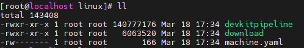
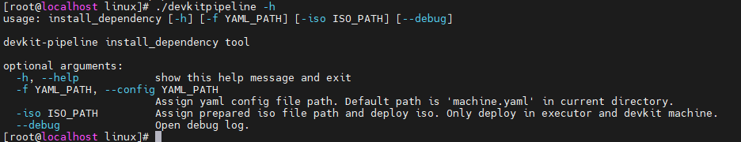
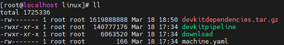
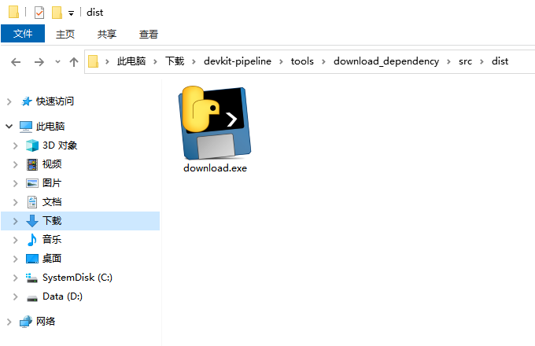
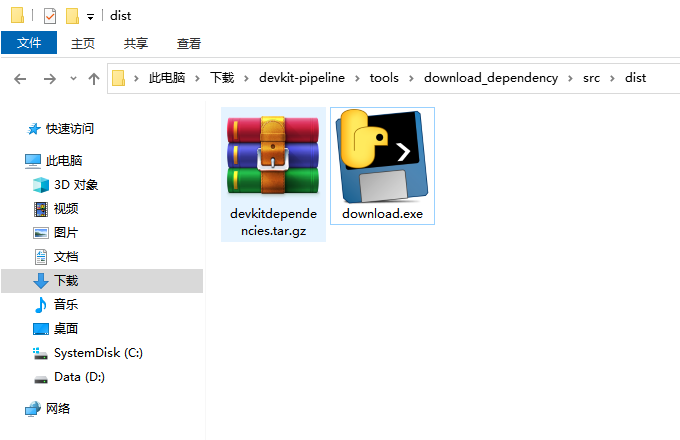

# 批量部署工具devkitpipeline

获取本项目release包v0.2版本，解压之后，将tools/linux文件夹内所有内容上传至linux服务器，获取文件列表如下图：




其中 **`devkitpipeline`** 为一键批量部署工具，与本项目仓库名称相同。`machine.yaml`文件为该工具倚赖的配置文件，具体填写内容说明见下文。在无网络环境下 **`download`** 一键下载工具为其提供所需组件包下载能力，windows版本 `download` 工具支持在windows机器上下载组件包。


## machine.yaml 配置文件

源码仓提供该配置文件模板为

```yaml
user: root
pkey: /root/.ssh/id_rsa
scanner:
  - 192.168.0.1
  - 192.168.0.2
  - 192.168.0.3
builder:
  - 192.168.0.1
executor:
  - 192.168.0.1
devkit:
  - 192.168.0.4
```

其中，**`user`** 需填写本结点至其他结点配置免密的用户名，**`pkey`** 为配置免密所用公钥对应的私钥路径。

**`scanner`**，**`builder`**，**`executor`**，**`devkit`** 分别对应用户的扫描机，构建机，执行机，devkit部署机器 ，需以yaml列表的形式输入各角色机器对应的ip。

- 生成公私钥对的命令为：

> ```shell
> ssh-keygen [-b bits] [-t dsa | ecdsa | ed25519 | rsa] [-C comment] [-f output_keyfile]
> ```
>
> 以rsa公私钥对为例，如下即为在当前路径下生成rsa公私钥对的命令：
>
> ```shell
> ssh-keygen -t rsa
> ```
>
> 在命令行输入上述命令后，命令回显会提示用户输入生成公私钥对所用密码，此处建议用户不输入密码，直接确认。若输入密码则后续批量部署工具在运行时需要用户手动输入密码。

- 配置本结点至其他结点免密的命令为：

> ```shell
> ssh-copy-id USER@REMOTE_HOST
> ```
>
> USER 替换为远程服务器的用户名，REMOTE_HOST 替换为远程服务器的ip地址。执行完该命令后，会提示输入远程服务器的密码。
>
> 输入远程服务器的密码后，公钥就会被复制到远程服务器的 authorized_keys 文件中，这样就可以实现无密码登录远程服务器的功能。


## devkitpipeline 批量部署工具

在命令行进入工具所在的文件夹路径，输入如下命令，可以查看该工具的使用提示。

```shell
./devkitpipeline -h
```


除 **`-h`** 使用提示参数外，**`devkitpipeline`** 批量部署工具还提供 **`-f`**，**`-iso`** ，**`--debug`** 三个参数。

- 使用`-f`参数，指定所需yaml配置文件为后续输入的路径。若不使用`-f`参数，批量部署工具会从当前路径下读取名为`machine.yaml`的文件作为yaml配置文件。 `-f`参数别名为`--config`。
- 使用 `-iso` 参数，指定要安装镜像源文件，仅部署在executor和devkit机器上。
- 使用 `--debug`参数，可以打开批量部署工具的debug日志信息，方便根据命令行日志输出确认哪个环节出现了问题。

注：本批量部署工具将标准输出作为日志输出地址，没有生成单独的日志文件。


#### 使用批量部署工具常用的命令为：

```shell
./devkitpipeline -f ./machine.yaml --debug
```

```
./devkitpipeline -f ./machine.yaml -iso /path/to/iso --debug
```


#### 批量部署工具目前支持批量部署 GCCforOpenEuler，BiShengCompiler，BiShengJDK8，BiShengJDK17，lkp-tests,并支持根据iso镜像文件挂载本地镜像。

各工具下载版本为2024年2月各工具官网提供的最新版，可查看本项目源代码download_dependency工具目录下的 `download_config.py` 文件查看具体下载链接。

BiShengJDK8 和 BiShengJDK17 均使用 `update-alternatives` 工具进行配置。默认BiShengJDK8版本优先。

部署安装过程中会使用目标结点机器的 **`/tmp`** 目录作为临时文件所在目录，部署完成后将会删除 **`/tmp`** 目录下的临时文件。若目标结点机器 **`/tmp`** 目录磁盘空间不足，则会导致安装失败。若使用挂载本地镜像方式安装，则安装完依赖后，本地镜像源将被取消挂载并恢复原来的镜像源配置。


## download 一键下载工具

当批量部署工具所在结点网络不通时，可以使用 **`download`** 一键下载工具在有网络环境的机器上先行将所需的组件安装包及校验文件下载下来并打包成 **`devkitdependencies.tar.gz`** 文件，供用户上传至批量部署工具所在结点，供批量部署工具在默认路径加载使用。

 `devkitdependencies.tar.gz` 文件上传路径为`devkitpipeline` 批量部署工具所在路径。上传完成后目录文件列表如下：



#### 一键下载工具linux版本

该工具在release包v0.2版本，tools/linux文件夹下，在Linux机器上使用，用于下载组件包。

在有网络环境的linux服务器上，一键下载工具所在路径，执行如下命令，可以查看该工具的使用提示。

```shell
./download -h
```


除 **`-h`** 使用提示参数外，**`download`** 批量下载工具还提供 **`-iso`** 参数。

- 使用 -iso 参数，指定下载iso版本，输入'auto'将自动检测操作系统版本，并自动下载对应的版本iso文件。

##### 使用批量部署工具常用的命令为：

```shell
./download 
```

```shell
./download -iso auto
```


#### 一键下载工具windows版本

该工具在release包v0.2版本，tools/windows文件夹下，可在windows机器上使用，用于下载组件包。



双击该`download.exe` 文件即可在当前目录下下载组件包。下载完成后结果如下：




##### 使用批量部署工具常用的命令为：

```shell
./download 
```

```shell
./download -iso openEuler_2203_LTS
```


## 部署结果

批量部署工具将各组件安装至用户家目录下的.local文件夹下。

#### GCCforOpenEuler 安装结果

批量部署工具将`GCCforOpenEuler`安装包解压至用户家目录下的.local文件夹下，并在用户的 `~/.bashrc` 文件中新增如下两行命令。用户重新登录服务器后即可查询当前环境所用`gcc`版本。

```shell
export GCC_HOME=${HOME}/.local/gcc-10.3.1-2023.12-aarch64-linux/bin
export PATH=${GCC_HOME}:${PATH}
```


#### BiShengCompiler安装结果

批量部署工具将`BiShengCompiler`安装包解压至用户家目录下的.local文件夹下，并在用户的 `~/.bashrc` 文件中新增如下两行命令。用户重新登录服务器后即可查询当前环境所用`clang`版本。

```shell
export BISHENG_COMPILER_HOME=${HOME}/.local/BiShengCompiler-3.2.0-aarch64-linux/bin
export PATH=${BISHENG_COMPILER_HOME}:${PATH}
```


#### BiShengJDK8安装结果

批量部署工具将`BiShengJDK8`安装包解压至用户家目录下的.local文件夹下，并使用`alternatives`中`install`命令配置java版本。用户重新登录服务器后即可使用如下命令查询或更改当前环境所用`java`版本。

```shell
update-alternatives --config java
```

```shell
java -version
```


#### BiShengJDK17安装结果

批量部署工具将`BiShengJDK17`安装包解压至用户家目录下的.local文件夹下，并使用`alternatives`中`install`命令配置java版本。用户重新登录服务器后即可使用如下命令查询或更改当前环境所用`java`版本。

```shell
update-alternatives --config java
```

```shell
java -version
```

