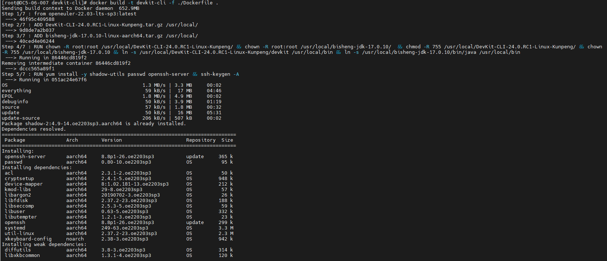
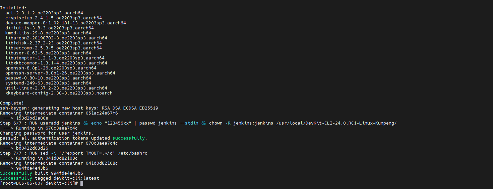
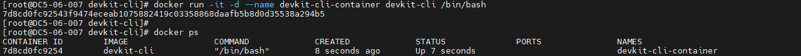
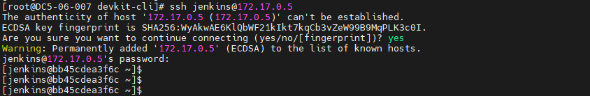

##            

### 创建Dockerfile，内容例如：

```dockerfile
#基础镜像，以openeuler 20.03 lts sp2为例
from openeuler-20.03-lts-sp2:latest

#解压缩资源包
ADD DevKit-CLI-24.0.RC1-Linux-Kunpeng.tar.gz /usr/local/
ADD bisheng-jdk-17.0.10-linux-aarch64.tar.gz /usr/local/

#修改权限、属组，创建软连接
RUN chown -R root:root /usr/local/DevKit-CLI-24.0.RC1-Linux-Kunpeng/ && chown -R root:root /usr/local/bisheng-jdk-17.0.10/  && chmod -R 755 /usr/local/DevKit-CLI-24.0.RC1-Linux-Kunpeng/ && chown -R 755 /usr/local/bisheng-jdk-17.0.10 && ln -s /usr/local/DevKit-CLI-24.0.RC1-Linux-Kunpeng/devkit /usr/local/bin && ln -s /usr/local/bisheng-jdk-17.0.10/bin/java /usr/local/bin 

#如需开启ssh登录容器，可执行以下步骤，否则可跳过；注意需保证可访问公网
RUN yum install -y shadow-utils passwd openssh-server && ssh-keygen -A

#如需使用普通用户，可执行以下步骤，否则可跳过；jenkins为用户名，123456xx为密码，请按需修改
RUN useradd jenkins && echo "123456xx" | passwd jenkins --stdin && chown -R jenkins:jenkins /usr/local/DevKit-CLI-24.0.RC1-Linux-Kunpeng/

#取消bash超时
RUN sed -i '/^export TMOUT=.*/d' /etc/bashrc

```

#### 下载包到同一目录

[下载毕昇JDK17](https://mirrors.huaweicloud.com/kunpeng/archive/compiler/bisheng_jdk/bisheng-jdk-17.0.10-linux-aarch64.tar.gz)
[DevKit命令行工具下载](https://mirrors.huaweicloud.com/kunpeng/archive/DevKit/Packages/Kunpeng_DevKit/DevKit-CLI-24.0.RC1-Linux-Kunpeng.tar.gz)

和dockerfile放置在同一路径下


#### 执行构建命令

```commandline
docker build -t devkit-cli -f ./Dockerfile .
```





#### 查看构建成功的镜像


#### 开启sshd(可选)
执行以下命令拉起容器，devkit-cli-container为容器名，可按需修改
```
docker run -it -d --name devkit-cli-container devkit-cli /bin/bash
```


执行以下命令进入容器, devkit-cli-container为容器名，请和启动时保持一致
```
docker exec -it devkit-cli-container /bin/bash 
```

进入容器后，执行以下命令启动开启ssh访问
```
/usr/sbin/sshd
```


退出容器，执行以下命令验证ssh连接是否正常，jenkins为自定义用户，需和dockerfile内保持一致
```
ssh jenkins@172.17.0.5
```
