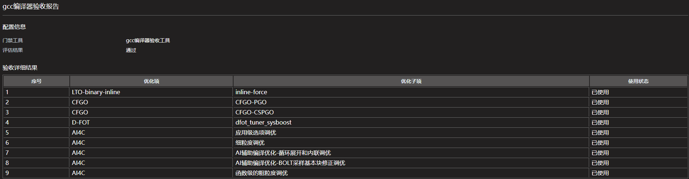

### 介绍
GCC for openEuler编译器应用于原生开发出具验收报告，明确所用的优化能力，目前做法是通过搜索编译日志中的优化选项，来判断编译器的优化能力是否启用。

### 操作步骤
- 编译时开启详细编译选项输出
    - make构建：
      - 多数情况，同时输出到终端和文件：
      ```
      make VERBOSE=1 |& tee build.log
      ```
      - 部分项目（如Linux内核），使用 `V=1` 作为详细模式：
      ```
      make V=1 |& tee build.log
      ```
    - ninja构建：
      - 先执行 
      ```
      cmake ..
      ```
      - 后续构建时自动输出完整命令：
      ```
      ninja -v |& tee build.log
      ```
    - 其他构建方式：参照上述方法，开启输出详细构建命令。
- ai4c使用编译时指定输出到log
  - 用户可使用AI4C中的`AI辅助编译优化-循环展开和内联调优`功能，重定向日志到`inline_unroll.ai4c.log `
  - 用户可使用AI4C中的`AI辅助编译优化-BOLT采样基本块修正调优`功能，重定向日志到`bolt_bb.ai4c.log`
  - 用户可使用AI4C中的`应用级选项调优`功能，重定向日志到`compiler_option_tune.ai4c.log`
  - 用户可使用AI4C中的`细粒度调优`功能，重定向日志到`pass_option_tune.ai4c.log`
  - 用户可使用AI4C中的`函数级的粗粒度调优`功能，重定向日志到`function_option_tune.ai4c.log`
  - 汇总ai4c.log
  ```
  find . -name *.ai4c.log | xargs -I {} cp {} ./htmlreports
  ```

- [获取工具](https://gitee.com/pyshj/devkit-pipeline/releases/tag/gcc-check-tool-v1.0)
- 生成验收报告
  - 将包含编译选项的日志，打包为 `.zip`、`.gz` 或 `.bz2` 格式，
  - 运行工具生成GCC for openEuler编译器验收html报告：
  ```
  $ ./acceptance_command_line_gcc -tool gcc -package htmlreports.zip

    Starting decompression...
    Starting decompression...
    test result is successful
    Decompression completed.
    View the report in gcc_test_result.html.
  ```
  