# 1.devkit-pipeline Jenkins验收报告收集
1.1、 选择需要收集报告的任务
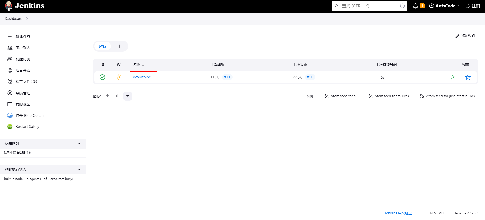
1.2、 进入任务，展示如下页面，选择需要收集报告的流水进入
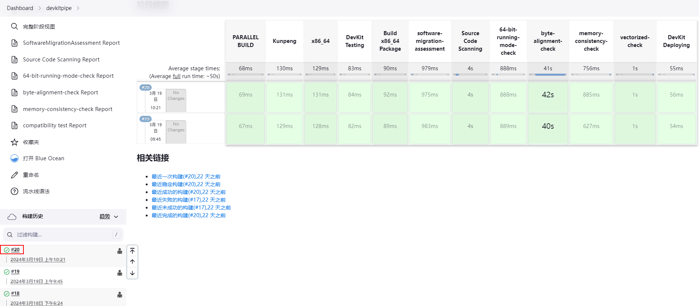
1.3、 进入流水后如下图所示
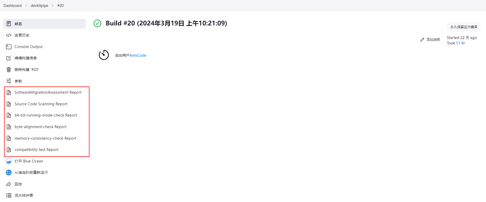
1.4、 点击上图红框中的报告进入报告页面，点击右上角的zip下载报告至本地
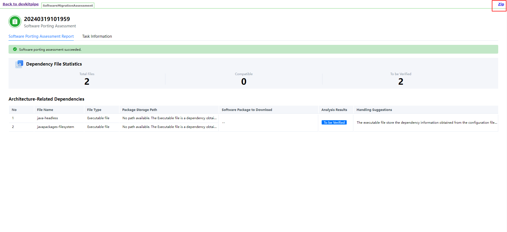
1.5、若Jenkins中未配置Devkit测试平台，报告中不包含如图所示的compatibility test Report，请参考第3节（非Jenkins和Gitlab验收报告收集）中的DevKit测试平台报告收集进行收集，请将compatibility_report.html下载至本地，并与下载至本地的zip压缩包放置于同一目录

# 2.devkit-pipeline Gitlab验收报告收集

2.1、 选择需要收集报告的仓库
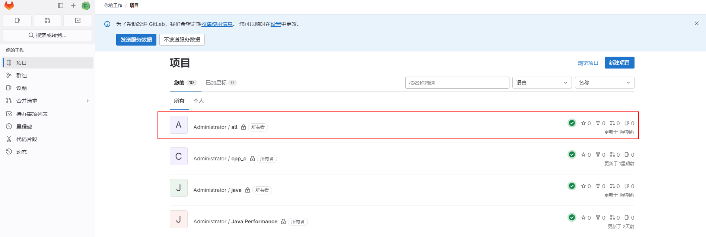

2.2、 进入仓库后，点击流水线，选择需要收集流水，下载报告至本地（流水线中下载的报告均默认为zip格式）
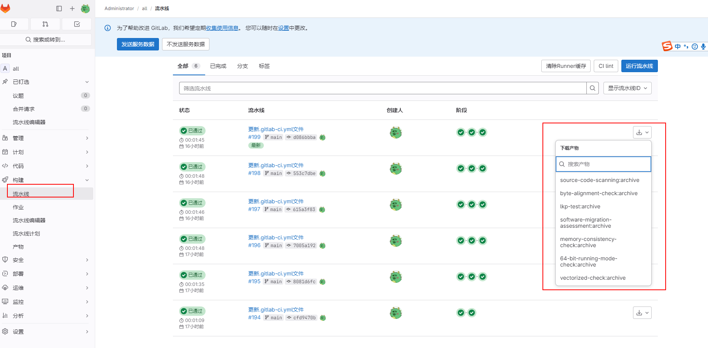
2.3、若Gitlab中未配置Devkit测试平台，报告中不包含上图所示的lkp-test:archive，请参考第3节（非Jenkins和Gitlab验收报告收集）中的DevKit测试平台报告收集进行收集，
请将compatibility_report.html下载至本地，并与下载至本地的zip压缩包放置于同一目录
# 3.非Jenkins和Gitlab验收报告收集
3.1、 DevKit测试平台报告收集  
DevKit测试平台报告收集需要进入到DevKit测试平台实际安装路径，以安装在/root/.local路径为例，需要进入到`/root/.local/compatibility_testing/`目录，该目录下名为compatibility_report.html文件为验收报告
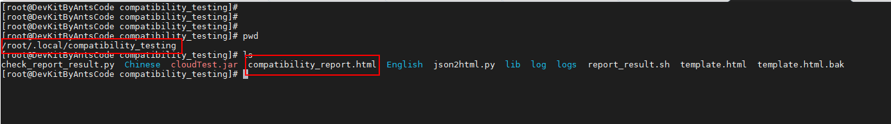
3.2、 迁移扫描工具和亲和工具扫描报告收集  
后台手动运行扫描工具，工具会给出报告生成的路径，以迁移扫描工具为例，/root/pkg-mig_20240411014930_eeb4.html文件为验收报告
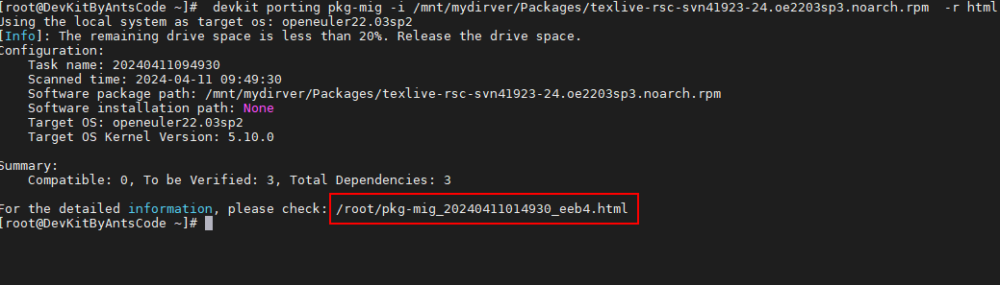
# 4.精度分析报告收集
4.1、在终端执行命令：find / -name preccheck.log

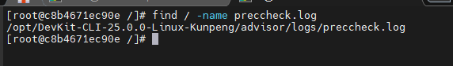
4.2、preccheck.log日志文件为验收报告，将preccheck.log下载至本地
# 5.鲲鹏低负载性能采集库报告收集
5.1、当运行调优任务的时候在终端执行命令：perf record -e "cycles" sleep 时间(时间根据调优任务的时长自定义)
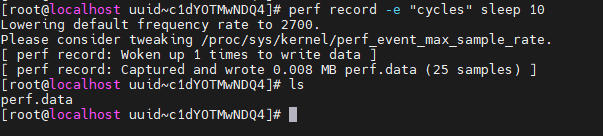

5.2、生成的perf.data为验收报告，将perf.data下载至本地
# 6.验收报告打包
6.1、 Jenkins和Gitlab验收报告打包

将下载的的验收报告放置于同一个文件夹中

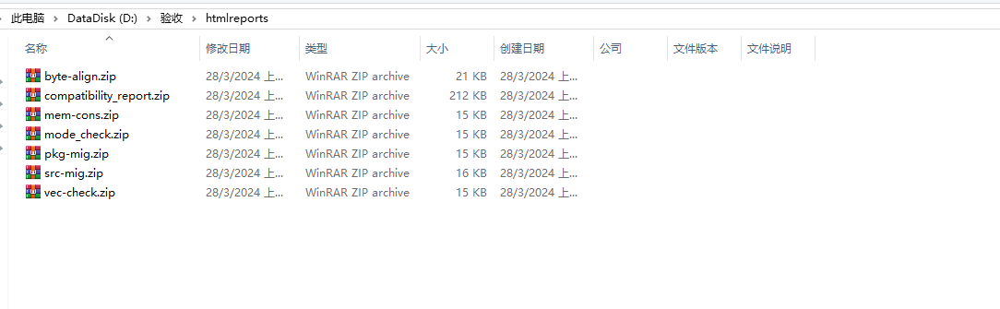
将文件夹压缩成tar.gz、zip或bz2其中任何一种格式即可
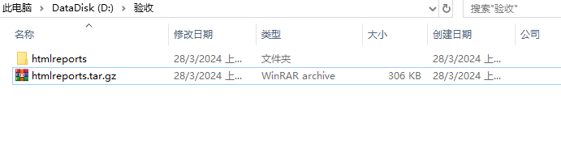

6.2、 非Jenkins和Gitlab验收报告打包
在服务器任意目录创建名为htmlreports的文件夹，将生成的报告拷贝至该文件夹下，将文件夹压缩成tar.gz、zip或bz2其中任何一种格式即可
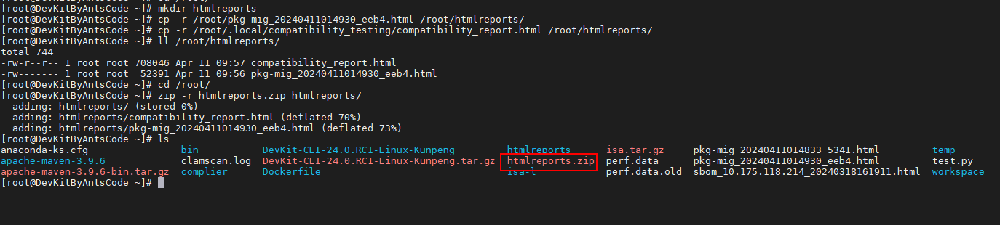
