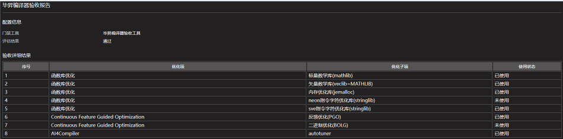

### 介绍
毕昇编译器应用于原生开发出具验收报告，明确所用的优化能力，目前做法是通过搜索编译日志中的优化选项，来判断毕昇编译器的优化能力是否启用。

### 操作步骤
- 编译时开启详细编译选项输出
    - make构建：
      - 多数情况，同时输出到终端和文件：
      ```
      make VERBOSE=1 |& tee build.log
      ```
      - 部分项目（如Linux内核），使用 `V=1` 作为详细模式：
      ```
      make V=1 |& tee build.log
      ```
    - ninja构建：
      - 先执行 
      ```
      cmake ..
      ```
      - 后续构建时自动输出完整命令：
      ```
      ninja -v |& tee build.log
      ```
    - 其他构建方式：参照上述方法，开启输出详细构建命令。
- [获取工具](https://gitee.com/pyshj/devkit-pipeline/releases/tag/%E6%AF%95%E6%98%87%E7%BC%96%E8%AF%91%E5%99%A8%E9%AA%8C%E6%94%B6%E5%B7%A5%E5%85%B7)
- 生成验收报告
  - 将包含编译选项的日志，打包为 `.zip`、`.gz` 或 `.bz2` 格式，
  - 运行工具生成毕昇编译器验收html报告：
  ```
  $ ./acceptance_command_line_bisheng -tool BiSheng  -package  htmlreports.zip

  Starting decompression...
  Decompression completed.
  View the report in /home/test/devkit-pipeline/tools/毕昇编译器验收工具.html.
  ```
  
