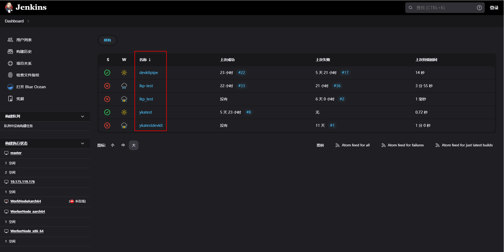
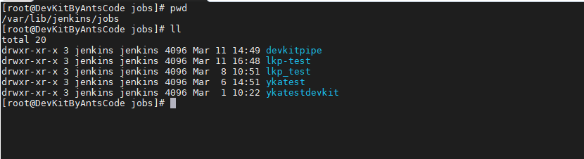
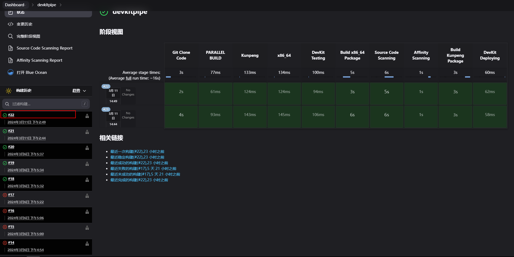
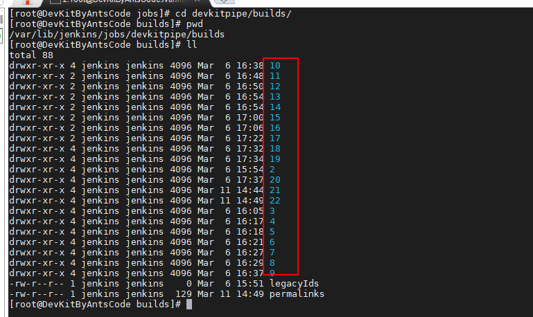
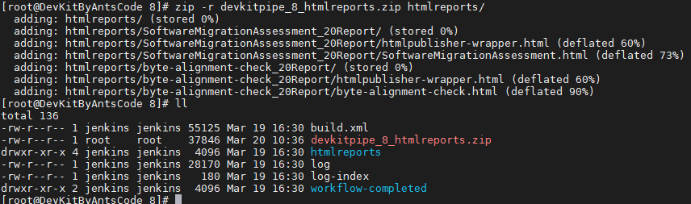
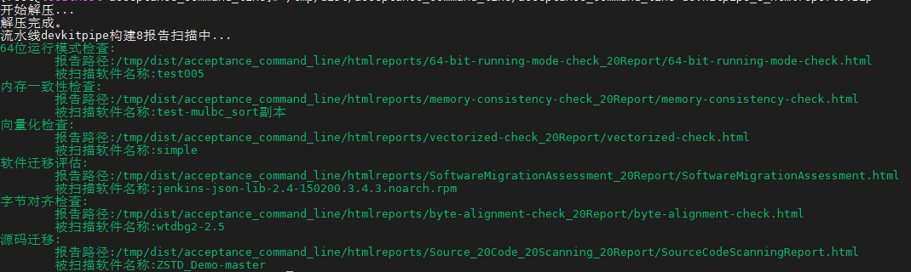

<center><big><b>《Jenkins报告验收》</b></big></center>

#### 1.Jenkins流水线生成报告
其中，`command to generate report`是生成报告的命令，`reportDir`是报告所在的目录，`reportFiles`是报告的文件名，`reportName`是报告的名称

reportFiles和reportName参数要命名要与[Jenkins流水线配置迁移、亲和门禁.md](https://gitee.com/openeuler/devkit-pipeline/blob/master/document/Jenkins安装部署/Jenkins流水线配置迁移、亲和门禁.md)文档中得命名保持一致

```
stage('') {
    steps {
        sh 'command to generate report'
    }
    post {
        always {
            publishHTML(target: [allowMissing: false,
                                    alwaysLinkToLastBuild: false,
                                    keepAll              : true,
                                    reportDir            : '.',
                                    reportFiles          : '*.html',
                                    reportName           : '*']
            )
        }
    }
    }
```
#### 2.Jenkins master将某次构建生成得报告打包
2.1、进入Jenkins master环境的`/var/lib/jenkins/jobs`目录
2.2、当前目录下选择与web见面一致的流水线名称



2.3、确定流水线名称后进入`{流水线名称}/builds`目录
2.4、选择需要查看报告的构建ID



2.5、进入`{构建ID}`目录
2.6、将该目录下的htmlreports文件可压缩成tar.gz、zip、bz等常见的压缩包格式，参考命令如下

```
zip -r devkitpipe_8_htmlreports.zip htmlreports/ 
# devkitpipe是流水线名称，8是构建id
``` 



#### 3.命令行验收报告
执行如下命令

```
# acceptance_command_line路径根据实际情况更换
# -tool输入DevKit 
# -package参数输入需要扫描的压缩包
/devkit-pipeline/build/devkit-pipeline-v0.2/linux/acceptance_command_line  -tool DevKit -package devkitpipe_8_htmlreports.zip 
```
扫描出devkit-pipeline相关报告

当前路径下会生成devkitpipe_8_htmlreports.html