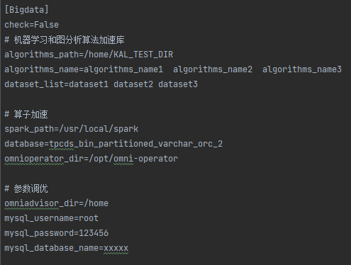
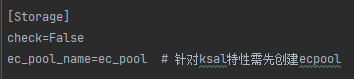
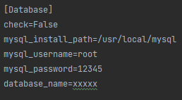
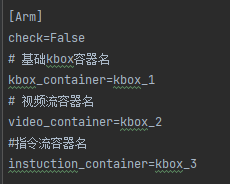
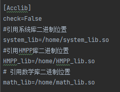
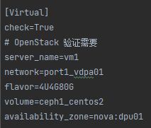
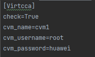
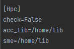

# **鲲鹏使能套件BoostKit验收工具使用说明**

## 1. **采集工具**

### **1.1采集工具能力说明**


    用于一键收集鲲鹏使能套件BoostKit 特性使能情况信息，以及系统信息，生成统一压缩包（压缩包包含客户id标识信息以及打包时间信息）。 压缩包用于后续分析出具验收报告

系统信息收集包括：操作系统版本信息、内核版本、鲲鹏服务器的机型

软件信息收集包括：BoostKit 下八个解决方案特性是否生效的关键日志信息。 对于未使能的特性，采集过程中会有报错，是正常现象。


### **1.2采集工具配置文件说明**

**文件名称**： config.ini

**位置**: 和采集脚本同级目录

**功能**: 用于控制收集是否采集解决方案特性信息以及 必要用户信息输入


#### **1.2.1大数据配置文件说明**




> check=False

check 默认为False, 置为True 则开启大数据相关特性使能信息收集功能

 

> algorithms_path=/home/KAL_TEST_DIR

机器学习和图分析算法加速库安装路径，默认为/home/KAL_TEST_DIR


> algorithms_name=algorithms_name1  algorithms_name2  algorithms_name3

在$KAL_TEST_DIR/bin/ml/ or $KAL_TEST_DIR/bin/graph/ 目录下有对应 算法名_run.sh 脚本

用户自获取 算法名成填入algorithms_name 对应行，多个算法空格隔开，至少选择四种不同的算法

机器学习和图分析算法加速库的算法名列表，默认为algorithms_name1  algorithms_name2  algorithms_name3


> dataset_list=dataset1 dataset2 dataset3

机器学习和图分析算法加速库的数据集列表，默认为dataset1 dataset2 dataset3


> spark_path=/home/

spark的安装路径，默认为/home/


> database=tpcds_bin_partitioned_orc_1000

所创建对应数据库的名称，根据用户所创建的数据库名称填写，默认为tpcds_bin_partitioned_orc_1000


> omnioperator_dir=/opt/omni-operator

算子加速的安装路径，默认为/opt/omni-operator


> omniadvisor_dir=/home

参数调优的安装路径，默认为/home


> mysql_username=root

可以启动数据库服务的用户名，默认是root用户


> mysql_password=12345

登录数据库的密码，默认为12345


> mysql_database_name=xxxxx

所创建对应数据库的名称，根据用户所创建的数据库名称填写

> omnimv_dir=/omnimv

omnimv 目录路径, 用于物化视图特性验证

> omnidata_launcher_server=

launcher 所在服务器的名称 (需可直接ssh无密码访问, 不填则默认在当前服务器上)

> omnidata_launcher=/home/omm/omnidata-install/omnidata/bin/launcher

launcher 二进制路径，用于算子下推特性验证

> omnidata_install_path=/home/omm/omnidata-install

omnidata 安装目录，用于算子下推特性验证

> push_down_jars=/usr/local/spark-plugin-jar/*

算子下推相关jar包路径，用于算子下推特性验证

> push_down_conf=spark.executor.extraClassPath=./*

配置spark参数，用于算子下推特性验证

> zookeeper_address=agent1:2181,agent2:2181,agent3:2181

连接 zookeeper 地址，用于算子下推特性验证

> zookeeper_path=/sdi/status

存放下推资源信息的目录，用于算子下推特性验证

> shuffle_jars=/home/ockadmin/opt/ock/jars/*

shuffle加速相关jar包路径，用于shuffle加速特性验证

#### **1.2.2分布式存储配置文件说明**



> check=False

check 默认为False, 置为True 则开启分布式存储相关特性使能信息收集功能

 

> ec_pool_name=ec_pool

注：分布式存储加速算法库特性信息收集 需用户自己先创建 ec_pool， **并回填ec_pool_name至配置文件**

创建流程如下：

ceph osd erasure-code-profile set EC-profile k=4 m=2 plugin=ksal

ceph osd pool create ceph_ecpool 32 32 erasure EC-profile

> ceph_conf=/tmp/ceph.conf

ceph 配置文件路径，用于“压缩算法”特性验收

> storage_maintain_bin=/tmp/maintain

用到存储维护工具库特性的二进制路径

> rocksdb_bin=/tmp/rock.bin

用到Rocksdb元数据加速特性的二进制路径

> ucache_bin=/tmp/ucache.bin

用到Ucache智能读缓存特性的二进制路径

> non_ceph_bin=/tmp/non_ceph.bin

非ceph场景下的软件二进制路径，用于“存储加速算法库”特性验收

> non_ceph_pid=38799 

非ceph场景下的软件进程id，用于“存储加速算法库”特性验收

 

#### **1.2.3数据库配置文件说明**



> check=False

check 默认为False, 置为True 则开启数据库相关特性使能信息收集功能

> use_mysql=1

是否 mysql 场景下验收，填1或0

> other_db_bin=/usr/losql/pgsql

非mysql场景下，需填写数据库二进制路径

> mysql_install_path=/usr/local/mysql

数据库安装路径，默认为/usr/local/mysql

> mysql_username=root

可以启动数据库服务的用户名，默认是root用户

> mysql_password=123456

登录数据库的密码，默认为123456

> mysql_port=3306

数据库端口，默认为3306

> nvme_name=nvme0n1

nvme盘名称，用于验收 ”MySQL NVMe SSD原子写“ 特性

> database_name=xxxx

所创建对应数据库的名称，根据用户所创建的数据库名称填写

> greenplum_username=root

greenplum 用户名，用于验收“KAEzip压缩解压缩优化”特性

> greenplum_port=5432

greenplum 端口，用于验收“KAEzip压缩解压缩优化”特性

> kae_version=

kae 版本, 填写1.0或2.0, 用于验收“KAEzip压缩解压缩优化”特性

> greenplum_kae_sql=

greenplum kae sql 语句，用于验收“KAEzip压缩解压缩优化”特性
 

#### **1.2.4 ARM原生配置文件说明**



> check=False

check 默认为False, 置为True 则开启ARM原生特性使能信息收集功能

> kbox_container=kbox_1

> video_container=android_2

> instuction_container=kbox_3

分别为待采集的kbox、视频流、指令流容器名称。要求3个容器均存在，否则会退出脚本。

 


#### **1.2.5加速库配置文件说明**



工具默认支持验收 KAE 特性，配置文件无需修改

> check=False

check 默认为False, 置为True 则开启加速库特性使能信息收集功能

> system_lib=/home/system_lib.so

引用系统库二进制文件绝对路径

> HMPP_lib=/home/HMPP_lib.so

引用HMPP库二进制文件绝对路径

> math_lib=/home/math_lib.so 

引用数学库二进制文件绝对路径

> math_jar=/home/math.jar

引用数学库的jar包位置

> math_java=/home/math.class

引用数学库的字节码文件位置


#### **1.2.6虚拟化配置文件说明**




注意：

1.OVS流表网卡加速特性需再host测执行，配置文件无需修改

2.虚拟化DPU卸载 特性需要再DPU测执行采集工具， 配置文件无需修改

3.OVS流表归一化 特性验证前需准备环境，让物理机B上的虚拟机持续ping物理机A上的虚拟机，然后在物理机A上运行采集工具
该特性默认支持验收， 配置文件无需修改

OpenStack 验证需要以下信息

> server_name=vm1

> network=port1_vdpa01

> flavor=4U4G80G

> volume=ceph1_centos2

> availability_zone=nova:dpu01 

> vm_ip=71.14.48.104

虚拟机ip, 用于验收高性能云盘优化特性

> vm_user=root

虚拟机用户名, 用于验收高性能云盘优化特性

> vm_password=Huawei12#$

虚拟机密码, 用于验收高性能云盘优化特性

> vm_ceph_disk_name=vdb

虚拟机使用的高性能云盘名称, 用于验收高性能云盘优化特性

> vm_name=vm1

虚拟机名称, 用于验收高性能云盘优化特性

#### **1.2.7 机密计算配置文件说明**



> check=False

check 默认为False, 置为True 则开启数据库相关特性使能信息收集功能

 

> cvm_name

机密虚机名称,默认为cvm1

> cvm_username

机密虚机的用户名,默认为root

> cvm_password

机密虚机的用户名密码,默认为huawei

 

#### **1.2.8 HPC配置文件说明**




> check=False

check 默认为False, 置为True 则开启HPC相关特性使能信息收集功能

> acc_lib

引用HPC加速库改造二进制文件绝对路径

> sme

引用HPC SME改造二进制文件绝对路径

> sve_source_code

填写有用到 sve 的源码目录或文件的绝对路径


### 1.3 采集工具使用说明

#### 1.3.1 二进制使用

```
./collect_msg 
# 同级目录下具有config.ini 配置文件，且已按1.2中对应解决方案完成相关参数配置
```

#### 1.3.2  shell 脚本使用

```
bash collect_msg.sh 
# 同级目录下具有config.ini 配置文件， 且已按1.2中对应解决方案完成相关参数配置
```
