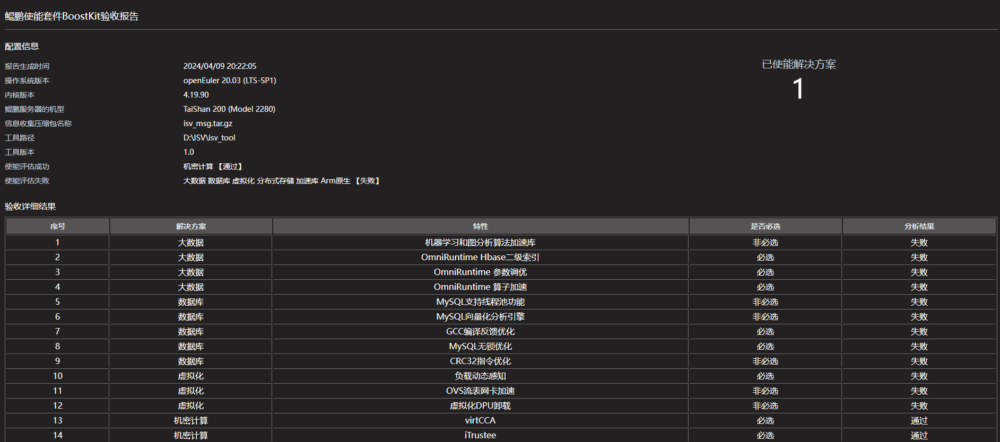

# **鲲鹏使能套件BoostKit验收工具使用说明**

## 1. **采集工具**

### **1.1采集工具能力说明**


    用于一键收集鲲鹏使能套件BoostKit 特性使能情况信息，以及系统信息，生成统一压缩包（压缩包包含客户id标识信息以及打包时间信息）。 压缩包用于后续分析出具验收报告

系统信息收集包括：操作系统版本信息、内核版本、鲲鹏服务器的机型

软件信息收集包括：BoostKit 下八个解决方案特性是否生效的关键日志信息


### **1.2采集工具配置文件说明**

**文件名称**： config.ini

**位置**: 和采集脚本同级目录

**功能**: 用于控制收集是否采集解决方案特性信息以及 必要用户信息输入


#### **1.2.1大数据配置文件说明**


> check=False

check 默认为False, 置为True 则开启大数据相关特性使能信息收集功能

 

> algorithms_path=/home/KAL_TEST_DIR

机器学习和图分析算法加速库安装路径，默认为/home/KAL_TEST_DIR


> algorithms_name=algorithms_name1  algorithms_name2  algorithms_name3

在$KAL_TEST_DIR/bin/ml/ or $KAL_TEST_DIR/bin/graph/ 目录下有对应 算法名_run.sh 脚本

用户自获取 算法名成填入algorithms_name 对应行，多个算法空格隔开，至少选择四种不同的算法

机器学习和图分析算法加速库的算法名列表，默认为algorithms_name1  algorithms_name2  algorithms_name3


> dataset_list=dataset1 dataset2 dataset3

机器学习和图分析算法加速库的数据集列表，默认为dataset1 dataset2 dataset3


> spark_path=/home/

spark的安装路径，默认为/home/


> database=tpcds_bin_partitioned_orc_1000

所创建对应数据库的名称，根据用户所创建的数据库名称填写，默认为tpcds_bin_partitioned_orc_1000


> omniadvisor_dir=/home

参数调优的安装路径，默认为/home


> mysql_username=root

可以启动数据库服务的用户名，默认是root用户


> mysql_password=12345

登录数据库的密码，默认为12345


> mysql_database_name=xxxxx

所创建对应数据库的名称，根据用户所创建的数据库名称填写


#### **1.2.2分布式存储配置文件说明**


> check=False

check 默认为False, 置为True 则开启分布式存储相关特性使能信息收集功能

 

> ec_pool_name=ec_pool

注：分布式存储加速算法库特性信息收集 需用户自己先创建 ec_pool， **并回填ec_pool_name至配置文件**

创建流程如下：

ceph osd erasure-code-profile set EC-profile k=4 m=2 plugin=ksal

ceph osd pool create ceph_ecpool 32 32 erasure EC-profile

 

 

#### **1.2.3数据库配置文件说明**


> check=False

check 默认为False, 置为True 则开启数据库相关特性使能信息收集功能

> mysql_install_path=/usr/local/mysql

数据库安装路径，默认为/usr/local/mysql

> mysql_username=root

可以启动数据库服务的用户名，默认是root用户

> mysql_password=123456

登录数据库的密码，默认为123456

> database_name=xxxx

所创建对应数据库的名称，根据用户所创建的数据库名称填写

 

#### **1.2.4 ARM原生配置文件说明**


> check=False

check 默认为False, 置为True 则开启ARM原生特性使能信息收集功能

> kbox_container=kbox_1

> video_container=android_2

> instuction_container=kbox_3

分别为待采集的kbox、视频流、指令流容器名称。要求3个容器均存在，否则会退出脚本。

 


#### **1.2.5加速库配置文件说明**


> check=False

check 默认为False, 置为True 则开启加速库特性使能信息收集功能

> system_lib=/home/system_lib.so

引用系统库二进制文件绝对路径

> HMPP_lib=/home/HMPP_lib.so

引用HMPP库二进制文件绝对路径

> math_lib=/home/math_lib.so 

引用数学库二进制文件绝对路径


#### **1.2.6虚拟化配置文件说明**


注意：

1.OVS流表网卡加速特性需再host测执行，配置文件无需修改

2.虚拟化DPU卸载 特性需要再DPU测执行采集工具， 配置文件无需修改

OpenStack 验证需要以下信息

> server_name=vm1

> network=port1_vdpa01

> flavor=4U4G80G

> volume=ceph1_centos2

> availability_zone=nova:dpu01 

#### **1.2.7 机密计算配置文件说明**


> check=False

check 默认为False, 置为True 则开启数据库相关特性使能信息收集功能

 

> cvm_name

机密虚机名称,默认为cvm1

> cvm_username

机密虚机的用户名,默认为root

> cvm_password

机密虚机的用户名密码,默认为huawei

 

#### **1.2.8 HPC配置文件说明**


> check=False

check 默认为False, 置为True 则开启HPC相关特性使能信息收集功能

> acc_lib

引用HPC加速库改造二进制文件绝对路径

> sme

引用HPC SME改造二进制文件绝对路径

## 1. **分析工具**

### 1.1 **分析工具能力说明**

     用于分析鲲鹏使能套件BoostKit 特性使能情况，以及系统信息。工具输入信息来源为信息收集工具生成的tar.gz 压缩包，输出特性使能情况 以及服务器相关信息的html 报告

  如下图 new_report.html

36723.png)

### 1.2 **分析工具使用说明**

```
./isv_tool -tool BoostKit  -package ./xxx技术限公司_isv_msg_202404081100.tar.gz
```

-tool # 指定分析BoostKit 特性使能情况

-package # 输入采集压缩包，一般由采集工具一键收集生成的压缩包名称